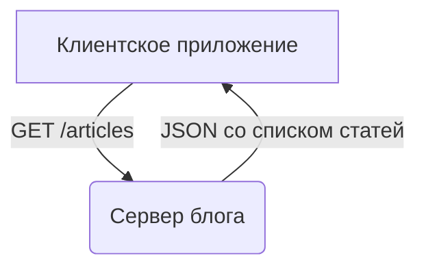

# API: что это такое и как работает

## Введение: что такое API и зачем это нужно?

Аббревиатура API (Application Programming Interface) — программный интерфейс приложения — все чаще встречается не только в требованиях к вакансиям для разработчиков, но и в повседневной жизни. Когда вы оплачиваете покупку в интернет-магазине, заказываете такси через приложение или проверяете погоду на своем смартфоне, вы, скорее всего, используете API. 

Простыми словами, API — это набор правил и инструментов, который позволяет разным программам «общаться» друг с другом. Это своего рода «контракт», который одна программа предоставляет другой, описывая, как к ней можно обращаться, какие данные передавать и что ожидать в ответ. API позволяет разработчикам использовать функциональность других сервисов и приложений, не вникая в детали их внутренней реализации. Это значительно ускоряет и упрощает процесс разработки, позволяя создавать более сложные и функциональные продукты.

## Основные концепции API

Чтобы лучше понять, как работают API, давайте разберем несколько ключевых концепций:

*   **Ресурсы:** В контексте API, ресурс — это любой объект, к которому можно получить доступ. Это может быть пользователь, продукт, фотография, статья или любой другой элемент данных. Каждый ресурс имеет уникальный идентификатор (URI - Uniform Resource Identifier), по которому к нему можно обратиться.

*   **Методы HTTP:** Для взаимодействия с ресурсами API, как правило, используют стандартные методы протокола HTTP. Самые распространенные из них:
      *   `GET`: получение данных о ресурсе.
    *   `POST`: создание нового ресурса.а.
     *   `PUT` / `PATCH`: обновление существующего ресурса.са.
    *   `DELETE`: удаление ресурса.а.

*   **Форматы данных:** Данные, которыми обмениваются клиент и сервер через API, могут быть представлены в различных форматах. Наиболее популярными являются:
    *   **JSON (JavaScript Object Notation):** легковесный текстовый формат, который легко читается как человеком, так и машиной.
    *   **XML (eXtensible Markup Language):** более строгий и многословный формат, который также широко используется, особенно в корпоративных системах.

*   **Ключи API (API Keys):** Для контроля доступа к API и отслеживания его использования, многие сервисы требуют использования специальных ключей. Ключ API — это уникальная строка символов, которая передается с каждым запросом и идентифицирует приложение-клиента.

## Практические примеры

### Пример 1: API для получения погоды

Представьте, что вы создаете сайт, на котором хотите отображать актуальную погоду. Вместо того чтобы создавать собственную метеостанцию, вы можете воспользоваться API погодного сервиса, например, OpenWeatherMap.

Вот как это может выглядеть на практике (пример на Python с использованием библиотеки `requests`):

```python
import requests
import json

# Ваш ключ API от OpenWeatherMap
api_key = "ВАШ_API_КЛЮЧ"

# Город, для которого вы хотите получить погоду
city_name = "Москва"

# Формируем URL для запроса к API
url = f"http://api.openweathermap.org/data/2.5/weather?q={city_name}&appid={api_key}&units=metric&lang=ru"

# Отправляем GET-запрос
response = requests.get(url)

# Проверяем, что запрос прошел успешно
if response.status_code == 200:
    # Получаем данные в формате JSON
    data = response.json()

    # Извлекаем нужную информацию
    temperature = data['main']['temp']
    description = data['weather'][0]['description']

    print(f"Погода в городе {city_name}: {description}, температура: {temperature}°C")
else:
    print("Не удалось получить данные о погоде")

```

В этом примере мы отправляем `GET`-запрос к API OpenWeatherMap, передавая в качестве параметров название города и наш ключ API. В ответ мы получаем JSON-объект с подробной информацией о погоде, из которого мы извлекаем температуру и описание.

### Пример 2: REST API для блога

Допустим, у вас есть блог, и вы хотите дать возможность другим приложениям получать списки ваших статей. Вы можете создать для этого простой REST API.

**Диаграмма взаимодействия:**



**Пример ответа сервера (в формате JSON):**

```json
[
  {
    "id": 1,
    "title": "Первая статья",
    "author": "Иван Иванов",
    "published_date": "2024-01-22"
  },
  {
    "id": 2,
    "title": "Вторая статья",
    "author": "Петр Петров",
    "published_date": "2024-01-23"
  }
]
```

В данном случае, когда клиентское приложение отправляет `GET`-запрос на эндпоинт `/articles`, сервер возвращает массив JSON-объектов, каждый из которых представляет одну статью.

## Типичные ошибки и как их избежать

При работе с API, особенно на начальных этапах, можно столкнуться с рядом типичных ошибок:

*   **Отсутствие обработки ошибок:** Всегда проверяйте код ответа сервера. Ответ с кодом `200 OK` означает успех, но могут быть и другие коды, сигнализирующие об ошибках (например, `404 Not Found`, `401 Unauthorized`, `500 Internal Server Error`). Ваше приложение должно корректно обрабатывать такие ситуации.

*   **Небезопасное хранение ключей API:** Никогда не храните ключи API в открытом виде в коде вашего приложения, особенно если вы выкладываете его в публичный репозиторий. Используйте переменные окружения или другие безопасные способы хранения.

*   **Игнорирование документации:** Документация к API — ваш лучший друг. Внимательно изучайте ее, чтобы понять, как правильно формировать запросы, какие параметры использовать и в каком формате ожидать ответ.

## Связь с другими темами

Понятие API тесно связано с такими концепциями, как:

*   **Микросервисная архитектура:** В этой архитектуре приложение строится как набор небольших, независимо развертываемых сервисов, которые взаимодействуют друг с другом по API.
*   **Веб-сервисы:** Это программные системы, которые предоставляют свои услуги через интернет, как правило, с помощью API. REST и SOAP — два основных подхода к созданию веб-сервисов.
*   **Интеграция приложений:** API является ключевым инструментом для интеграции различных программных систем, позволяя им обмениваться данными и функциональностью.

## Заключение

API играет фундаментальную роль в современной веб-разработке и не только. Это мощный инструмент, который позволяет создавать более сложные, функциональные и интегрированные приложения. Понимание принципов работы API открывает перед разработчиками огромные возможности для творчества и инноваций. Надеемся, эта статья помогла вам разобраться в том, что такое API и как с ним работать.
