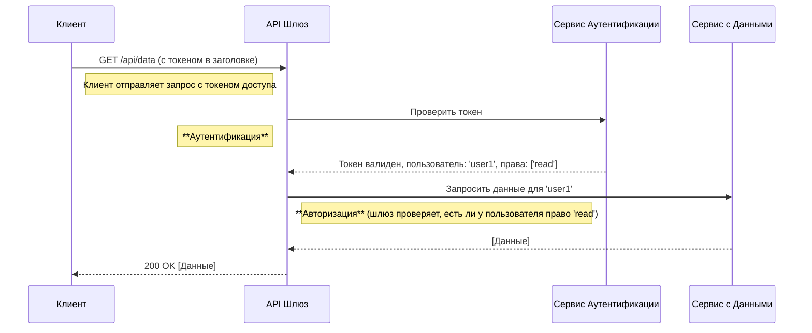

## Введение

В мире цифровой безопасности два термина часто используются как взаимозаменяемые, хотя и обозначают совершенно разные, хоть и тесно связанные, процессы: **аутентификация** и **авторизация**. Понимание их различий — это фундаментальный шаг к построению безопасных и надежных систем. Если говорить просто, аутентификация отвечает на вопрос "Кто вы?", в то время как авторизация определяет, "Что вам разрешено делать?".

Представьте, что вы находитесь в аэропорту. На стойке регистрации вы предъявляете паспорт, чтобы доказать свою личность — это **аутентификация**. Авиакомпания проверяет, что вы — это действительно вы. После этого вам выдают посадочный талон, который дает вам право пройти на определенный рейс и занять конкретное место. Этот талон — ваша **авторизация**. Он не подтверждает вашу личность, но определяет ваши права и привилегии в рамках системы авиакомпании. В современном мире, где данные являются новой нефтью, правильное разграничение доступа — это не просто техническая деталь, а критическая необходимость для защиты информации от несанкционированного использования.

### Основные концепции

#### Аутентификация: Подтверждение личности

**Аутентификация** — это процесс проверки и подтверждения того, что субъект (пользователь, сервис или устройство) является тем, за кого себя выдает. Это первый рубеж обороны в любой системе безопасности. Для подтверждения личности используются различные факторы, которые можно разделить на три основные категории:

* **Что-то, что вы знаете (фактор знания):** Самый распространенный пример — пароль или PIN-код. Это секретная информация, известная только пользователю.
* **Что-то, что у вас есть (фактор обладания):** Это может быть физический объект, такой как USB-ключ (например, YubiKey), смарт-карта или мобильный телефон, на который приходит одноразовый код (SMS или через приложение-аутентификатор).
* **Что-то, чем вы являетесь (фактор свойства):** Это биометрические данные — уникальные физические характеристики человека. К ним относятся отпечатки пальцев, сканирование сетчатки глаза, распознавание лица или голоса.

Современные системы все чаще отходят от однофакторной аутентификации (обычно просто пароля) в пользу **многофакторной (MFA)** или **двухфакторной (2FA)**. MFA требует от пользователя предоставить два или более доказательства своей личности из разных категорий. Например, после ввода пароля (знание) система может попросить ввести код из SMS (обладание), что значительно повышает уровень безопасности.

#### Авторизация: Предоставление прав доступа

**Авторизация** — это процесс, который следует *сразу за* успешной аутентификацией. Он определяет, какие именно ресурсы, файлы, данные или функции доступны аутентифицированному пользователю. Если аутентификация — это пропуск в здание, то авторизация — это ключ от конкретных кабинетов внутри.

Управление доступом строится на нескольких ключевых принципах:

* **Принцип наименьших привилегий (Principle of Least Privilege, PoLP):** Каждому пользователю или компоненту системы должны быть предоставлены только те права, которые минимально необходимы для выполнения его задач. Администратору не нужен доступ к бухгалтерии, а бухгалтеру — к настройкам сервера.
* **Управление доступом на основе ролей (Role-Based Access Control, RBAC):** Права доступа группируются в роли (например, "администратор", "редактор", "читатель"), а пользователям назначаются эти роли. Это упрощает управление правами в больших системах: вместо того чтобы настраивать права для каждого пользователя индивидуально, достаточно изменить права для роли.
* **Управление доступом на основе атрибутов (Attribute-Based Access Control, ABAC):** Более гибкая модель, где решение о доступе принимается на основе атрибутов пользователя (должность, отдел), атрибутов ресурса (уровень конфиденциальности) и окружения (время суток, местоположение).

### Практические примеры

#### Пример 1: Веб-приложение на Python (Flask)

Рассмотрим простой сценарий: пользователь входит в систему и пытается получить доступ к панели администратора. Здесь мы видим четкое разделение: сначала логин (аутентификация), затем проверка роли (авторизация).

```python
from flask import Flask, request, abort
from functools import wraps

app = Flask(__name__)

# Упрощенная база данных пользователей
users = {
    "admin": {"password": "password123", "roles": ["admin", "user"]},
    "user1": {"password": "password456", "roles": ["user"]}
}

# Функция для симуляции проверки токена (аутентификация)
def get_current_user():
    # В реальном приложении здесь была бы проверка JWT или сессионного токена
    user_id = request.headers.get("X-User-ID")
    if user_id in users:
        return {"id": user_id, **users[user_id]}
    return None

# Декоратор для проверки авторизации (требуется определенная роль)
def requires_role(role):
    def decorator(f):
        @wraps(f)
        def decorated_function(*args, **kwargs):
            user = get_current_user()
            # 1. Аутентификация: пользователь должен быть в системе
            if not user:
                abort(401) # Unauthorized (нет аутентификации)
            # 2. Авторизация: у пользователя должна быть нужная роль
            if role not in user["roles"]:
                abort(403) # Forbidden (нет авторизации)
            return f(*args, **kwargs)
        return decorated_function
    return decorator

@app.route("/")
def public_page():
    return "Это публичная страница, доступная всем."

@app.route("/profile")
@requires_role("user") # Доступно всем аутентифицированным пользователям
def profile_page():
    user = get_current_user()
    return f"Это ваш профиль, {user['id']}."

@app.route("/admin")
@requires_role("admin") # Доступно только администраторам
def admin_page():
    return "Добро пожаловать в панель администратора!"

if __name__ == "__main__":
    app.run(debug=True)
```

#### Пример 2: Диаграмма последовательности API-запроса

Визуализируем процесс с помощью диаграммы в формате Mermaid. Она наглядно показывает шаги от запроса до получения данных.



#### Пример 3: Авторизация в файловой системе Linux

Командная строка Linux — прекрасный пример встроенной системы авторизации. Когда вы выполняете `ls -l`, вы видите права доступа к файлам, например `-rwxr-xr--`. Это и есть механизм авторизации:

* `rwx` для владельца (`user`): Владелец может читать, писать и исполнять файл.
* `r-x` для группы (`group`): Члены группы могут читать и исполнять, но не изменять файл.
* `r--` для остальных (`others`): Все остальные могут только читать файл.
Здесь аутентификацией является ваш вход в систему под определенным логином. После этого ядро операционной системы авторизует каждое ваше действие с файлами на основе вашего ID пользователя и групп, в которые вы входите.

### Типичные ошибки и как их избежать

1. **Путаница понятий:** Разработчики реализуют надежную аутентификацию, но забывают про авторизацию. В итоге любой залогиненный пользователь получает доступ ко всем данным. **Решение:** Всегда проверяйте права доступа после аутентификации.
2. **Небезопасное хранение учетных данных:** Хранение паролей в открытом виде или с использованием устаревших алгоритмов хеширования (как MD5). **Решение:** Используйте современные, соленые и адаптивные хеш-функции (например, Argon2, bcrypt).
3. **Избыточные права:** Предоставление пользователям или сервисам больше прав, чем им необходимо. **Решение:** Строго следуйте принципу наименьших привилегий.
4. **Отсутствие MFA:** Для административных учетных записей и доступа к критически важным данным отсутствие многофакторной аутентификации — серьезная уязвимость. **Решение:** Включайте MFA везде, где это возможно.

### Связь с другими темами

* **Идентификация:** Это шаг, предшествующий аутентификации. Пользователь заявляет, кто он, например, вводя свой логин или email. Система еще не знает, правду ли он говорит. Аутентификация — это проверка этого заявления.
* **OAuth 2.0 и OpenID Connect (OIDC):** Это современные протоколы, которые стандартизируют процессы авторизации и аутентификации. OAuth 2.0 — это фреймворк для *авторизации*, позволяющий приложениям получать доступ к ресурсам от имени пользователя. OIDC — это надстройка над OAuth 2.0, которая добавляет слой *аутентификации*, позволяя узнать, кто именно предоставил разрешение.
* **JSON Web Tokens (JWT):** Это компактный и безопасный способ передачи информации между сторонами в виде JSON-объекта. JWT часто используется для передачи данных об аутентифицированном пользователе и его правах (ролях), что позволяет сервисам принимать решения об авторизации без постоянных обращений к центральному серверу.

### Заключение

Аутентификация и авторизация — это два столпа, на которых держится безопасность современных приложений. Аутентификация — это "предъявите ваш паспорт", а авторизация — "вот список того, что вам разрешено делать". Нельзя построить надежную систему, уделив внимание только одному из этих аспектов. Подобно ключу и замку, они работают вместе, чтобы гарантировать, что только нужные люди получают доступ к нужным данным в нужное время. Комплексный подход, включающий надежную аутентификацию (желательно многофакторную) и гранулярную, продуманную авторизацию, является залогом создания по-настоящему безопасного цифрового продукта.
