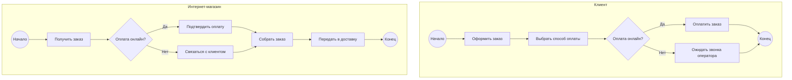
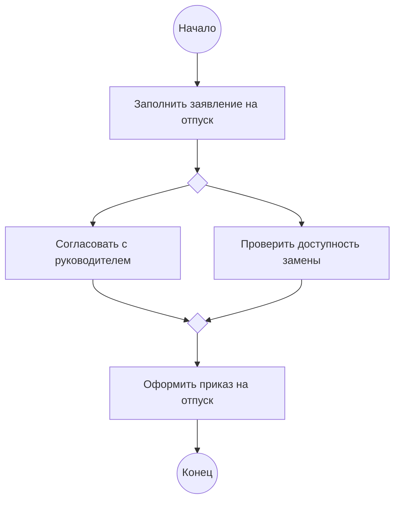

## Введение

Business Process Model and Notation (BPMN) — это стандартная графическая нотация для моделирования бизнес-процессов. Она предоставляет набор символов для изображения бизнес-процессов в виде диаграмм, которые понятны как бизнес-аналитикам, так и техническим специалистам. Основная цель BPMN — создать единый язык для всех участников процесса, от руководителей до разработчиков, что способствует лучшему взаимопониманию и более эффективной оптимизации процессов.

Использование BPMN помогает компаниям визуализировать свои рабочие процессы, выявлять узкие места, определять области для улучшения и автоматизации. Нотация позволяет описывать сложные процессы с высокой степенью детализации, что делает ее мощным инстру-ментом для анализа и реинжиниринга бизнес-процессов.

## Основные концепции с объяснениями

Нотация BPMN включает в себя большое количество элементов, но для начала достаточно освоить основные, которые позволят описывать большинство процессов. К ним относятся пулы и дорожки, события, задачи и шлюзы.

### Пулы и дорожки (Pools and Lanes)

**Пул (Pool)** представляет собой участника процесса. Это может быть как целая организация, так и отдельный клиент или система. Пул является контейнером для одного или нескольких процессов. Когда в диаграмме участвует несколько организаций (например, "Покупатель" и "Продавец"), каждая из них изображается в виде отдельного пула.

**Дорожка (Lane)** — это подразделение внутри пула. Дорожки используются для разграничения ролей, должностей или отделов внутри одной организации. Например, в пуле "Интернет-магазин" могут быть дорожки "Отдел продаж", "Склад" и "Служба доставки". Это позволяет четко определить, кто за какой этап процесса отвечает.

### События (Events)

**События** — это то, что происходит во время процесса. Они влияют на его ход и обозначаются кружками. Существует три основных типа событий:

*   **   **Начальное событие (Start Event):** Показывает, где начинается процесс. Обозначается тонким кружком.*   *   **Промежуточное событие (Intermediate Event):** Происходит между начальным и конечным событиями. Может быть инициировано (например, отправка сообщения) или обрабатывающим (например, получение сообщения). Обозначается двойным кружком.
*   **   **Конечное событие (End Event):** Показывает, где процесс завершается. Обозначается жирным кружком.
События также могут быть типизированными, например, событие-таймер, событие-сообщение, событие-ошибка и т.д.

### Задачи (Tasks)

**Задача (Task)** — это работа, которую необходимо выполнить в рамках процесса. Обозначается прямоугольником с закругленными углами. Задачи могут быть разных типов:

*   **   **Задача-сценарий (Script Task):** Выполняется автоматически с помощью скрипта.*   *   **Задача-пользователь (User Task):** Выполняется человеком с использованием программного обеспечения.
*   **   **Задача-сервис (Service Task):** Выполняется веб-сервисом или другим автоматизированным приложением.*   *   **Задача-отправка сообщения (Send Task):** Отправляет сообщение другому участнику процесса.
*   *   **Задача-получение сообщения (Receive Task):** Ожидает получения сообщения от другого участника.

### Шлюзы (Gateways)

**Шлюзы** — это точки принятия решений в процессе, которые управляют потоками управления. Обозначаются ромбами. Основные типы шлюзов:

*   *   **Эксклюзивный шлюз (Exclusive Gateway):** Разделяет поток на несколько альтернативных путей. Только один из путей может быть выбран. Условия выбора указываются на исходящих потоках.
*   *   **Параллельный шлюз (Parallel Gateway):** Разделяет поток на несколько параллельных путей. Все пути выполняются одновременно.
*   *   **Инклюзивный шлюз (Inclusive Gateway):** Разделяет поток на несколько путей, из которых может быть выбран один или несколько, в зависимости от выполнения условий.

## Практические примеры

### Пример 1: Процесс заказа в интернет-магазине

Этот пример иллюстрирует простой процесс заказа товара в интернет-магазине с использованием основных элементов BPMN.

### Пример 2: Процесс согласования отпуска

Этот пример показывает использование параллельного шлюза для одновременного выполнения двух задач.

## Типичные ошибки и как их избежать

1.  **Неправильное использование шлюзов**: Самая частая ошибка — путать эксклюзивный и параллельный шлюзы. Помните, что эксклюзивный шлюз предполагает выбор *одного* из путей, а параллельный — выполнение *всех* путей.
2.  **Отсутствие конечного события**: Каждый процесс должен иметь хотя бы одно конечное событие. Это показывает, что процесс завершен.
3.  **Слишком сложные диаграммы**: Не стоит пытаться уместить весь процесс на одной диаграмме. Используйте подпроцессы для декомпозиции сложных участков.
4.  **Неправильное именование элементов**: Названия задач, событий и процессов должны быть четкими и понятными. Используйте глаголы для задач (например, "Оформить заказ") и существительные для событий (например, "Заказ получен").

## Связь с другими темами

BPMN тесно связан с такими концепциями, как **управление бизнес-процессами (BPM)**, **архитектура предприятия (Enterprise Architecture)** и **гибкая разработка (Agile)**. BPMN является одним из ключевых инструментов в рамках BPM-инициатив, позволяя анализировать и оптимизировать процессы. В контексте архитектуры предприятия BPMN помогает моделировать бизнес-уровень. В Agile-разработке BPMN-диаграммы могут использоваться для визуализации пользовательских историй и сценариев.

## Заключение

BPMN — это мощный и гибкий инструмент для моделирования бизнес-процессов. Освоение основных элементов нотации — пулов, дорожек, событий, задач и шлюзов — позволяет создавать понятные и информативные диаграммы, которые служат основой для анализа, оптимизации и автоматизации бизнес-процессов. Начиная с простых диаграмм и постепенно усложняя их, вы сможете эффективно применять BPMN для решения широкого круга бизнес-задач.
