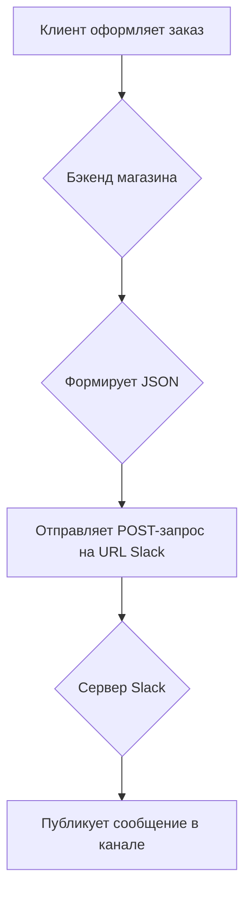

# Callback и Webhook: Полное руководство

## Введение

В мире веб-разработки и API существует множество способов организации взаимодействия между различными компонентами системы. Два из наиболее распространенных, но часто путаемых, — это **коллбэки (callbacks)** и **вебхуки (webhooks)**. Оба механизма позволяют реализовать асинхронное взаимодействие и управлять потоком выполнения кода, но делают это по-разному и для разных целей. В этой статье мы подробно разберем, что такое коллбэки и вебхуки, в чем их ключевые различия, и рассмотрим практические примеры их использования.

## Основные концепции

### Что такое Callback?

**Callback (коллбэк, обратный вызов)** — это функция, которая передается в другую функцию в качестве аргумента и выполняется после завершения основной операции. Это фундаментальный паттерн в асинхронном программировании, особенно в языках вроде JavaScript. Коллбэки позволяют выполнять код не последовательно, а по мере готовности результата, не блокируя при этом основной поток выполнения.

Представьте, что вы заказываете пиццу. Вы делаете заказ (вызываете функцию) и даете свой номер телефона (передаете коллбэк). Вместо того чтобы ждать у двери, вы занимаетесь своими делами. Когда пицца готова, курьер звонит вам (выполняется коллбэк), и вы получаете свой заказ.

### Что такое Webhook?

**Webhook (вебхук, веб-перехватчик)** — это механизм, позволяющий одному веб-приложению или сервису уведомлять другое о наступлении определенных событий в режиме реального времени. По сути, это HTTP-коллбэк. Одно приложение (поставщик) отправляет HTTP-запрос (обычно POST) на заранее определенный URL другого приложения (потребителя) при возникновении события.

Продолжая аналогию с пиццей, вебхук — это как если бы пиццерия сама звонила вам на каждом этапе: "Тесто раскатано", "Пицца в печи", "Курьер выехал". Вы заранее предоставляете свой "URL" (номер телефона), и система автоматически уведомляет вас о всех важных событиях.

### Ключевые различия

| Характеристика | Callback | Webhook |
|---|---|---|
| **Среда выполнения** | В рамках одного приложения или процесса | Между разными веб-сервисами (межсетевое взаимодействие) |
| **Механизм** | Передача функции как аргумента | Отправка HTTP-запроса на URL |
| **Коммуникация** | Внутрипроцессная, синхронная или асинхронная | Межпроцессная, всегда асинхронная |
| **Зависимость от языка** | Языково-зависимый | Языково-независимый (основан на HTTP) |

## Практические примеры

### Пример 1: Синхронный Callback в JavaScript

Коллбэки часто используются для обработки массивов. Например, метод `map` принимает коллбэк-функцию, которая применяется к каждому элементу массива.

```javascript
const numbers = [1, 2, 3, 4, 5];

// Используем стрелочную функцию как коллбэк
const squaredNumbers = numbers.map(number => number * number);

console.log(squaredNumbers); // Вывод: [1, 4, 9, 16, 25]
```

В этом примере `number => number * number` — это коллбэк, который выполняется для каждого элемента массива `numbers`.

### Пример 2: Асинхронный Callback в Node.js

Классический пример асинхронного коллбэка — чтение файла в Node.js. Операция чтения может занять время, и чтобы не блокировать программу, мы передаем коллбэк, который выполнится, когда файл будет прочитан.

```javascript
const fs = require('fs');

fs.readFile('example.txt', 'utf8', (err, data) => {
  if (err) {
    console.error("Ошибка при чтении файла:", err);
    return;
  }
  console.log("Содержимое файла:", data);
});

console.log("Чтение файла инициировано...");
```

Здесь `(err, data) => { ... }` — это коллbэк. Он будет вызван только после завершения операции чтения файла. Сообщение "Чтение файла инициировано..." появится в консоли раньше, чем содержимое файла.

### Пример 3: Webhook для уведомлений в Slack

Предположим, у нас есть интернет-магазин, и мы хотим получать уведомления в Slack о каждом новом заказе. Для этого мы можем использовать вебхуки.

1.  **Настройка в Slack:** В настройках Slack мы создаем "Incoming Webhook" для определенного канала. Slack генерирует для нас уникальный URL.
2.  **Настройка в магазине:** В административной панели нашего магазина мы указываем этот URL в качестве эндпоинта для вебхуков о новых заказах.
3.  **Процесс:**
    *   Клиент оформляет заказ.
    *   Бэкенд нашего магазина формирует JSON-объект с информацией о заказе.
    *   Бэкенд отправляет `POST`-запрос с этим JSON на URL, предоставленный Slack.
    *   Slack получает запрос и публикует отформатированное сообщение в указанном канале.

**Пример диаграммы взаимодействия:**



## Типичные ошибки и как их избежать

### Callback Hell (Ад коллбэков)

При большом количестве вложенных асинхронных операций код может превратиться в так называемый "ад коллбэков" — глубоко вложенную и трудночитаемую структуру.

**Как избежать:**
*   **   **Именование функций:** Вместо анонимных функций используйте именованные.*   *   **Модульность:** Разбивайте код на небольшие, переиспользуемые функции.
*   **   **Промисы (Promises) и Async/Await:** В современном JavaScript для работы с асинхронностью предпочтительнее использовать промисы и синтаксис `async/await`, которые делают код более плоским и читаемым..

### Проблемы с Webhook

*   **   **Потеря данных:** Если ваш сервис-потребитель недоступен в момент отправки вебхука, уведомление может быть потеряно.
    **Решение:** Поставщик вебхуков должен реализовывать механизм повторных отправок (retries) с экспоненциальной задержкой.
*   *   **Безопасность:** Поскольку URL вебхука общедоступен, кто угодно может отправлять на него запросы. 
    **Решение:** Используйте подписи (signatures). Поставщик подписывает каждый запрос с помощью секретного ключа, а потребитель проверяет эту подпись, чтобы убедиться в подлинности запроса.
*   *   **Дублирование событий:** Из-за повторных отправок ваш сервис может получить одно и то же уведомление несколько раз. 
    **Решение:** Делайте обработчики идемпотентными. Например, проверяйте уникальный ID события перед его обработкой.

## Связь с другими темами

*   **   **API и REST:** Вебхуки являются частью архитектуры API и часто используются в связке с REST API для создания более реактивных и эффективных систем.*   *   **Событийно-ориентированная архитектура (EDA):** И коллбэки, и вебхуки являются ключевыми элементами событийно-ориентированной архитектуры, где компоненты системы реагируют на события, а не на прямые команды.
*   *   **Микросервисы:** Вебхуки — популярный способ организации асинхронной коммуникации между микросервисами.

## Заключение

И коллбэки, и вебхуки являются мощными инструментами для управления асинхронными операциями. **Коллбэки** — это фундаментальный паттерн программирования, работающий внутри одного приложения, который позволяет выполнять код по завершении определенной задачи. **Вебхуки** же выводят эту концепцию на уровень межсетевого взаимодействия, позволяя разным веб-сервисам обмениваться информацией о событиях в реальном времени.

Понимание разницы между этими двумя механизмами и умение правильно их применять — ключ к созданию гибких, масштабируемых и эффективных приложений. В то время как современный JavaScript предлагает более элегантные решения для асинхронности, чем "чистые" коллбэки, понимание их работы остается важным для любого разработчика. Вебхуки же продолжают быть стандартом де-факто для интеграции множества SaaS-платформ и построения сложных распределенных систем.
