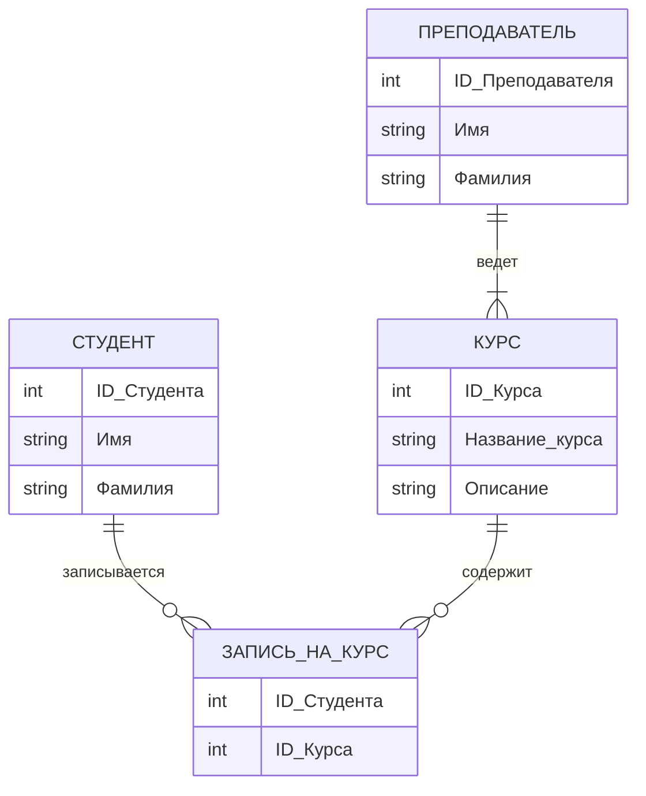
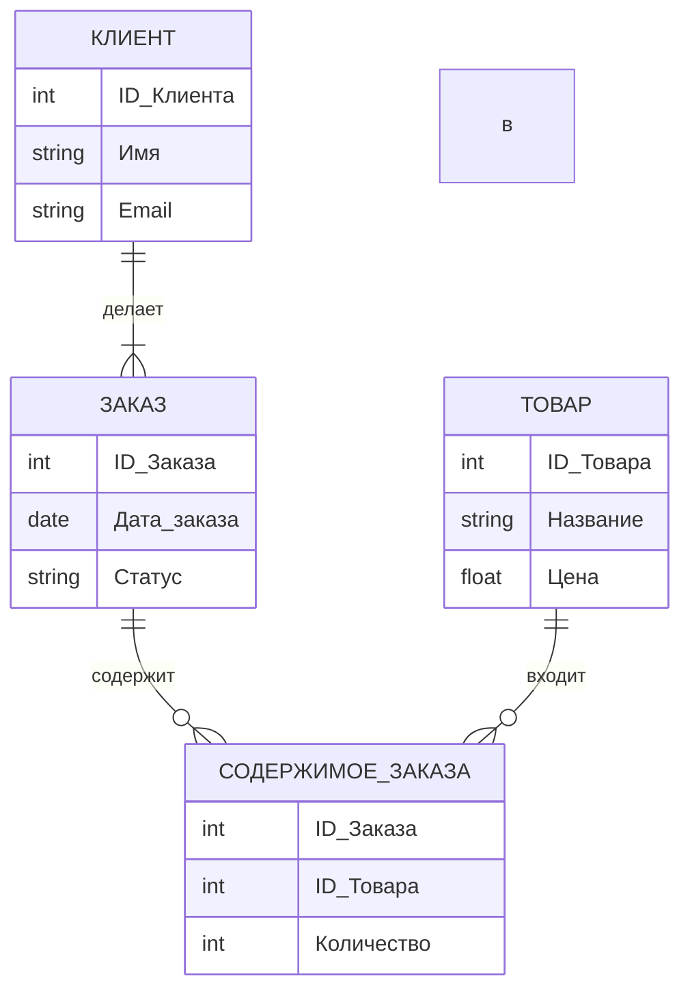

# ERD (Entity-Relationship Diagram): Диаграммы сущность-связь

## Введение

Диаграмма «сущность-связь» (Entity-Relationship Diagram, ERD) — это визуальное представление структуры данных, которое наглядно демонстрирует, как различные «сущности» (например, люди, объекты или концепции) связаны между собой в рамках определенной системы. ER-диаграммы являются фундаментальным инструментом при проектировании и отладке реляционных баз данных, а также находят широкое применение в бизнес-анализе, разработке программного обеспечения и системном проектировании.

Основная цель ER-диаграммы — предоставить ясное и однозначное описание данных, которое будет понятно как техническим специалистам, так и представителям бизнеса. Это достигается за счет использования стандартизированного набора символов для обозначения сущностей, их атрибутов и связей между ними.

## Основные концепции

ER-модель базируется на трех ключевых элементах: сущностях, атрибутах и связях.

### Сущности (Entities)

**Сущность** — это объект, концепция или явление реального мира, информация о котором должна храниться в базе данных. В грамматическом смысле сущности часто соответствуют существительным. Примерами могут служить «Клиент», «Товар», «Заказ».

Существует несколько типов сущностей:

*   **Сильная (независимая) сущность** (Strong/Independent Entity): Существует самостоятельно и не зависит от других сущностей. У каждой сильной сущности есть первичный ключ, который уникально идентифицирует каждый ее экземпляр.
*   **Слабая (зависимая) сущность** (Weak/Dependent Entity): Ее существование зависит от другой (родительской) сущности. У слабой сущности нет собственного первичного ключа, и она идентифицируется через связь с родительской сущностью.
*   **Ассоциативная сущность** (Associative Entity): Используется для реализации связи «многие-ко-многим» между двумя или более сущностями. Она также может иметь собственные атрибуты.

### Атрибуты (Attributes)

**Атрибут** — это свойство или характеристика, описывающая сущность. Например, для сущности «Студент» атрибутами могут быть «Имя», «Фамилия», «Дата рождения».

Атрибуты бывают нескольких видов:

*   **Простой атрибут** (Simple Attribute): Неделимый атрибут, например, «Имя».
*   **Составной атрибут** (Composite Attribute): Атрибут, который можно разделить на несколько более простых, например, «Адрес» можно разбить на «Улицу», «Город», «Индекс».
*   **Однозначный атрибут** (Single-valued Attribute): Может иметь только одно значение, например, «Идентификационный номер».
*   **Многозначный атрибут** (Multi-valued Attribute): Может иметь несколько значений, например, «Номер телефона» (у человека может быть несколько номеров).
*   **Производный атрибут** (Derived Attribute): Его значение можно вычислить на основе значений других атрибутов. Например, «Возраст» можно вычислить из «Даты рождения».

### Связи (Relationships)

**Связь** — это ассоциация между двумя или более сущностями, которая показывает, как они взаимодействуют. В грамматике связи часто соответствуют глаголам. Например, «Студент» *изучает* «Курс».

Важной характеристикой связи является **мощность связи (кардинальность)**, которая определяет количество экземпляров одной сущности, которые могут быть связаны с экземплярами другой сущности:

*   **Один-к-одному (1:1)**: Один экземпляр сущности А связан с одним экземпляром сущности Б (например, «Директор» и «Школа»).
*   **Один-ко-многим (1:M)**: Один экземпляр сущности А связан с несколькими экземплярами сущности Б (например, «Преподаватель» и «Студенты»).
*   **Многие-ко-многим (M:N)**: Несколько экземпляров сущности А связаны с несколькими экземплярами сущности Б (например, «Студенты» и «Курсы»).

## Практические примеры

### Пример 1: Система учета студентов и курсов

Представим простую систему для университета.

**Сущности:**
*   **Студент**
*   **Курс**
*   **Преподаватель**

**Атрибуты:**
*   **Студент**: `ID_Студента` (первичный ключ), `Имя`, `Фамилия`.
*   **Курс**: `ID_Курса` (первичный ключ), `Название_курса`, `Описание`.
*   **Преподаватель**: `ID_Преподавателя` (первичный ключ), `Имя`, `Фамилия`.

**Связи:**
*   **Преподаватель** ведет **Курс** (1:M, один преподаватель может вести много курсов).
*   **Студент** записан на **Курс** (M:N, один студент может быть записан на много курсов, и на одном курсе может быть много студентов). Для реализации этой связи создается ассоциативная сущность **Запись_на_курс** с атрибутами `ID_Студента` и `ID_Курса`.

### Пример 2: Интернет-магазин

*   **Сущности**: `Клиент`, `Заказ`, `Товар`.
*   **Атрибуты**:
    *   `Клиент`: `ID_Клиента` (PK), `Имя`, `Email`.
    *   `Заказ`: `ID_Заказа` (PK), `Дата_заказа`, `Статус`.
    *   `Товар`: `ID_Товара` (PK), `Название`, `Цена`.
*   **Связи**:
    *   `Клиент` *делает* `Заказ` (1:M).
    *   `Заказ` *содержит* `Товар` (M:N, реализуется через ассоциативную сущность `Содержимое_заказа`).

## Типичные ошибки и как их избежать

1.  **Неправильное определение связей**: Часто путают связи 1:M и M:N. Важно тщательно анализировать бизнес-правила. Если сомневаетесь, задайте вопрос: «Может ли один экземпляр А быть связан с несколькими Б? А наоборот?».
2.  **Избыточные связи**: Иногда можно выразить связь через другие, уже существующие связи. Это усложняет схему. Старайтесь оставлять только необходимые связи.
3.  **Отсутствие нормализации**: ER-диаграмма должна приводить к хорошо нормализованной базе данных. Избегайте дублирования данных и создавайте сущности, которые описывают одну и только одну концепцию.
4.  **Смешение концептуального и физического уровней**: На начальных этапах проектирования не стоит задумываться о типах данных и индексах. Сначала создается концептуальная модель, затем логическая, и только потом — физическая.

## Связь с другими темами

*   **DFD (Data Flow Diagram)**: Если ERD показывает статическую структуру данных, то DFD (диаграмма потоков данных) демонстрирует, как данные перемещаются и преобразуются в системе. Они дополняют друг друга: ERD — это «что», а DFD — это «как».
*   **UML (Unified Modeling Language)**: ER-диаграммы являются частью UML и тесно связаны с диаграммами классов. Диаграммы классов в UML используются в объектно-ориентированном анализе и проектировании и могут включать не только данные, но и поведение (методы).

## Заключение

ER-диаграммы — это мощный и универсальный инструмент для моделирования данных. Они помогают структурировать информацию, выявлять взаимосвязи и создавать эффективные и надежные базы данных. Понимание основных концепций ER-моделирования является ключевым навыком для любого системного аналитика, разработчика баз данных или архитектора программного обеспечения. Правильно построенная ER-диаграмма служит прочным фундаментом для всей информационной системы, обеспечивая ее логическую целостность и масштабируемость.
