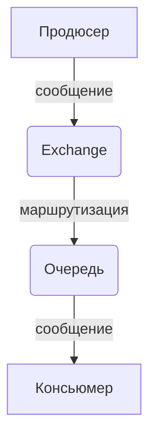
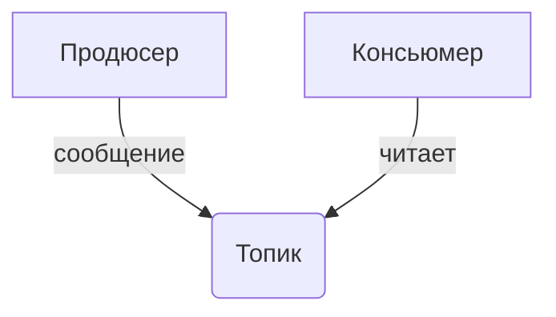

## Введение

В мире распределенных систем и микросервисной архитектуры, где приложения и сервисы должны эффективно обмениваться данными, брокеры сообщений играют ключевую роль. Они выступают в качестве посредников, обеспечивая надежную и асинхронную передачу информации между различными компонентами системы. Это позволяет создавать гибкие, масштабируемые и отказоустойчивые приложения.

В этой статье мы подробно рассмотрим двух самых популярных брокеров сообщений: **Apache Kafka** и **RabbitMQ**. Мы разберем их основные концепции, архитектурные особенности, сравним их сильные и слабые стороны, а также рассмотрим практические примеры использования. Цель этой статьи — дать как начинающим, так и опытным разработчикам и системным аналитикам глубокое понимание того, как работают эти технологии и в каких сценариях их лучше применять.

## Основные концепции

Чтобы понять, как работают брокеры сообщений, необходимо ознакомиться с несколькими ключевыми концепциями.

### Базовые компоненты

* **Продюсер (Producer):** Приложение, которое отправляет сообщения в брокер.
* **Консьюмер (Consumer) / Потребитель:** Приложение, которое получает (потребляет) сообщения из брокера.
* **Сообщение (Message):** Единица данных, которую продюсер отправляет, а консьюмер получает. Сообщение обычно состоит из заголовка (headers) и тела (body).
* **Очередь (Queue):** Структура данных, в которой хранятся сообщения в порядке их поступления (FIFO - First-In-First-Out). Сообщения находятся в очереди до тех пор, пока их не заберет консьюмер.
* **Топик (Topic):** Именованный канал для сообщений. В отличие от очередей, где одно сообщение обрабатывается одним консьюмером, в топики сообщения могут доставляться множеству подписчиков.
### RabbitMQ: "Умный брокер"

RabbitMQ — это классический брокер сообщений, который реализует протокол AMQP (Advanced Message Queuing Protocol). Его часто называют "умным брокером", потому что он берет на себя значительную часть логики по маршрутизации и доставке сообщений.

**Ключевые компоненты RabbitMQ:**

* **Exchange (Обменник):** Получает сообщения от продюсеров и направляет их в одну или несколько очередей. Тип обменника определяет логику маршрутизации:
    * **Direct:** Отправляет сообщение в очередь, ключ маршрутизации которой в точности совпадает с ключом маршрутизации сообщения.
    * **Fanout:** Отправляет сообщение во все связанные с ним очереди, игнорируя ключ маршрутизации.
    * **Topic:** Отправляет сообщение в очереди, ключ маршрутизации которых соответствует шаблону, заданному в ключе маршрутизации сообщения.
    * **Headers:** Использует заголовки сообщения для маршрутизации.
* **Binding (Связывание):** Правило, которое связывает обменник с очередью.
**Принцип работы:** Продюсер отправляет сообщение в обменник. Обменник, в зависимости от своего типа и правил связывания, перенаправляет сообщение в соответствующие очереди. Консьюмеры подписываются на очереди и получают из них сообщения. RabbitMQ использует **push-модель**, активно отправляя сообщения консьюмерам.

### Apache Kafka: "Глупый брокер, умный потребитель"

Kafka — это распределенная платформа для потоковой передачи данных. Ее часто описывают как "глупый брокер, умный потребитель", поскольку брокер в основном отвечает за хранение данных, а большая часть логики (например, отслеживание прочитанных сообщений) ложится на плечи консьюмеров.

**Ключевые компоненты Kafka:**

* **Топик (Topic):** В Kafka топики являются основной единицей хранения. Они разделены на **партиции (partitions)**.
* **Партиция (Partition):** Упорядоченный, неизменяемый лог сообщений. Каждое сообщение в партиции имеет уникальный идентификатор — **офсет (offset)**.
* **Офсет (Offset):** Порядковый номер сообщения в партиции. Консьюмеры сами отслеживают офсеты, чтобы знать, какие сообщения они уже прочитали.
* **Группа консьюмеров (Consumer Group):** Несколько консьюмеров, которые совместно читают данные из одного или нескольких топиков. Kafka гарантирует, что каждое сообщение из партиции будет доставлено только одному консьюмеру в рамках одной группы.

**Принцип работы:** Продюсеры отправляют сообщения в топики. Сообщения распределяются по партициям (по умолчанию, по принципу Round-robin, либо на основе ключа сообщения). Консьюмеры, объединенные в группы, используют **pull-модель**, самостоятельно запрашивая новые сообщения из топиков. Они сами отслеживают свой прогресс чтения с помощью офсетов. Сообщения в Kafka не удаляются после прочтения и могут храниться в течение длительного времени, что позволяет многократно их перечитывать.

## Практические примеры

Рассмотрим простые примеры использования RabbitMQ и Kafka на языке Python.

### Пример 1: RabbitMQ — простая очередь

В этом примере мы создадим простого продюсера, который отправляет сообщение в очередь, и консьюмера, который это сообщение получает.

**Диаграмма:**



**Код продюсера (publisher.py):**

```python
import pika

connection = pika.BlockingConnection(pika.ConnectionParameters('localhost'))
channel = connection.channel()

channel.queue_declare(queue='hello')

channel.basic_publish(exchange='', # default exchange
                      routing_key='hello',
                      body='Hello World!')
print(" [x] Sent 'Hello World!'")
connection.close()
```

**Код консьюмера (consumer.py):**

```python
import pika

connection = pika.BlockingConnection(pika.ConnectionParameters('localhost'))
channel = connection.channel()

channel.queue_declare(queue='hello')

def callback(ch, method, properties, body):
    print(f" [x] Received {body}")

channel.basic_consume(queue='hello',
                      on_message_callback=callback,
                      auto_ack=True)

print(' [*] Waiting for messages. To exit press CTRL+C')
channel.start_consuming()
```

### Пример 2: Kafka — простой топик

Аналогичный пример для Kafka. Продюсер отправляет сообщение в топик, а консьюмер его читает.

**Диаграмма:**



**Код продюсера (producer.py):**

```python
from kafka import KafkaProducer

producer = KafkaProducer(bootstrap_servers='localhost:9092')

producer.send('my-topic', b'Hello, Kafka!')
producer.flush()
print(" [x] Sent 'Hello, Kafka!'")
```

**Код консьюмера (consumer.py):**

```python
from kafka import KafkaConsumer

consumer = KafkaConsumer('my-topic', bootstrap_servers='localhost:9092')

for message in consumer:
    print(f" [x] Received {message.value}")
```

## Типичные ошибки и как их избежать

При работе с брокерами сообщений разработчики часто сталкиваются с одними и теми же проблемами. Рассмотрим наиболее распространенные из них.

### 1. Неправильный выбор брокера

**Ошибка:** Выбор Kafka для простых задач, где достаточно RabbitMQ, или наоборот, использование RabbitMQ в высоконагруженных системах, требующих потоковой обработки данных.

**Как избежать:** Тщательно анализируйте требования вашего проекта.

* **RabbitMQ** отлично подходит для задач, требующих сложной маршрутизации, и для систем с относительно невысокой нагрузкой, где важна гарантированная доставка и простота настройки.
* **Kafka** — ваш выбор, если речь идет о больших потоках данных (сотни тысяч сообщений в секунду), аналитике в реальном времени, логировании и системах, где данные нужно перечитывать многократно.

### 2. Отсутствие идемпотентности у консьюмеров

**Ошибка:** Консьюмер обрабатывает одно и то же сообщение несколько раз (например, из-за сбоя и повторной доставки), что приводит к дублированию данных или некорректным операциям (например, повторное списание средств).

**Как избежать:** Проектируйте консьюмеры идемпотентными. Это означает, что повторная обработка одного и того же сообщения не должна изменять состояние системы. Для этого можно использовать уникальные идентификаторы сообщений и проверять, не было ли сообщение обработано ранее.

### 3. Неправильная настройка партиций в Kafka

**Ошибка:** Недостаточное или избыточное количество партиций в топике. Малое количество партиций ограничивает параллелизм и пропускную способность. Слишком большое — увеличивает нагрузку на брокеры и может привести к задержкам.

**Как избежать:** Количество партиций должно соответствовать количеству консьюмеров в группе для максимального параллелизма. Планируйте масштабирование заранее и учитывайте ожидаемую нагрузку. Начать можно с небольшого количества и увеличивать по мере необходимости.

### 4. Блокирующие операции в консьюмерах

**Ошибка:** Выполнение длительных, блокирующих операций (например, сложные вычисления, долгие запросы к базе данных или внешним API) в коде консьюмера. Это замедляет обработку сообщений и может привести к "зависанию" всей очереди или партиции.

**Как избежать:** Используйте асинхронные подходы. Если необходимо выполнить длительную операцию, выносите ее в отдельный поток или процесс, а консьюмер должен лишь быстро принять сообщение и поставить задачу на выполнение.

## Связь с другими темами

Брокеры сообщений тесно связаны с несколькими важными концепциями и технологиями в современной разработке программного обеспечения.

* **Микросервисная архитектура:** Брокеры являются одним из основных способов организации асинхронного взаимодействия между микросервисами. Они позволяют сервисам быть слабосвязанными, что упрощает их независимую разработку, развертывание и масштабирование.

* **Событийно-ориентированная архитектура (Event-Driven Architecture, EDA):** В этой архитектуре компоненты системы реагируют на события. Брокеры сообщений, особенно Kafka, являются ядром таких систем, выступая в роли центральной шины событий, через которую сервисы обмениваются информацией о произошедших событиях.

* **Большие данные (Big Data) и потоковая обработка:** Kafka была изначально разработана в LinkedIn для обработки огромных потоков данных. Она идеально подходит для сбора, хранения и обработки логов, метрик, данных с IoT-устройств и других потоковых данных в реальном времени.

* **CQRS (Command Query Responsibility Segregation):** В системах, использующих паттерн CQRS, брокеры сообщений могут использоваться для асинхронной передачи обновлений от "командной" части системы к "запрос-ной".

## Заключение

И RabbitMQ, и Kafka являются мощными инструментами для построения распределенных систем, но они решают разные задачи и основаны на разных принципах.

**RabbitMQ** — это надежный, гибкий и относительно простой в освоении брокер сообщений, который отлично подходит для традиционных задач, требующих сложной маршрутизации и гарантированной доставки в системах с умеренной нагрузкой. Его "умная" природа упрощает разработку консьюмеров.

**Kafka**, с другой стороны, — это высокопроизводительная, масштабируемая платформа для потоковой обработки данных, созданная для работы с огромными объемами информации в реальном времени. Ее архитектура "глупого брокера" и "умного потребителя" обеспечивает невероятную пропускную способность и отказоустойчивость, но требует более сложной логики на стороне клиентов.

Выбор между ними зависит исключительно от требований вашего проекта. Понимание их фундаментальных различий в архитектуре и принципах работы — ключ к построению эффективной и надежной системы. Надеемся, эта статья помогла вам разобраться в мире брокеров сообщений и сделать правильный выбор.
