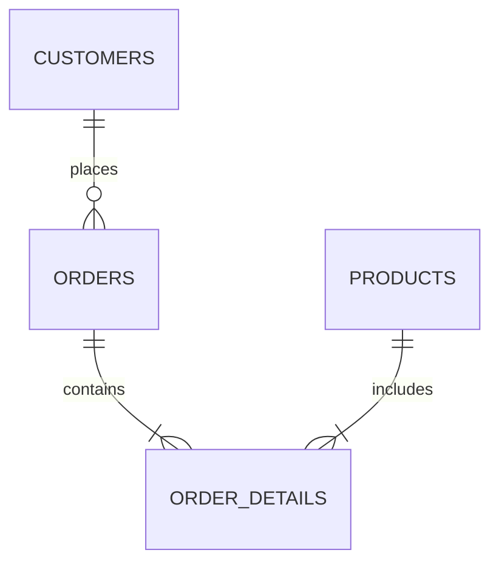

## Введение: что такое нормализация и зачем она нужна?

Нормализация баз данных — это процесс организации данных в реляционной базе данных с целью уменьшения избыточности и улучшения целостности данных. Проще говоря, это набор правил и рекомендаций, которые помогают структурировать таблицы и связи между ними таким образом, чтобы избежать дублирования информации и потенциальных ошибок при работе с данными. Основная цель нормализации — создать логичную, эффективную и надежную структуру базы данных.

Представьте, что вы храните информацию о клиентах и их заказах в одной большой таблице. Если один клиент делает несколько заказов, его личные данные (имя, адрес, телефон) будут повторяться в каждой строке, соответствующей его заказу. Это не только занимает лишнее место, но и создает проблемы при обновлении информации. Если клиент сменит адрес, вам придется найти и обновить все строки с его заказами. Если вы пропустите хотя бы одну, в базе данных возникнет противоречие. Нормализация помогает решить подобные проблемы, разделяя данные на несколько связанных таблиц.

## Основные концепции и нормальные формы

Процесс нормализации основан на концепции **нормальных форм**. Каждая нормальная форма представляет собой набор критериев, которым должна удовлетворять структура таблицы. Всего существует несколько нормальных форм, но на практике чаще всего используются первые три, а также нормальная форма Бойса-Кодда (BCNF).

### Первая нормальная форма (1НФ)

**Определение:** Таблица находится в первой нормальной форме, если все ее атрибуты (столбцы) являются атомарными, то есть содержат только одно значение, а не списки или множества.

**Объяснение:** Это самое базовое требование. Каждая ячейка таблицы должна содержать одно и только одно значение. Например, нельзя в одном поле хранить несколько телефонных номеров или список заказанных товаров.

### Вторая нормальная форма (2НФ)

**Определение:** Таблица находится во второй нормальной форме, если она находится в 1НФ и каждый неключевой атрибут полностью функционально зависит от первичного ключа.

**Объяснение:** Это правило актуально для таблиц с составным первичным ключом (ключом, состоящим из нескольких столбцов). Оно означает, что все неключевые столбцы должны зависеть от *всего* составного ключа, а не от его части. Если какой-то столбец зависит только от части ключа, его следует вынести в отдельную таблицу.

### Третья нормальная форма (3НФ)

**Определение:** Таблица находится в третьей нормальной форме, если она находится в 2НФ и все ее атрибуты зависят только от первичного ключа и не имеют транзитивных зависимостей.

**Объяснение:** Транзитивная зависимость возникает, когда неключевой столбец зависит от другого неключевого столбца, который, в свою очередь, зависит от первичного ключа. Такие зависимости также приводят к избыточности и аномалиям, поэтому их следует устранять, вынося зависимые данные в отдельную таблицу.

### Нормальная форма Бойса-Кодда (BCNF)

**Определение:** Усиленная версия 3НФ. Таблица находится в BCNF, если для каждой нетривиальной функциональной зависимости `X -> Y`, `X` является суперключом (потенциальным ключом).

**Объяснение:** BCNF устраняет некоторые аномалии, которые могут остаться в таблицах, находящихся в 3НФ, особенно в случаях с несколькими пересекающимися составными ключами.

## Практические примеры

Рассмотрим процесс нормализации на примере базы данных для учета книг в библиотеке.

### Пример 1: Приведение к 1НФ

Изначально у нас есть одна таблица, где мы пытаемся хранить всю информацию:

**Таблица `Library` (не в 1НФ)**

| BookID | Title | Authors | Genre | Borrower | BorrowDate |
|---|---|---|---|---|---|
| 1 | Война и мир | Л.Н. Толстой, редактор А.А. Петров | Роман | Иван Иванов | 2024-01-15 |
| 2 | Мастер и Маргарита | М.А. Булгаков | Роман | Петр Петров | 2024-01-20 |
| 3 | 1984 | Дж. Оруэлл | Антиутопия | Иван Иванов | 2024-02-01 |

Здесь в столбце `Authors` у книги "Война и мир" указано два автора. Это нарушение 1НФ. Чтобы это исправить, мы должны создать отдельные строки для каждого автора, но это приведет к дублированию. Правильный подход — создать отдельную таблицу для авторов и связать ее с книгами.

**Приведенные к 1НФ таблицы:**

**Таблица `Books`**

| BookID | Title | Genre |
|---|---|---|
| 1 | Война и мир | Роман |
| 2 | Мастер и Маргарита | Роман |
| 3 | 1984 | Антиутопия |

**Таблица `BookAuthors`**

| BookID | Author |
|---|---|
| 1 | Л.Н. Толстой |
| 1 | А.А. Петров (редактор) |
| 2 | М.А. Булгаков |
| 3 | Дж. Оруэлл |

### Пример 2: Приведение к 2НФ и 3НФ

Теперь рассмотрим таблицу заказов, где первичный ключ является составным: (`OrderID`, `ProductID`).

**Таблица `OrderDetails` (в 1НФ, но не в 2НФ)**

| OrderID | ProductID | ProductName | Quantity | CustomerID | CustomerName |
|---|---|---|---|---|---|
| 101 | 12 | Ноутбук | 1 | 1 | Иван Иванов |
| 101 | 15 | Мышь | 2 | 1 | Иван Иванов |
| 102 | 12 | Ноутбук | 1 | 2 | Петр Петров |

Здесь `ProductName` зависит только от `ProductID` (часть ключа), а `CustomerName` зависит от `CustomerID`, который вообще не является частью ключа. Это нарушение 2НФ и 3НФ.

**Приведение к 2НФ:** Выносим `ProductName` в таблицу `Products`.

**Таблица `OrderDetails_2NF`**

| OrderID | ProductID | Quantity | CustomerID | CustomerName |
|---|---|---|---|---|
| 101 | 12 | 1 | 1 | Иван Иванов |
| 101 | 15 | 2 | 1 | Иван Иванов |
| 102 | 12 | 1 | 2 | Петр Петров |

**Таблица `Products`**

| ProductID | ProductName |
|---|---|
| 12 | Ноутбук |
| 15 | Мышь |

**Приведение к 3НФ:** Теперь у нас осталась транзитивная зависимость: `OrderID -> CustomerID -> CustomerName`. Выносим `CustomerName` в таблицу `Customers`.

**Итоговые таблицы в 3НФ:**

**Таблица `Orders`**

| OrderID | CustomerID |
|---|---|
| 101 | 1 |
| 102 | 2 |

**Таблица `OrderDetails`**

| OrderID | ProductID | Quantity |
|---|---|---|
| 101 | 12 | 1 |
| 101 | 15 | 2 |

**Таблица `Products`**

| ProductID | ProductName |
|---|---|
| 12 | Ноутбук |
| 15 | Мышь |

**Таблица `Customers`**

| CustomerID | CustomerName |
|---|---|
| 1 | Иван Иванов |
| 2 | Петр Петров |

Такая структура исключает избыточность и аномалии обновления.

### Пример 3: Диаграмма связей (ER-диаграмма)

После нормализации наша схема базы данных для библиотеки может выглядеть так:

Эта диаграмма наглядно показывает, как таблицы связаны между собой. `CUSTOMERS` и `ORDERS` имеют связь "один ко многим" (один клиент может сделать много заказов). `ORDERS` и `ORDER_DETAILS` также связаны "один ко многим". `PRODUCTS` и `ORDER_DETAILS` тоже.

## Типичные ошибки и как их избежать

1.  **Избыточная нормализация (Over-normalization):** Иногда разработчики увлекаются и разбивают таблицы на слишком мелкие части. Это может усложнить запросы (потребуется слишком много `JOIN`'ов) и снизить производительность. Важно найти баланс между устранением избыточности и сложностью схемы.
2.  **Недостаточная нормализация (Under-normalization):** Обратная ситуация, когда в таблицах остается избыточность, что приводит к аномалиям данных. Чаще всего это происходит из-за неполного анализа зависимостей между данными.
3.  **Неправильный выбор первичных ключей:** Выбор неудачного первичного ключа может усложнить связи между таблицами и привести к проблемам с производительностью. Ключи должны быть уникальными, стабильными и простыми.

**Как избежать:**

*   **Тщательно анализируйте данные:** Перед проектированием схемы поймите, какие сущности есть в вашей предметной области и как они связаны.
*   **Соблюдайте баланс:** Не стремитесь к самой высокой нормальной форме, если это не оправдано. Для большинства приложений достаточно 3НФ.
*   **Рассмотрите денормализацию:** В некоторых случаях, особенно в высоконагруженных системах или для аналитических запросов, намеренная денормализация (объединение таблиц) может повысить производительность. Но делать это нужно осознанно, понимая возможные риски.

## Связь с другими темами

*   **Проектирование баз данных:** Нормализация — это неотъемлемая часть процесса проектирования реляционных баз данных.
*   **SQL и запросы:** Структура базы данных напрямую влияет на то, как вы будете писать SQL-запросы. Хорошо нормализованная база данных обычно требует более сложных запросов с `JOIN`'ами, но обеспечивает целостность данных.
*   **NoSQL базы данных:** В отличие от реляционных баз данных, многие NoSQL базы (например, документо-ориентированные) используют денормализованные структуры данных для повышения скорости чтения. Выбор между SQL и NoSQL часто зависит от приоритетов: целостность данных против производительности и гибкости.

## Заключение

Нормализация — это мощный инструмент в арсенале разработчика баз данных. Она позволяет создавать надежные, масштабируемые и эффективные структуры данных, избегая многих распространенных проблем. Хотя процесс нормализации может показаться сложным на первый взгляд, понимание его основных принципов и нормальных форм является ключевым навыком для любого, кто работает с реляционными базами данных. Главное — подходить к процессу вдумчиво, анализировать зависимости данных и находить правильный баланс для конкретной задачи.
