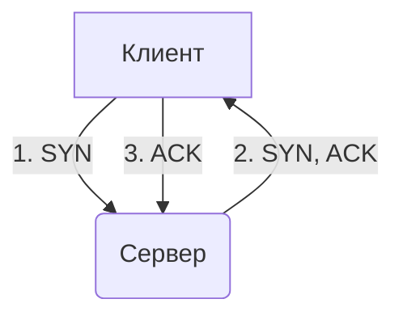

## Введение

В мире, где цифровые технологии пронизывают каждый аспект нашей жизни, передача данных является фундаментальным процессом. От отправки простого электронного письма до просмотра потокового видео в высоком разрешении — все это было бы невозможно без стандартизированных правил, известных как **протоколы передачи данных**. Эти протоколы представляют собой набор соглашений, которые определяют, как данные форматируются, передаются, принимаются и обрабатываются в сети. Они обеспечивают надежное и эффективное взаимодействие между различными устройствами, независимо от их производителя, операционной системы или местоположения.

Представьте себе, что вы пытаетесь отправить посылку в другую страну. Вам необходимо знать не только адрес получателя, но и правила почтовой службы: как упаковать посылку, какие документы приложить, какой язык использовать для написания адреса. Протоколы передачи данных выполняют аналогичную функцию в цифровом мире, предоставляя четкие инструкции для каждого этапа "путешествия" информации от отправителя к получателю. В этой статье мы подробно рассмотрим ключевые протоколы, лежащие в основе современного Интернета: TCP/IP, UDP, HTTP и HTTPS. Мы разберем их основные концепции, рассмотрим практические примеры использования, обсудим типичные ошибки и их связь с другими областями IT.

## Основные концепции

Чтобы понять, как работает Интернет, необходимо разобраться в его базовых протоколах. Их можно представить в виде стека или модели, где каждый уровень выполняет свою специфическую задачу, взаимодействуя с уровнями выше и ниже. Наиболее известной моделью является **TCP/IP**.

### Модель TCP/IP

Модель TCP/IP (Transmission Control Protocol/Internet Protocol) — это набор протоколов, который является стандартом для передачи данных в Интернете. Она состоит из четырех уровней:

1.  **Канальный уровень (Link Layer):** Самый низкий уровень, отвечающий за физическую передачу данных по среде передачи (например, Ethernet, Wi-Fi). Он преобразует цифровые данные в электрические сигналы, световые импульсы или радиоволны.
2.  **Сетевой уровень (Internet Layer):** Здесь работает **IP (Internet Protocol)**. Его основная задача — маршрутизация пакетов данных от источника к получателю через одну или несколько сетей. IP добавляет к данным заголовок с IP-адресами отправителя и получателя, подобно тому, как на конверт наклеивают марки с адресами.
3.  **Транспортный уровень (Transport Layer):** На этом уровне работают два ключевых протокола: **TCP (Transmission Control Protocol)** и **UDP (User Datagram Protocol)**. Они отвечают за установление соединения и управление потоком данных между двумя хостами.
4.  **Прикладной уровень (Application Layer):** Верхний уровень, с которым напрямую взаимодействуют приложения. Здесь работают такие протоколы, как **HTTP (HyperText Transfer Protocol)**, **HTTPS (HyperText Transfer Protocol Secure)**, FTP (File Transfer Protocol), SMTP (Simple Mail Transfer Protocol) и другие. Они определяют, как приложения обмениваются данными.

### TCP (Transmission Control Protocol)

**TCP** — это протокол, ориентированный на соединение. Это означает, что перед началом передачи данных он устанавливает надежное соединение между отправителем и получателем с помощью процесса, называемого **трехэтапным рукопожатием (three-way handshake)**:

1.  Клиент отправляет серверу сегмент с флагом `SYN` (synchronize).
2.  Сервер отвечает сегментом с флагами `SYN` и `ACK` (acknowledgment).
3.  Клиент подтверждает получение, отправляя сегмент с флагом `ACK`.

После этого соединение считается установленным. TCP гарантирует доставку данных в правильном порядке и без потерь. Если какой-либо пакет данных теряется в пути, TCP запрашивает его повторную отправку. Это делает его идеальным для приложений, где важна целостность данных, например, для загрузки файлов, электронной почты и просмотра веб-страниц.

### UDP (User Datagram Protocol)

**UDP** — это протокол без установления соединения. Он просто отправляет пакеты данных (датаграммы) получателю, не заботясь о том, дошли ли они, и в каком порядке. UDP не выполняет рукопожатий и не отслеживает состояние соединения. Это делает его значительно быстрее и эффективнее, чем TCP, но менее надежным.

UDP используется в приложениях, где скорость важнее надежности. Классические примеры — это потоковое видео и аудио, онлайн-игры и VoIP (голосовая связь через Интернет). В этих случаях потеря нескольких пакетов данных не так критична, как задержка, вызванная повторной передачей.

### HTTP (HyperText Transfer Protocol)

**HTTP** — это протокол прикладного уровня, который является основой для передачи данных во Всемирной паутине. Он работает по принципу "запрос-ответ". Клиент (обычно веб-браузер) отправляет HTTP-запрос на сервер, а сервер возвращает HTTP-ответ, который может содержать HTML-страницу, изображение, видео или другие данные.

Основные методы HTTP-запросов:

*   `GET`: Запрос на получение ресурса.
*   `POST`: Отправка данных на сервер для создания нового ресурса (например, отправка формы).
*   `PUT`: Обновление существующего ресурса.
*   `DELETE`: Удаление ресурса.

### HTTPS (HyperText Transfer Protocol Secure)

**HTTPS** — это безопасная версия HTTP. Он использует шифрование для защиты данных, передаваемых между клиентом и сервером. Это достигается за счет использования протокола **TLS (Transport Layer Security)** или его предшественника **SSL (Secure Sockets Layer)**, которые работают между прикладным и транспортным уровнями.

Когда вы заходите на сайт по HTTPS, происходит следующее:

1.  Браузер запрашивает у сервера его SSL-сертификат.
2.  Браузер проверяет подлинность сертификата у центра сертификации (CA).
3.  Если сертификат действителен, браузер и сервер устанавливают зашифрованное соединение с помощью асимметричного и симметричного шифрования.

HTTPS необходим для защиты конфиденциальной информации, такой как пароли, данные кредитных карт и личная переписка. Сегодня он является стандартом для большинства веб-сайтов.

## Практические примеры

Теория протоколов становится гораздо понятнее, когда мы видим их в действии. Рассмотрим несколько практических примеров.

### Пример 1: Трехэтапное рукопожатие TCP

Как мы уже упоминали, TCP устанавливает соединение с помощью трехэтапного рукопожатия. Этот процесс можно проиллюстрировать следующей диаграммой:



*   **Шаг 1:** Клиент инициирует соединение, отправляя пакет с флагом `SYN` (synchronize). Этот пакет, по сути, говорит: "Привет, я хочу установить соединение".
*   **Шаг 2:** Сервер, получив `SYN`-пакет, отвечает своим пакетом, который содержит флаги `SYN` и `ACK` (acknowledgment). Это означает: "Я тоже готов установить соединение, и я подтверждаю получение твоего запроса".
*   **Шаг 3:** Клиент получает `SYN/ACK`-пакет от сервера и отправляет в ответ свой `ACK`-пакет. Этот пакет завершает установку соединения, говоря: "Отлично, соединение установлено!".

После этого оба устройства готовы к обмену данными.

### Пример 2: Простой HTTP GET-запрос с помощью Python

Давайте посмотрим, как можно сделать простой HTTP-запрос на получение веб-страницы с помощью языка программирования Python и библиотеки `requests`. Этот код отправит `GET`-запрос на сайт `example.com` и выведет код состояния ответа и первые 150 символов содержимого страницы.

```python
import requests

try:
    # Отправляем GET-запрос на указанный URL
    response = requests.get('http://example.com')

    # Проверяем, успешен ли запрос (код состояния 200)
    if response.status_code == 200:
        print(f"Успешный запрос! Код состояния: {response.status_code}")
        print("\nСодержимое страницы (первые 150 символов):")
        print(response.text[:150])
    else:
        print(f"Ошибка! Код состояния: {response.status_code}")

except requests.exceptions.RequestException as e:
    print(f"Произошла ошибка при выполнении запроса: {e}")
```

Этот простой пример демонстрирует основной принцип работы HTTP: клиент (наш скрипт) отправляет запрос, а сервер (`example.com`) возвращает ответ.

### Пример 3: Разница между HTTP и HTTPS

Основное различие между HTTP и HTTPS заключается в шифровании. При использовании HTTP данные передаются в открытом виде, и любой, кто перехватит трафик, сможет их прочитать. HTTPS добавляет слой шифрования (TLS/SSL), который защищает данные от перехвата.

Представим это в виде схемы:

**HTTP (незащищенное соединение):**
```
[Ваш компьютер] <--> [Интернет] <--> [Веб-сервер]
   (Данные в открытом виде)
```

**HTTPS (защищенное соединение):**
```
[Ваш компьютер] <==> [Интернет] <==> [Веб-сервер]
   (Данные зашифрованы)
```

При использовании HTTPS злоумышленник, перехвативший ваш трафик, увидит лишь бессмысленный набор символов, так как у него не будет ключа для расшифровки.

## Типичные ошибки и как их избежать

При работе с сетевыми протоколами как начинающие, так и опытные разработчики могут столкнуться с рядом типичных проблем.

1.  **Неправильный выбор между TCP и UDP.**
    *   **Ошибка:** Использование TCP для приложений, требующих низкой задержки (например, онлайн-игры), что приводит к лагам из-за повторной отправки пакетов. Или, наоборот, использование UDP для передачи критически важных данных (например, финансовых транзакций), что может привести к их потере.
    *   **Решение:** Четко понимать требования вашего приложения. Если важна надежность и целостность данных — выбирайте TCP. Если приоритет — скорость и минимальная задержка, а потеря небольшого количества данных допустима — используйте UDP.

2.  **Игнорирование HTTPS.**
    *   **Ошибка:** Передача конфиденциальных данных (пароли, личная информация) по HTTP. Это делает их уязвимыми для перехвата.
    *   **Решение:** Всегда использовать HTTPS для сайтов и приложений, которые обрабатывают любую чувствительную информацию. В современном вебе HTTPS является стандартом де-факто для всех сайтов, даже если они не собирают данные пользователей.

3.  **Проблемы с CORS (Cross-Origin Resource Sharing).**
    *   **Ошибка:** При разработке веб-приложений часто возникает ситуация, когда фронтенд, загруженный с одного домена, пытается сделать AJAX-запрос к бэкенду на другом домене. По умолчанию браузеры блокируют такие запросы из соображений безопасности.
    *   **Решение:** Настроить на сервере (бэкенде) правильные заголовки CORS, которые разрешают запросы с определенных доменов. Например, заголовок `Access-Control-Allow-Origin: https://your-frontend-domain.com`.

4.  **Неправильная обработка кодов состояния HTTP.**
    *   **Ошибка:** Клиентское приложение не обрабатывает или неправильно интерпретирует коды состояния HTTP, возвращаемые сервером. Например, игнорирование кодов ошибок `4xx` (ошибки клиента) и `5xx` (ошибки сервера) может привести к некорректному поведению приложения.
    *   **Решение:** Реализовать в клиентском коде логику для обработки различных кодов состояния. Например, при получении кода `401 Unauthorized` перенаправлять пользователя на страницу входа, а при `500 Internal Server Error` — показывать сообщение об ошибке и предлагать повторить попытку позже.

## Связь с другими темами

Протоколы передачи данных тесно связаны с множеством других областей в IT. Понимание этой связи помогает увидеть общую картину и глубже освоить смежные дисциплины.

*   **Сетевая безопасность:** Протоколы, особенно HTTPS, играют центральную роль в обеспечении безопасности. Знание уязвимостей протоколов (например, атак типа "человек посередине" на HTTP) необходимо для построения защищенных систем. Темы, такие как брандмауэры, VPN и системы обнаружения вторжений (IDS), напрямую связаны с анализом и фильтрацией трафика на уровне протоколов TCP/IP.

*   **Веб-разработка:** Для фронтенд- и бэкенд-разработчиков понимание HTTP/HTTPS является обязательным. Это включает в себя знание методов запросов, кодов состояния, заголовков, cookies и принципов RESTful API. Производительность веб-сайтов также сильно зависит от правильного использования протоколов, например, от применения HTTP/2 или HTTP/3 для ускорения загрузки страниц.

*   **Системное администрирование и DevOps:** Специалисты в этих областях постоянно работают с сетевыми настройками. Они конфигурируют DNS, настраивают веб-серверы (Nginx, Apache), балансировщики нагрузки и следят за состоянием сети. Утилиты командной строки, такие как `ping`, `traceroute`, `netstat` и `curl`, являются их повседневными инструментами для диагностики проблем на уровне IP, TCP и HTTP.

*   **Облачные вычисления:** Поставщики облачных услуг, такие как AWS, Google Cloud и Azure, предоставляют широкий спектр сетевых сервисов (виртуальные частные сети, балансировщики нагрузки, группы безопасности), которые основаны на фундаментальных принципах TCP/IP. Для эффективного использования облачной инфраструктуры необходимо понимать, как эти сервисы управляют трафиком и обеспечивают связность между компонентами приложения.

## Заключение

Протоколы передачи данных, такие как TCP/IP, UDP, HTTP и HTTPS, являются невидимым, но незаменимым фундаментом современного Интернета. Они, подобно общему языку, позволяют миллиардам устройств по всему миру обмениваться информацией, обеспечивая работу всего, от простых веб-сайтов до сложных облачных приложений и систем потокового вещания. Понимание их принципов работы, различий и областей применения является ключевым навыком для любого IT-специалиста, будь то разработчик, системный администратор или инженер по безопасности.

Мы рассмотрели, как TCP обеспечивает надежность, а UDP — скорость; как HTTP лежит в основе веба, а HTTPS защищает наши данные с помощью шифрования. Практические примеры и разбор типичных ошибок показывают, что грамотное применение этих протоколов напрямую влияет на функциональность, производительность и безопасность создаваемых систем. В конечном счете, глубокое знание этих технологий открывает двери к созданию более эффективных, надежных и безопасных цифровых решений в постоянно развивающемся мире IT.
