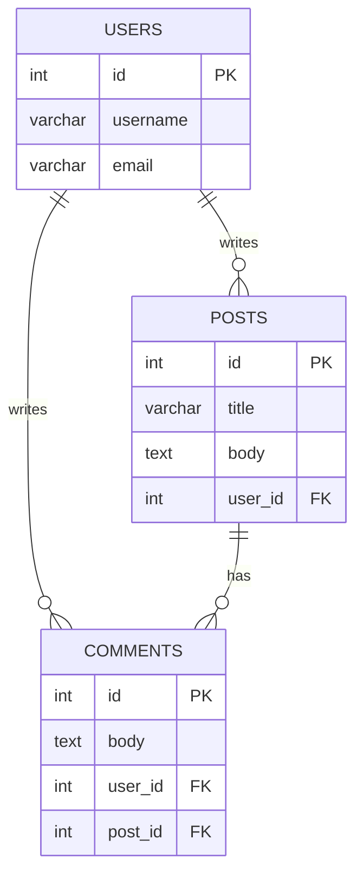

## Что такое реляционные базы данных и зачем они нужны?

Реляционная база данных (РБД) — это тип базы данных, в которой данные хранятся в виде таблиц, состоящих из строк и столбцов. Связь между данными в разных таблицах устанавливается с помощью ключей. Эта модель, предложенная Эдгаром Коддом в 1970 году, стала доминирующей в мире управления данными благодаря своей простоте, надежности и гибкости.

Основное преимущество реляционной модели заключается в её способности организовывать данные в структурированном виде, что облегчает их хранение, извлечение и обработку. Представьте себе огромную библиотеку. Если книги расставлены хаотично, найти нужную будет практически невозможно. Но если они отсортированы по жанрам, авторам и названиям, поиск займет считанные минуты. Реляционная база данных — это как идеально организованная библиотека для ваших данных.

Зачем они нужны? Практически любое современное приложение, от интернет-магазина до банковской системы, работает с большими объемами данных. РБД обеспечивают:

*   **Надежность:** Транзакции (например, перевод денег со счета на счет) выполняются атомарно — либо полностью, либо никак. Это гарантирует целостность данных.
*   **Целостность:** Правила, заданные в базе данных, не позволяют вносить некорректные данные (например, указать отрицательную цену товара).
*   **Гибкость:** Язык SQL (Structured Query Language) позволяет выполнять сложные запросы, объединяя данные из разных таблиц для получения нужной информации.
*   **Масштабируемость:** Реляционные базы данных могут хранить огромные объемы информации и обслуживать тысячи запросов в секунду.

Раздел 2: Основные концепции

### Таблицы, строки и столбцы

*   **Таблица (Table):** Основной объект в РБД, представляющий собой набор данных об однотипных объектах. Например, таблица `Сотрудники`.
*   **Строка (Row/Record):** Запись в таблице, описывающая один конкретный объект. Например, строка с данными об одном сотруднике.
*   **Столбец (Column/Attribute):** Атрибут, описывающий одно свойство объектов в таблице. Например, столбцы `Имя`, `Фамилия`, `Должность`.

### Ключи

*   **Первичный ключ (Primary Key):** Уникальный идентификатор каждой строки в таблице. Он не может быть пустым (NULL) и должен быть уникальным. Например, `ID_сотрудника`.
*   **Внешний ключ (Foreign Key):** Ключ в одной таблице, который ссылается на первичный ключ в другой таблице. Он используется для установления связей между таблицами. Например, в таблице `Заказы` может быть внешний ключ `ID_клиента`, ссылающийся на таблицу `Клиенты`.

### Связи

*   **Один-к-одному (One-to-One):** Каждой записи в одной таблице соответствует не более одной записи в другой. Например, `Сотрудник` и `Рабочее_место`.
*   **Один-ко-многим (One-to-Many):** Одной записи в одной таблице может соответствовать несколько записей в другой. Это самый распространенный тип связи. Например, один `Клиент` может сделать много `Заказов`.
*   **Многие-ко-многим (Many-to-Many):** Многим записям в одной таблице может соответствовать много записей в другой. Эта связь реализуется через промежуточную таблицу. Например, `Студенты` и `Курсы` (один студент может посещать много курсов, и один курс могут посещать много студентов).

### Нормализация

Нормализация — это процесс организации данных в базе данных с целью уменьшения избыточности и улучшения целостности данных. Существует несколько нормальных форм (1НФ, 2НФ, 3НФ и т.д.), но на практике чаще всего достаточно первых трех.

*   **Первая нормальная форма (1НФ):** Все атрибуты должны быть атомарными (неделимыми). В ячейке таблицы не может быть списка значений.
*   **Вторая нормальная форма (2НФ):** Таблица должна быть в 1НФ, и все неключевые атрибуты должны полностью зависеть от первичного ключа.
*   **Третья нормальная форма (3НФ):** Таблица должна быть во 2НФ, и все неключевые атрибуты должны зависеть только от первичного ключа, а не от других неключевых атрибутов.

Раздел 3: Практические примеры

### Пример 1: База данных блога

Представим, что мы создаем базу данных для простого блога. Нам нужны таблицы для пользователей, постов и комментариев.

**Диаграмма:**



**SQL для создания таблиц (на примере PostgreSQL):**

```sql
CREATE TABLE Users (
    id SERIAL PRIMARY KEY,
    username VARCHAR(50) NOT NULL UNIQUE,
    email VARCHAR(100) NOT NULL UNIQUE
);

CREATE TABLE Posts (
    id SERIAL PRIMARY KEY,
    title VARCHAR(255) NOT NULL,
    body TEXT NOT NULL,
    user_id INT NOT NULL,
    FOREIGN KEY (user_id) REFERENCES Users(id)
);

CREATE TABLE Comments (
    id SERIAL PRIMARY KEY,
    body TEXT NOT NULL,
    user_id INT NOT NULL,
    post_id INT NOT NULL,
    FOREIGN KEY (user_id) REFERENCES Users(id),
    FOREIGN KEY (post_id) REFERENCES Posts(id)
);
```

### Пример 2: Запрос для получения постов с комментариями

Чтобы получить пост и все его комментарии, нам нужно объединить таблицы `Posts` и `Comments`.

```sql
SELECT
    p.title AS post_title,
    p.body AS post_body,
    c.body AS comment_body,
    u.username AS comment_author
FROM Posts p
JOIN Comments c ON p.id = c.post_id
JOIN Users u ON c.user_id = u.id
WHERE p.id = 123; -- ID конкретного поста
```

Этот запрос вернет заголовок и текст поста, а также тексты всех комментариев к нему и имена их авторов.

Раздел 4: Типичные ошибки и как их избежать

1.  **Отсутствие нормализации:** Хранение всех данных в одной большой таблице приводит к избыточности, аномалиям при обновлении и усложняет поддержку. **Решение:** Проектируйте структуру данных, применяя хотя бы первые три нормальные формы.

2.  **Неправильное использование индексов:** Индексы ускоряют поиск, но замедляют операции вставки и обновления. Отсутствие индексов на часто запрашиваемых столбцах приводит к медленной работе. **Решение:** Анализируйте запросы и добавляйте индексы на столбцы, которые часто используются в `WHERE`, `JOIN` и `ORDER BY`.

3.  **SQL-инъекции:** Уязвимость, позволяющая злоумышленнику выполнять произвольные SQL-запросы к вашей базе данных. **Решение:** Никогда не вставляйте пользовательский ввод напрямую в SQL-запрос. Используйте параметризованные запросы (prepared statements).

4.  **N+1 проблема:** Когда для получения связанных данных выполняется один запрос для получения основной сущности, а затем N запросов для получения связанных сущностей. **Решение:** Используйте `JOIN` для получения всех необходимых данных за один запрос.

Раздел 5: Связь с другими темами

*   **NoSQL базы данных:** В отличие от реляционных, NoSQL базы данных (например, MongoDB, Cassandra) не используют таблицы и SQL. Они более гибкие и лучше подходят для неструктурированных данных, но не обеспечивают такой же уровень надежности и целостности.
*   **Кэширование:** Для ускорения доступа к часто запрашиваемым данным используются системы кэширования (например, Redis, Memcached), которые хранят данные в оперативной памяти.
*   **Аналитика данных:** Реляционные базы данных являются основным источником данных для аналитических систем, которые помогают бизнесу принимать решения на основе данных.

Раздел 6: Заключение

Реляционные базы данных — это фундаментальная технология, на которой построена значительная часть современного цифрового мира. Понимание их принципов работы, основных концепций и умение правильно их использовать — ключевой навык для любого IT-специалиста, будь то разработчик, аналитик или системный администратор. Несмотря на появление новых технологий, таких как NoSQL, реляционная модель остается актуальной и востребованной благодаря своей надежности, структурированности и мощи языка SQL. Глубокое понимание РБД открывает двери к созданию сложных, надежных и эффективных систем, способных обрабатывать огромные потоки информации.
