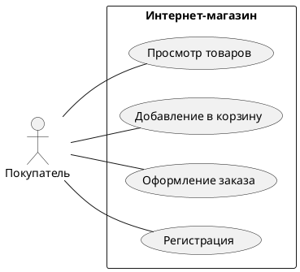

# Виды требований: от бизнес-целей до функциональных деталей

## Введение

В мире разработки программного обеспечения, где идеи превращаются в функциональные продукты, **требования** служат фундаментом и дорожной картой всего процесса. Без четкого и полного понимания того, что именно должна делать система и как она должна это делать, проект обречен на провал, превышение бюджета или, в лучшем случае, на создание продукта, который не решает реальные проблемы пользователей. Эта статья призвана подробно разобрать ключевые виды требований, с которыми сталкиваются системные аналитики, разработчики и менеджеры проектов, а также показать на практических примерах, как с ними работать.

Требования — это, по сути, формализованное описание потребностей и ожиданий от будущей системы. Они отвечают на вопросы «Что?», «Как?» и «Зачем?». Правильно сформулированные требования обеспечивают единое видение продукта у всей команды, минимизируют риски недопонимания и служат основой для проектирования, разработки, тестирования и успешного внедрения программного обеспечения.

## Основные концепции с объяснениями

Требования принято разделять на несколько уровней и типов, каждый из которых играет свою уникальную роль в жизненном цикле разработки. Основная иерархия включает в себя бизнес-требования, пользовательские, функциональные и нефункциональные требования.

### Бизнес-требования (Business Requirements)

**Бизнес-требования** — это высокоуровневые цели, которые организация или заказчик стремятся достичь с помощью создаваемого продукта. Они отвечают на вопрос «Зачем мы это делаем?» и определяют коммерческую ценность проекта. Эти требования обычно исходят от стейкхолдеров — ключевых заинтересованных лиц, таких как инвесторы, руководство компании или топ-менеджеры.

> Бизнес-требования определяют смысл проекта, основной скоп задач и рамки проекта, обосновывают его необходимость. Они должны быть объективны, компактны и понятны всем стейкхолдерам и участникам проекта [1].

**Примеры бизнес-требований:**

*   Увеличить долю онлайн-продаж на 20% в течение первого года после запуска новой электронной коммерции платформы.
*   Сократить время на обработку клиентских заявок на 50% за счет внедрения новой CRM-системы.
*   Выйти на новый рынок в странах СНГ в течение 6 месяцев.

### Пользовательские требования (User Requirements)

**Пользовательские требования** описывают задачи, которые пользователи должны иметь возможность выполнять с помощью системы. Они отвечают на вопрос «Что сможет делать пользователь?». Этот уровень требований фокусируется на взаимодействии пользователя с продуктом и его опыте.

Чаще всего пользовательские требования формулируются в виде **User Stories** (пользовательских историй) или **Use Cases** (сценариев использования).

*   *   **User Story** — это короткое, простое описание функции с точки зрения пользователя. Классический формат: «Как <роль>, я хочу <действие>, чтобы <цель>».
*   *   **Use Case** — это более формализованное и подробное описание взаимодействия между пользователем (актором) и системой для достижения определенной цели. Он включает в себя основной сценарий, альтернативные потоки и условия.

**Пример User Story:**

> Как зарегистрированный покупатель, я хочу добавлять товары в корзину, чтобы совершить покупку позже.

### Функциональные требования (Functional Requirements)

**Функциональные требования** — это самое детальное описание того, что **должна делать** система. Они определяют конкретное поведение продукта, его функции, операции и данные, с которыми он работает. Функциональные требования отвечают на вопрос «Как система должна реагировать на входные данные?». Они являются прямым руководством для разработчиков.

> Функциональные требования описывают непосредственно функционал, который необходимо реализовать в продукте или системе [1].

**Примеры функциональных требований:**

*   Система должна позволять пользователю регистрироваться с использованием email и пароля.
*   Пароль пользователя должен содержать не менее 8 символов, включая как минимум одну заглавную букву, одну строчную букву и одну цифру.
*   После успешной оплаты заказа система должна отправить пользователю подтверждение на электронную почту.

### Нефункциональные требования (Non-Functional Requirements)

Если функциональные требования определяют, **что** система делает, то **нефункциональные требования** (НФТ) определяют, **как** она это делает. Они описывают атрибуты качества, характеристики и ограничения системы, такие как производительность, безопасность, надежность, удобство использования и масштабируемость.

> Нефункциональные требования описывают, как должна работать система или программный продукт, и какими свойствами или характеристиками она должна обладать [1].

**Категории и примеры нефункциональных требований:**

| Категория | Пример |
| --- | --- |
| **Производительность** | Время отклика страницы каталога товаров не должно превышать 2 секунды при одновременной нагрузке до 1000 пользователей. |
| **Безопасность** | Все пароли пользователей должны храниться в зашифрованном виде с использованием алгоритма bcrypt. |
| **Надежность** | Система должна быть доступна 99.9% времени (не более 8.76 часов простоя в год). |
| **Масштабируемость** | Архитектура системы должна позволять горизонтальное масштабирование для обработки увеличения нагрузки в 5 раз в период сезонных распродаж. |
| **Удобство использования (Usability)** | Новый пользователь должен иметь возможность завершить процесс оформления заказа не более чем за 5 кликов. |

## Практические примеры

### Пример 1: Диаграмма Use Case для интернет-магазина

Диаграммы Use Case отлично визуализируют взаимодействие пользователей с системой. Ниже представлена простая диаграмма для интернет-магазина.

Эта диаграмма показывает, что «Покупатель» (актор) может выполнять четыре основных действия в системе «Интернет-магазин».

### Пример 2: Сценарий использования (Use Case)

**Use Case:** Оформление заказа

*   **   **Актор:** Покупатель*   **   **Предусловие:** Покупатель находится в корзине с добавленными товарами.* *   **Основной сценарий:****
    1.  Покупатель нажимает кнопку «Оформить заказ».
    2.  Система отображает страницу оформления заказа с полями для ввода адреса доставки и выбора способа оплаты.
    3.  Покупатель заполняет адрес доставки.
    4.  Покупатель выбирает способ оплаты «Банковская карта».
    5.  Покупатель нажимает кнопку «Оплатить».
    6.  Система перенаправляет на страницу платежного шлюза.
    7.  Покупатель вводит данные карты и подтверждает платеж.
    8.  Система получает подтверждение об успешной оплате.
    9.  Система отображает страницу с сообщением об успешном заказе и его номером.

## Типичные ошибки и как их избежать

1.  **1.  **Смешение уровней требований:** Часто функциональные требования записывают в документ с бизнес-требованиями. **Решение:** Четко разделяйте документы и артефакты для каждого уровня требований (BRD для бизнеса, User Stories для пользователей, спецификации для функциональных).).

2.  **2.  **Неоднозначность:** Требования вроде «система должна быть быстрой» или «интерфейс должен быть дружелюбным» бесполезны без конкретики. **Решение:** Используйте измеримые критерии для нефункциональных требований (например, «время отклика < 1 секунды») и прототипы для согласования интерфейса.а.

3.  **3.  **Отсутствие полноты:** Пропуск важных сценариев или состояний. **Решение:** Проводите тщательный анализ, используйте техники, такие как диаграммы состояний, и привлекайте к обсуждению тестировщиков на ранних этапах.х.

## Связь с другими темами

Работа с требованиями тесно интегрирована во все аспекты разработки ПО. Требования являются основой для **планирования** в Agile (например, формирование бэклога из User Stories), служат входными данными для **проектирования архитектуры**, а также являются базой для **тестирования** — каждый тест-кейс должен проверять конкретное требование.

## Заключение

Понимание и правильная классификация требований — это не просто бюрократическая формальность, а критически важный навык для создания успешных программных продуктов. Четкое разделение на бизнес, пользовательские, функциональные и нефункциональные требования позволяет выстроить прозрачный и управляемый процесс разработки, где каждый участник команды понимает свою роль и конечную цель. Инвестиции времени и усилий в качественный сбор и анализ требований всегда окупаются сторицей, приводя к созданию продуктов, которые действительно нужны пользователям и приносят ценность бизнесу.

---

### Ссылки

[1] Ensi.tech. (n.d.). *Классификация требований*. Retrieved from https://docs.ensi.tech/en/analyst-guides/tools/classification
