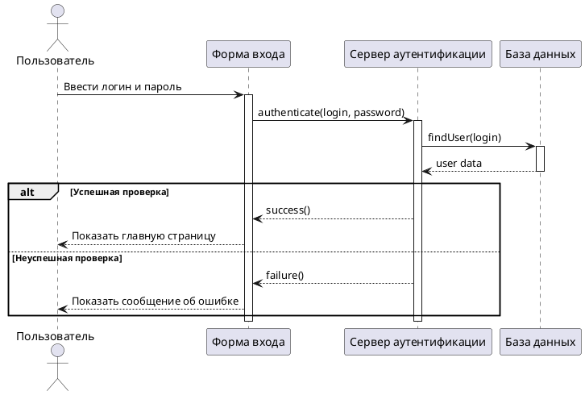
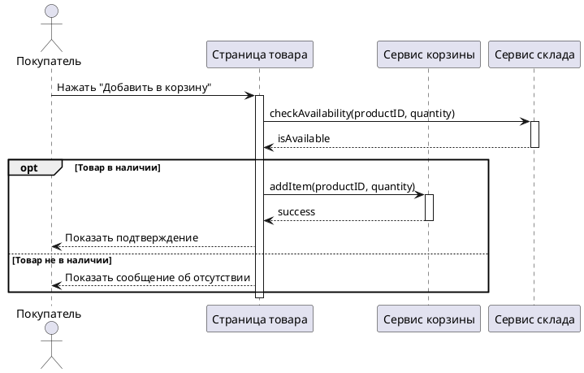
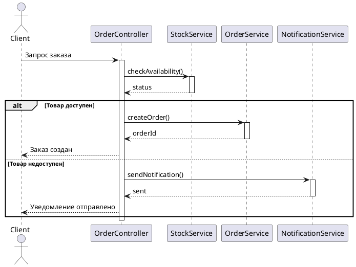

# Диаграмма последовательности (Sequence Diagram)

## Введение

Диаграмма последовательности (Sequence Diagram) — это один из наиболее популярных и полезных инструментов в арсенале системного аналитика и разработчика. Она относится к языку унифицированного моделирования (UML) и предназначена для визуализации взаимодействия объектов в системе во времени. Основная цель диаграммы — показать, как объекты обмениваются сообщениями для выполнения определенной функции или сценария. В отличие от других диаграмм, которые могут фокусироваться на статической структуре (например, диаграмма классов), диаграмма последовательности делает акцент на динамическом поведении системы.

Зачем это нужно? Во-первых, это помогает лучше понять логику работы сложной системы. Визуальное представление взаимодействий часто оказывается гораздо понятнее, чем текстовое описание. Во-вторых, диаграммы последовательности служат отличным инструментом для коммуникации между членами команды: аналитиками, разработчиками, тестировщиками и даже заказчиками. Они помогают убедиться, что все одинаково понимают, как должна работать та или иная функция. Наконец, на основе этих диаграмм можно проектировать и реализовывать код, а также создавать тестовые сценарии.

## Основные концепции

Чтобы правильно читать и строить диаграммы последовательности, необходимо понимать ее ключевые элементы.

### 1. Линии жизни (Lifelines)
Линия жизни представляет собой отдельного участника взаимодействия. Это может быть объект класса, компонент системы, внешний сервис или даже пользователь (в этом случае он называется актором). Каждый участник изображается в виде прямоугольника с его названием, от которого вниз идет пунктирная линия. Эта линия символизирует время: чем ниже по диаграмме, тем позже происходит событие.

### 2. Сообщения (Messages)
Сообщения показывают обмен информацией между линиями жизни. Они изображаются в виде стрелок. Существует несколько типов сообщений:
- **Синхронное сообщение (Synchronous Message):** Изображается сплошной линией с закрашенной стрелкой. Отправитель отправляет сообщение и ждет ответа, прежде чем продолжить свою работу. Это похоже на телефонный звонок: вы не можете делать ничего другого, пока не закончите разговор.
- **Асинхронное сообщение (Asynchronous Message):** Изображается сплошной линией с обычной открытой стрелкой. Отправитель отправляет сообщение и немедленно продолжает свою работу, не дожидаясь ответа. Это как отправка email: вы отправили и забыли, ответ может прийти позже.
- **Сообщение с ответом (Reply Message):** Изображается пунктирной линией с открытой стрелкой. Показывает возвращаемое значение или просто подтверждение получения синхронного сообщения.
- **Сообщение самому себе (Self-Message):** Стрелка, которая уходит от линии жизни и возвращается к ней же. Означает, что объект вызывает свой собственный метод.

### 3. Активации (Activation Boxes)
Активация, или фокус управления, изображается в виде узкого прямоугольника на линии жизни. Она показывает период времени, в течение которого объект занят выполнением какого-либо действия — либо напрямую, либо через вызов другого объекта. Начало активации совпадает с приходом сообщения, а конец — с завершением обработки и, возможно, отправкой ответа.

### 4. Фрагменты (Fragments)
Фрагменты позволяют добавлять на диаграмму сложную логику: циклы, условия, параллельные выполнения и т.д. Они изображаются в виде прямоугольника, который охватывает часть взаимодействия.
- **`alt` (Альтернатива):** Используется для моделирования условных конструкций (if-then-else). Прямоугольник делится на несколько частей пунктирной линией, каждая из которых соответствует одному из возможных сценариев.
- **`opt` (Опция):** Похож на `alt`, но используется для сценария, который может либо произойти, либо нет (if-then).
- **`loop` (Цикл):** Позволяет показать, что определенная последовательность сообщений будет повторяться несколько раз.
- **`par` (Параллельное выполнение):** Используется, когда несколько взаимодействий могут происходить одновременно.

## Практические примеры

### Пример 1: Процесс аутентификации пользователя

Это классический и простой пример. Пользователь вводит логин и пароль, система проверяет их и либо предоставляет доступ, либо отказывает.

**Объяснение:**
1. **Пользователь** (актор) взаимодействует с **Формой входа**.
2. **Форма входа** отправляет синхронное сообщение `authenticate` **Серверу аутентификации** и ждет ответа.
3. **Сервер** запрашивает данные пользователя из **Базы данных**.
4. Используется фрагмент `alt` для обработки двух сценариев: если пароль верный, возвращается успех, если нет — ошибка.
5. В конце **Форма входа** реагирует соответствующим образом.

### Пример 2: Добавление товара в корзину в интернет-магазине

Рассмотрим более сложный сценарий, включающий проверку наличия товара на складе.

**Объяснение:**
1. **Покупатель** нажимает кнопку на **Странице товара**.
2. **Страница товара** сначала отправляет запрос **Сервису склада**, чтобы проверить, доступен ли товар.
3. Используется фрагмент `opt` (в данном случае можно было и `alt`, но `opt` хорошо подходит для одного опционального действия). Если товар в наличии, он добавляется в корзину через **Сервис корзины**.
4. Если товара нет, покупателю выводится соответствующее сообщение.

### Пример 3: Диаграмма последовательности UML (Sequence Diagram)

Чтобы показать, как компоненты системы взаимодействуют для реализации этого процесса, разработчики использовали бы диаграмму последовательности UML. Она фокусируется на обмене сообщениями между объектами во времени.

Сценарий: Объект **OrderController** получает запрос от **Client**. Он вызывает метод `checkAvailability()` у объекта **StockService**. В зависимости от ответа, он либо вызывает `createOrder()` у **OrderService**, либо `sendNotification()` у **NotificationService**.

## Типичные ошибки и как их избежать

1.  **Перегруженность диаграммы.** Не пытайтесь уместить всю логику системы на одной диаграмме. Лучше разбить сложный процесс на несколько более простых сценариев. Диаграмма должна оставаться читаемой.
2.  **Неправильное использование типов сообщений.** Путаница между синхронными и асинхронными сообщениями может полностью исказить логику взаимодействия. Всегда думайте, должен ли отправитель ждать ответа.
3.  **Отсутствие альтернативных сценариев.** Часто рисуют только "счастливый путь" (happy path), забывая про обработку ошибок и исключений. Используйте фрагменты `alt` для показа всех важных вариантов развития событий.
4.  **Слишком много деталей.** Не нужно показывать каждый мелкий вызов метода внутри объекта. Фокусируйтесь на значимых взаимодействиях между *разными* объектами.
## Связь с другими темами

Диаграмма последовательности не существует в вакууме. Она тесно связана с другими артефактами системного анализа и проектирования:

-   **Диаграмма вариантов использования (Use Case Diagram):** Каждый вариант использования может быть детализирован одной или несколькими диаграммами последовательности. Если Use Case — это "что" система делает, то Sequence Diagram — это "как" она это делает.
-   **Диаграмма классов (Class Diagram):** Объекты, которые вы используете в качестве линий жизни на диаграмме последовательности, часто являются экземплярами классов из диаграммы классов. Это помогает связать статическую структуру с динамическим поведением.
-   **Диаграмма состояний (State Machine Diagram):** Если объект имеет сложное поведение с множеством состояний, диаграмма последовательности может показать, какие события вызывают переходы между этими состояниями.

## Заключение

Диаграмма последовательности — это мощный инструмент для моделирования и анализа динамического поведения системы. Она помогает визуализировать сложные взаимодействия, улучшает коммуникацию в команде и служит основой для дальнейшей разработки и тестирования. Понимание ее основных элементов и правил построения является ключевым навыком для любого системного аналитика и инженера. Главное — помнить о цели: создать ясную, читаемую и полезную модель, а не перегруженную и запутанную схему. Начиная с простых сценариев и постепенно усложняя их, вы сможете эффективно использовать этот инструмент в своей работе.
