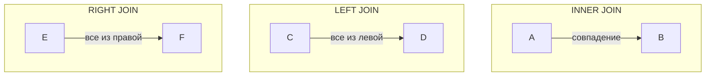

## Введение

В мире реляционных баз данных информация часто распределена по нескольким таблицам для обеспечения целостности данных и уменьшения избыточности. Однако для получения осмысленных результатов и построения сложных отчетов нам необходимо объединять данные из этих таблиц. Именно здесь в игру вступает оператор **SQL JOIN**, который является одним из самых фундаментальных и мощных инструментов в арсенале любого, кто работает с базами данных.

`JOIN` позволяет комбинировать строки из двух или более таблиц на основе связанного столбца между ними. Без него нам пришлось бы выполнять множество отдельных запросов и объединять результаты на уровне приложения, что неэффективно и сложно. Понимание `JOIN` открывает двери к сложному анализу данных, позволяя извлекать ценную информацию из, казалось бы, разрозненных наборов данных.

## Основные концепции

Основой для соединения таблиц является наличие **ключевых полей** (key fields). Обычно это **первичный ключ** (primary key) в одной таблице и **внешний ключ** (foreign key) в другой. Эти ключи создают логическую связь между таблицами, которую `JOIN` использует для сопоставления строк.

Существует несколько типов `JOIN`, каждый из которых служит своей цели:

*   **INNER JOIN**: Возвращает только те строки, для которых найдено совпадение в обеих таблицах.
*   **LEFT JOIN** (или **LEFT OUTER JOIN**): Возвращает все строки из левой таблицы и совпадающие строки из правой. Если совпадения нет, то столбцы правой таблицы будут содержать `NULL`.
*   **RIGHT JOIN** (или **RIGHT OUTER JOIN**): Возвращает все строки из правой таблицы и совпадающие строки из левой. Если совпадения нет, то столбцы левой таблицы будут содержать `NULL`.
*   **FULL OUTER JOIN**: Возвращает все строки, когда есть совпадение в одной из таблиц. Если совпадения в одной из таблиц нет, ее столбцы будут `NULL`.
*   **CROSS JOIN**: Возвращает декартово произведение двух таблиц, то есть каждая строка из первой таблицы соединяется с каждой строкой из второй. Этот тип соединения используется редко и требует осторожности, так как может привести к огромному набору результатов.

Для наглядности представим это в виде диаграммы Венна:



## Практические примеры

Давайте рассмотрим работу `JOIN` на конкретных примерах. Представим, что у нас есть две таблицы: `Customers` (клиенты) и `Orders` (заказы).

**Таблица `Customers`:**

| CustomerID | CustomerName  | Country |
|------------|---------------|---------|
| 1          | Ivan Ivanov   | Russia  |
| 2          | Petr Petrov   | Belarus |
| 3          | John Smith    | USA     |
| 4          | Anna Schmidt  | Germany |

**Таблица `Orders`:**

| OrderID | CustomerID | OrderDate  |
|---------|------------|------------|
| 101     | 2          | 2026-01-10 |
| 102     | 1          | 2026-01-12 |
| 103     | 2          | 2026-01-15 |
| 104     | 5          | 2026-01-18 |

### Пример 1: INNER JOIN

Мы хотим получить список всех клиентов, которые сделали хотя бы один заказ, вместе с датами их заказов. `INNER JOIN` идеально подходит для этой задачи, так как он выберет только тех клиентов, у которых есть совпадения в таблице `Orders`.

**Запрос:**
```sql
SELECT Customers.CustomerName, Orders.OrderID, Orders.OrderDate
FROM Customers
INNER JOIN Orders ON Customers.CustomerID = Orders.CustomerID;
```

**Результат:**

| CustomerName | OrderID | OrderDate  |
|--------------|---------|------------|
| Ivan Ivanov  | 102     | 2026-01-12 |
| Petr Petrov  | 101     | 2026-01-10 |
| Petr Petrov  | 103     | 2026-01-15 |

Обратите внимание, что John Smith и Anna Schmidt не попали в результат, так как у них нет заказов. Заказ с `CustomerID` 5 также был проигнорирован, так как такого клиента нет в таблице `Customers`.

### Пример 2: LEFT JOIN

Теперь представим, что нам нужен список **всех** клиентов, а также информация об их заказах, если они есть. Это полезно, чтобы увидеть, кто из клиентов еще ничего не заказывал.

**Запрос:**
```sql
SELECT Customers.CustomerName, Orders.OrderID
FROM Customers
LEFT JOIN Orders ON Customers.CustomerID = Orders.CustomerID;
```

**Результат:**

| CustomerName | OrderID |
|--------------|---------|
| Ivan Ivanov  | 102     |
| Petr Petrov  | 101     |
| Petr Petrov  | 103     |
| John Smith   | NULL    |
| Anna Schmidt | NULL    |

Как видите, в результат попали все клиенты из "левой" таблицы (`Customers`). Для тех, у кого не было заказов, в столбце `OrderID` стоит `NULL`.

### Пример 3: CROSS JOIN

Хотя `CROSS JOIN` используется редко, он может быть полезен для генерации тестовых данных или создания всех возможных комбинаций. Давайте посмотрим, что произойдет, если мы применим его к нашим таблицам.

**Запрос:**
```sql
SELECT Customers.CustomerName, Orders.OrderID
FROM Customers
CROSS JOIN Orders;
```

**Результат:**
Результатом будет 16 строк (4 клиента * 4 заказа), где каждый клиент будет соединен с каждым заказом, независимо от `CustomerID`. Это демонстрирует, почему `CROSS JOIN` без условия `WHERE` может быть опасен.

## Типичные ошибки и как их избежать

1.  **Отсутствие условия `ON`**: Если вы забудете указать условие соединения `ON`, большинство СУБД обработают ваш `JOIN` как `CROSS JOIN`, что приведет к декартову произведению и, скорее всего, неверному результату. **Решение**: Всегда дважды проверяйте наличие и правильность условия `ON`.

2.  **Неправильные ключи для соединения**: Соединение по столбцам, которые не являются уникальными идентификаторами или не имеют логической связи, приведет к дублированию данных или некорректным результатам. **Решение**: Убедитесь, что вы соединяете таблицы по правильно определенным первичным и внешним ключам.

3.  **Путаница между `LEFT` и `RIGHT` JOIN**: Неправильный выбор между `LEFT` и `RIGHT` может привести к потере нужных данных или включению ненужных. **Решение**: Четко определите, какая таблица является для вас "главной" (из которой нужны все строки), и используйте соответствующий `JOIN`. `LEFT JOIN` является более распространенным и интуитивно понятным для большинства сценариев.

4.  **Проблемы с производительностью**: Соединение очень больших таблиц без соответствующих индексов на ключевых полях может выполняться крайне медленно. **Решение**: Всегда создавайте индексы для столбцов, которые используются в `JOIN`.

## Связь с другими темами

*   **Нормализация баз данных**: `JOIN` является прямым следствием процесса нормализации. Нормализация разделяет данные на несколько таблиц для устранения избыточности, а `JOIN` позволяет собрать их обратно.
*   **Агрегатные функции** (`GROUP BY`, `COUNT`, `SUM`): `JOIN` часто используется вместе с агрегатными функциями для создания отчетов. Например, можно соединить таблицы клиентов и заказов, а затем сгруппировать по клиентам, чтобы посчитать количество заказов для каждого (`COUNT`).
*   **Подзапросы (Subqueries)**: В некоторых случаях `JOIN` и подзапросы могут быть взаимозаменяемыми. Однако `JOIN` часто является более производительным и читаемым решением, чем сложные вложенные подзапросы.

## Заключение

Оператор `SQL JOIN` — это краеугольный камень работы с реляционными базами данных. Он предоставляет гибкий и мощный механизм для объединения данных из различных таблиц, что позволяет выполнять сложный анализ и получать целостную картину. Освоение `INNER`, `LEFT`, `RIGHT` и `CROSS JOIN` является обязательным навыком для любого аналитика данных, разработчика или администратора баз данных. Понимание их различий и правильное применение не только обеспечит точность ваших данных, но и значительно повысит производительность ваших запросов.
