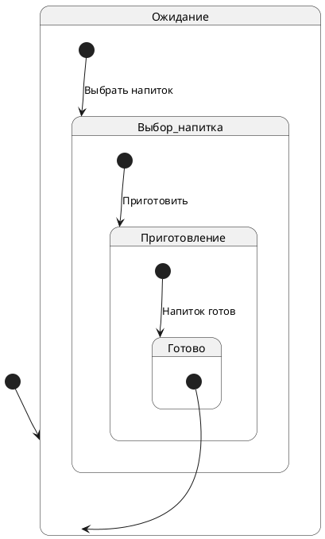
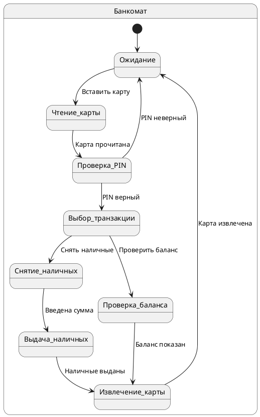

## Введение

Диаграмма состояний (State Diagram или State Machine Diagram) — это один из видов диаграмм, используемых в UML (Unified Modeling Language) для визуализации динамического поведения системы. Она наглядно показывает, как объект или система переходит из одного состояния в другое в ответ на внешние или внутренние события. Диаграммы состояний являются мощным инструментом для моделирования жизненного цикла объекта, сложных бизнес-процессов и поведения реактивных систем, которые характеризуются своей реакцией на события.

Основная цель диаграммы состояний — описать все возможные состояния, в которых может находиться объект, и все возможные переходы между этими состояниями. Это позволяет лучше понять логику работы системы, выявить потенциальные проблемы и ошибки на ранних стадиях проектирования, а также служит отличной основой для написания тестов и технической документации.

## Основные концепции

Для правильного понимания и построения диаграмм состояний необходимо ознакомиться с их ключевыми элементами:

* **Состояние (State):** Это определённый момент в жизненном цикле объекта, в течение которого он удовлетворяет некоторым условиям, выполняет определённую деятельность или ожидает какого-либо события. Графически состояние изображается в виде прямоугольника со скруглёнными углами. Внутри прямоугольника указывается имя состояния. Состояние может иметь три секции: имя, переменные состояния и действия (entry, exit, do).
* **Начальное состояние (Initial State):** Обозначает точку входа в диаграмму состояний, то есть состояние, в котором объект находится в самом начале своего жизненного цикла. На диаграмме может быть только одно начальное состояние, и оно изображается в виде закрашенного круга.
* **Конечное состояние (Final State):** Указывает на завершение жизненного цикла объекта. Объект, достигший конечного состояния, прекращает свое существование в контексте данной диаграммы. На диаграмме может быть несколько конечных состояний, и они изображаются в виде закрашенного круга внутри другого круга.
* **Переход (Transition):** Это направленная стрелка от одного состояния к другому, которая показывает, что объект может перейти из одного состояния в другое. Переход обычно инициируется событием и может сопровождаться выполнением определённого действия. Синтаксис перехода может включать в себя: `событие [условие] / действие`.
* **Событие (Event):** Это внешнее или внутреннее воздействие на объект, которое может вызвать переход из одного состояния в другое. Примерами событий могут быть вызов метода, истечение времени, получение сообщения и т.д.
* **Охраняющее условие (Guard Condition):** Это логическое выражение, которое должно быть истинным для того, чтобы переход мог состояться. Условие записывается в квадратных скобках `[]` после имени события.
* **Действие (Action):** Это атомарная операция, которая выполняется при переходе из одного состояния в другое. Действие записывается после символа `/`.
* **Составное состояние (Composite State):** Это состояние, которое само содержит вложенную диаграмму состояний. Это позволяет создавать иерархические модели и упрощать сложные диаграммы.
* **Параллельные состояния (Concurrent States):** Внутри составного состояния могут быть области, которые выполняются параллельно. Эти области разделяются пунктирной линией.

## Практические примеры

### Пример 1: Кофемашина

Рассмотрим простую кофемашину. У нее могут быть следующие состояния: "Ожидание", "Выбор напитка", "Приготовление" и "Готово".

**Описание диаграммы:**

1. **Ожидание:** Начальное состояние. Кофемашина готова к работе.
2. **Выбор напитка:** Пользователь выбирает напиток.
3. **Приготовление:** Кофемашина готовит выбранный напиток.
4. **Готово:** Напиток готов, и кофемашина возвращается в состояние ожидания.

### Пример 2: Банкомат (ATM)

Более сложный пример — работа банкомата. Здесь мы можем увидеть больше состояний и переходов.

**Описание диаграммы:**

1. **Ожидание:** Банкомат ждет, пока клиент вставит карту.
2. **Чтение карты:** Банкомат считывает данные с карты.
3. **Проверка PIN:** Клиент вводит PIN-код, и банкомат его проверяет.
4. **Выбор транзакции:** Клиент выбирает операцию (снять наличные, проверить баланс и т.д.).
5. **Снятие наличных:** Клиент вводит сумму для снятия.
6. **Выдача наличных:** Банкомат выдает наличные.
7. **Проверка баланса:** Банкомат показывает баланс на экране.
8. **Извлечение карты:** Банкомат возвращает карту клиенту.

Эти примеры показывают, как диаграммы состояний помогают визуализировать и понять поведение объектов в различных ситуациях.

## Типичные ошибки и как их избежать

При создании диаграмм состояний можно допустить ряд ошибок, которые усложнят понимание и использование модели. Вот некоторые из них:

* **Смешивание состояний и действий:** Состояние — это стабильный период в жизни объекта, а действие — это то, что происходит при переходе. Не стоит называть состояния глаголами (например, "Проверка PIN"). Лучше использовать существительные или прилагательные ("PIN проверяется").
* **Отсутствие начального или конечного состояния:** Каждая диаграмма должна иметь четкое начало и, в большинстве случаев, конец. Это помогает понять, с чего начинается и чем заканчивается жизненный цикл объекта.
* **Слишком много или слишком мало деталей:** Диаграмма должна быть достаточно подробной, чтобы отражать все важные аспекты поведения объекта, но не настолько перегруженной, чтобы стать нечитаемой. Используйте составные состояния для группировки связанных состояний и упрощения диаграммы.
* **Некорректные переходы:** Убедитесь, что все возможные переходы между состояниями учтены и что нет "висячих" состояний, из которых нельзя выйти.
* **Игнорирование событий и условий:** Переходы должны быть инициированы событиями, а условия (guards) помогают определить, когда переход возможен. Не забывайте указывать их на диаграмме.

Чтобы избежать этих ошибок, рекомендуется:

1. Четко определить объект и его жизненный цикл перед началом моделирования.
2. Использовать иерархию состояний для управления сложностью.
3. Проводить ревью диаграмм с коллегами для выявления неточностей и упущений.

## Связь с другими темами

Диаграммы состояний тесно связаны с другими диаграммами и концепциями в системном анализе и проектировании:

1. **Диаграммы последовательности (Sequence Diagrams):** Показывают взаимодействие между объектами во времени. Диаграмма состояний может быть использована для моделирования жизненного цикла одного из этих объектов.
2. **Диаграммы классов (Class Diagrams):** Определяют структуру системы и классы объектов. Диаграмма состояний уточняет поведение экземпляров этих классов.
3. **Диаграммы деятельности (Activity Diagrams):** Моделируют потоки работ и операций. В то время как диаграммы деятельности фокусируются на потоке управления от одной деятельности к другой, диаграммы состояний фокусируются на изменениях состояния объекта.
4. **Теория автоматов:** Диаграммы состояний являются графическим представлением конечных автоматов, фундаментальной концепции в информатике.

## Заключение

Диаграмма состояний — это незаменимый инструмент для моделирования динамического поведения систем. Она позволяет наглядно представить жизненный цикл объекта, его возможные состояния и переходы между ними. Правильно построенная диаграмма состояний помогает улучшить понимание системы, выявить потенциальные проблемы на ранних этапах разработки и служит отличной основой для дальнейшего проектирования, тестирования и документирования. Несмотря на кажущуюся простоту, создание качественной диаграммы состояний требует внимательности и глубокого понимания предметной области, но затраченные усилия окупаются повышением качества и надежности разрабатываемой системы.
