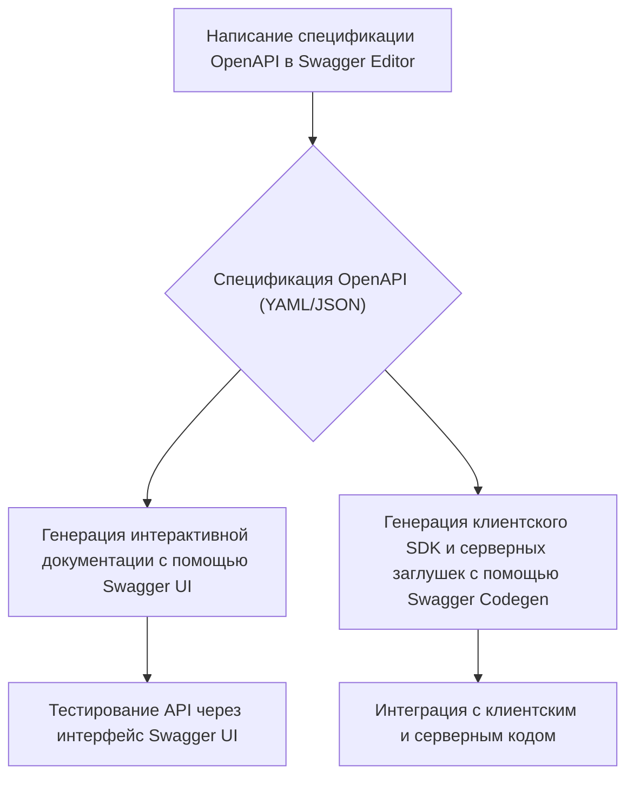

# Swagger и OpenAPI - документирование API

## Введение

В мире разработки программного обеспечения, где микросервисная архитектура и взаимодействие между различными компонентами системы становятся все более распространенными, четкое и понятное документирование API (Application Programming Interface) приобретает первостепенное значение. API служит контрактом между поставщиком и потребителем услуг, и его качественное описание упрощает интеграцию, ускоряет разработку и снижает количество ошибок. Именно здесь на сцену выходят Swagger и OpenAPI.

**OpenAPI Specification** (ранее известная как Swagger Specification) — это открытый стандарт для описания RESTful API. Он представляет собой формализованный способ определения эндпоинтов, операций, моделей данных, параметров запросов и ответов, а также другой метаинформации об API. Этот стандарт не зависит от языка программирования и позволяет как людям, так и машинам понимать возможности API без необходимости доступа к исходному коду.

**Swagger** — это набор инструментов с открытым исходным кодом, построенный вокруг спецификации OpenAPI. Эти инструменты помогают проектировать, создавать, документировать и использовать RESTful API. Таким образом, OpenAPI — это спецификация, а Swagger — это инструментарий для работы с этой спецификацией.

## Основные концепции

Для понимания OpenAPI и Swagger необходимо ознакомиться с ключевыми концепциями, которые лежат в их основе.

### Спецификация OpenAPI

Спецификация OpenAPI описывает API в формате YAML или JSON. Основные разделы спецификации включают:

- **`openapi`**: Версия спецификации OpenAPI (например, `3.0.0`).
- **`info`**: Общая информация об API, включая название (`title`), описание (`description`) и версию (`version`).
- **`servers`**: Список URL-адресов, по которым доступен API (например, для разработки, тестирования и продакшена).
- **`paths`**: Описание всех эндпоинтов API. Каждый путь (`path`) содержит описание HTTP-методов (`GET`, `POST`, `PUT`, `DELETE` и т.д.), которые к нему применимы.
- **`components`**: Раздел для переиспользуемых компонентов, таких как схемы данных (`schemas`), параметры (`parameters`), ответы (`responses`) и другие. Это позволяет избежать дублирования кода и упрощает поддержку спецификации.
- **`security`**: Описание схем безопасности, используемых в API (например, API ключи, OAuth2).
- **`tags`**: Группировка операций для удобства навигации в документации.

### Инструменты Swagger

Экосистема Swagger включает в себя несколько ключевых инструментов:

- **Swagger Editor**: Онлайн-редактор для написания и валидации спецификаций OpenAPI. Он предоставляет автодополнение и мгновенную обратную связь, подсвечивая ошибки в синтаксисе.
- **Swagger UI**: Инструмент для генерации интерактивной HTML-документации из спецификации OpenAPI. Пользователи могут не только читать описание API, но и отправлять реальные запросы к эндпоинтам прямо из браузера.
- **Swagger Codegen**: Генератор кода, который позволяет создавать клиентские SDK, серверные заглушки и другую кодовую базу на основе спецификации OpenAPI. Это значительно ускоряет процесс разработки и интеграции.

## Практические примеры

Рассмотрим несколько примеров, иллюстрирующих использование OpenAPI и Swagger.

### Пример 1: Простое API для блога (YAML)

Представим, что мы создаем простое API для управления постами в блоге. Спецификация на OpenAPI 3.0 в формате YAML может выглядеть следующим образом:

```yaml
openapi: 3.0.0
info:
  title: Blog API
  description: A simple API for managing blog posts.
  version: 1.0.0
servers:
  - url: https://api.example.com/v1
paths:
  /posts:
    get:
      summary: Get all posts
      description: Returns a list of all blog posts.
      responses:
        '200':
          description: A list of posts.
          content:
            application/json:
              schema:
                type: array
                items:
                  $ref: '#/components/schemas/Post'
  /posts/{id}:
    get:
      summary: Get a single post
      description: Returns a single post by its ID.
      parameters:
        - name: id
          in: path
          required: true
          schema:
            type: integer
      responses:
        '200':
          description: A single post.
          content:
            application/json:
              schema:
                $ref: '#/components/schemas/Post'
        '404':
          description: Post not found.
components:
  schemas:
    Post:
      type: object
      properties:
        id:
          type: integer
          format: int64
        title:
          type: string
        content:
          type: string
```

Этот пример описывает два эндпоинта: `/posts` для получения списка всех постов и `/posts/{id}` для получения одного поста по его идентификатору. В разделе `components` определена схема данных `Post`, которая затем переиспользуется в ответах.

### Пример 2: Диаграмма взаимодействия инструментов Swagger

Для наглядности представим процесс работы с API с использованием инструментов Swagger в виде диаграммы.



Эта диаграмма показывает, как спецификация OpenAPI, созданная в **Swagger Editor**, становится центральным элементом, на основе которого генерируются документация (**Swagger UI**) и код (**Swagger Codegen**), что обеспечивает консистентность и упрощает разработку.

## Типичные ошибки и как их избежать

При работе с OpenAPI и Swagger разработчики могут сталкиваться с рядом типичных ошибок.

1.  **Неполное или неточное описание**: Одна из самых частых проблем — это неполное описание эндпоинтов, параметров или моделей данных. **Решение**: Следуйте принципу "документация как код" (documentation as code) и интегрируйте процесс обновления спецификации в ваш CI/CD пайплайн. Используйте линтеры для проверки полноты и корректности спецификации.

2.  **Рассинхронизация между кодом и документацией**: Код меняется, а документация остается старой. **Решение**: Автоматизируйте генерацию спецификации из кода (code-first подход) с помощью аннотаций или, наоборот, генерируйте код из спецификации (design-first подход). Оба подхода помогают поддерживать документацию в актуальном состоянии.

3.  **Слишком сложная или запутанная структура спецификации**: Большие и сложные API могут приводить к громоздким и трудным для чтения спецификациям. **Решение**: Используйте раздел `components` для переиспользования схем, параметров и ответов. Разбивайте большую спецификацию на несколько файлов и используйте `$ref` для их связывания.

## Связь с другими темами

Swagger и OpenAPI тесно связаны с другими важными концепциями в разработке ПО:

- **RESTful API**: OpenAPI является стандартом де-факто для описания именно RESTful API. Понимание принципов REST (Representational State Transfer) необходимо для грамотного проектирования и документирования API.
- **Микросервисная архитектура**: В микросервисах каждый сервис имеет свой API. OpenAPI помогает стандартизировать описание этих API, что упрощает взаимодействие между сервисами.
- **CI/CD (Continuous Integration/Continuous Deployment)**: Спецификацию OpenAPI можно и нужно интегрировать в CI/CD пайплайны. Это позволяет автоматически тестировать API на соответствие контракту, генерировать SDK и публиковать документацию при каждом изменении.
- **API-First подход**: Концепция, при которой разработка начинается с проектирования и документирования API. OpenAPI и Swagger являются ключевыми инструментами для реализации этого подхода.

## Заключение

Swagger и OpenAPI предоставляют мощный и гибкий инструментарий для документирования RESTful API. Использование спецификации OpenAPI как единого источника правды позволяет создавать четкую, интерактивную и всегда актуальную документацию. Это не только улучшает опыт разработчиков, использующих ваш API, но и способствует более быстрой и качественной разработке, снижает количество ошибок интеграции и упрощает поддержку системы в целом. В современной экосистеме разработки ПО владение этими инструментами является важным навыком для любого специалиста, работающего с API.
