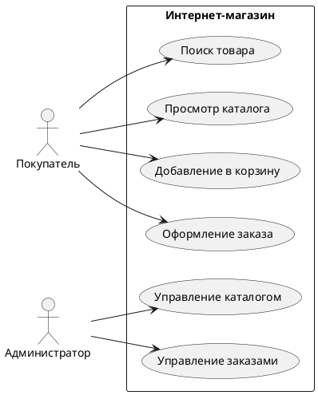

## Введение

Системный аналитик — это IT-специалист, который выступает связующим звеном между бизнесом и командой разработки. Его основная задача — перевести потребности и цели бизнеса на язык, понятный программистам, и убедиться, что итоговый продукт будет решать поставленные задачи. В мире, где цифровизация проникает во все сферы жизни, роль системного аналитика становится все более важной, ведь именно от его работы зависит, насколько успешным и полезным будет создаваемое программное обеспечение.

Простыми словами, системный аналитик — это "переводчик" и "архитектор" в мире IT. Он помогает заказчику четко сформулировать, что именно он хочет получить, а разработчикам — понять, как это реализовать. Без системного аналитика проекты рискуют затянуться, выйти за рамки бюджета или, в худшем случае, оказаться совершенно бесполезными для конечного пользователя.

## Основные концепции

Работа системного аналитика строится на нескольких ключевых концепциях и процессах, которые помогают ему эффективно выполнять свои задачи. Понимание этих концепций — первый шаг к освоению профессии.

### Сбор и анализ требований

Это, пожалуй, самая важная часть работы системного аналитика. Требования — это описание того, что должна делать система. Они бывают нескольких видов:

*   **Бизнес-требования:** высокоуровневые цели, которые бизнес хочет достичь с помощью системы (например, "увеличить продажи на 20%" или "сократить время обработки заявок вдвое").
*   **Пользовательские требования:** описывают задачи, которые пользователи должны иметь возможность выполнять в системе (например, "пользователь должен иметь возможность зарегистрироваться на сайте с помощью email и пароля").
*   **Функциональные требования:** детализируют, как именно система должна выполнять пользовательские задачи (например, "при регистрации система должна проверять корректность введенного email и требовать пароль длиной не менее 8 символов").
*   **Нефункциональные требования:** определяют качественные характеристики системы, такие как производительность, безопасность, надежность, удобство использования (например, "сайт должен загружаться не дольше 2 секунд", "данные пользователей должны быть зашифрованы").

Для сбора требований аналитик использует различные методы: интервью с заказчиками и пользователями, анкетирование, анализ документов, наблюдение за работой пользователей.

### Моделирование и проектирование

Собранные требования необходимо структурировать и представить в виде, понятном для команды разработки. Для этого используются различные нотации и диаграммы:

*   **UML (Unified Modeling Language):** стандартный язык для визуального моделирования программных систем. С его помощью можно создавать диаграммы различных типов:
    *   **Use Case Diagram (Диаграмма вариантов использования):** показывает, какие действия (варианты использования) могут выполнять пользователи (акторы) в системе.
    *   **Activity Diagram (Диаграмма деятельности):** описывает пошаговый рабочий процесс или алгоритм.
    *   **Sequence Diagram (Диаграмма последовательности):** демонстрирует взаимодействие объектов во времени.
    *   **Class Diagram (Диаграмма классов):** описывает структуру системы, показывая классы, их атрибуты, методы и отношения между ними.
*   **BPMN (Business Process Model and Notation):** нотация для моделирования бизнес-процессов. Помогает визуализировать, как устроены процессы в компании, и найти пути их оптимизации.

### Жизненный цикл разработки ПО

Системный аналитик участвует во всех этапах жизненного цикла разработки программного обеспечения (Software Development Lifecycle, SDLC), от планирования до внедрения и поддержки. Существуют различные методологии разработки, и роль аналитика в них может немного отличаться:

*   **Waterfall (Водопадная модель):** классическая модель, где каждый этап (анализ, проектирование, разработка, тестирование) выполняется строго последовательно. Аналитик в этой модели отвечает за создание полного и исчерпывающего технического задания (ТЗ) на начальном этапе.
*   **Agile (Гибкие методологии, например, Scrum, Kanban):** итеративный подход, где разработка ведется короткими циклами (спринтами). Аналитик в Agile-команде работает в тесном контакте с разработчиками и заказчиком, постоянно уточняя и детализируя требования.

## Практические примеры

Теория становится понятнее, когда подкреплена практикой. Рассмотрим несколько примеров, иллюстрирующих работу системного аналитика.

### Пример 1: Проектирование системы онлайн-магазина (Use Case Diagram)

Представим, что к нам пришел заказчик, который хочет создать небольшой интернет-магазин по продаже книг. Наша задача как системных аналитиков — описать, как пользователи будут взаимодействовать с системой.

**Акторы (Actors):**

*   **Покупатель:** незарегистрированный или зарегистрированный пользователь, который хочет купить книгу.
*   **Администратор:** сотрудник магазина, управляющий каталогом товаров и заказами.

**Варианты использования (Use Cases):**

*   **Поиск товара:** Покупатель может искать книги по названию, автору или жанру.
*   **Просмотр каталога:** Покупатель может просматривать список книг, отсортированный по разным параметрам.
*   **Добавление в корзину:** Покупатель может добавить выбранную книгу в корзину.
*   **Оформление заказа:** Покупатель может оформить заказ, указав свои контактные данные и адрес доставки.
*   **Управление каталогом:** Администратор может добавлять, редактировать и удалять книги.
*   **Управление заказами:** Администратор может просматривать и изменять статусы заказов.

На основе этого мы можем построить простую Use Case диаграмму:


Эта диаграмма наглядно показывает основные функции системы и роли пользователей, что помогает всей команде иметь единое видение продукта.

### Пример 2: Моделирование процесса обработки заказа (BPMN)

Теперь давайте детализируем процесс оформления и обработки заказа с помощью нотации BPMN. Это поможет нам понять, какие шаги включает в себя процесс и где его можно улучшить.

```bpmn
@startuml
!define PARTICIPANT_STYLE rectangle

participant "Покупатель" as customer
participant "Система" as system
participant "Менеджер" as manager

customer -> system: Оформить заказ
activate system

system -> system: Проверить наличие товара
alt товар в наличии
    system -> manager: Новый заказ
    activate manager
    manager -> manager: Собрать заказ
    manager -> system: Заказ готов к отправке
    system -> customer: Заказ отправлен
    deactivate manager
else товар отсутствует
    system -> customer: Уведомить об отсутствии товара
end

deactivate system
@enduml
```
Эта диаграмма описывает последовательность действий от момента оформления заказа покупателем до его отправки. Она помогает выявить узкие места (например, ручная сборка заказа менеджером) и подумать над их автоматизацией.

### Пример 3: Фрагмент технического задания (Код)

Предположим, нам нужно описать требование к функции регистрации. Фрагмент ТЗ может выглядеть так:

**Функциональное требование FR-01: Регистрация пользователя**

*   **Описание:** Система должна предоставлять пользователю возможность зарегистрироваться с использованием email и пароля.
*   **Поля:**
    *   Email (обязательное, валидация на корректность формата)
    *   Пароль (обязательное, не менее 8 символов, должен содержать как минимум одну заглавную букву и одну цифру)
    *   Подтверждение пароля (обязательное, должно совпадать с полем "Пароль")
*   **Логика:**
    1.  При отправке формы система проверяет, что все обязательные поля заполнены.
    2.  Система проверяет, что email еще не зарегистрирован в системе.
    3.  Система проверяет пароль на соответствие требованиям безопасности.
    4.  Система проверяет, что пароль и его подтверждение совпадают.
    5.  В случае успеха, система создает новую учетную запись пользователя и отправляет на указанный email письмо для подтверждения регистрации.

А вот как может выглядеть простая реализация проверки пароля на Python, которую разработчик напишет на основе этого требования:

```python
import re

def is_password_valid(password):
    """Проверяет, соответствует ли пароль требованиям безопасности."""
    if len(password) < 8:
        return False
    if not re.search(r'[A-Z]', password):
        return False
    if not re.search(r'[0-9]', password):
        return False
    return True

print(is_password_valid('password123'))  # False
print(is_password_valid('Password123')) # True
```

## Типичные ошибки и как их избежать

На пути системного аналитика, особенно начинающего, встречается немало подводных камней. Знание типичных ошибок помогает избежать их и повысить качество своей работы.

### Ошибка 1: Недостаточное погружение в предметную область

Часто аналитики, особенно с техническим бэкграундом, концентрируются на технологиях, упуская из виду специфику бизнеса, для которого создается система. Это приводит к тому, что продукт формально работает, но не решает реальные проблемы пользователей.

*   **Как избежать:** Потратьте время на изучение предметной области. Общайтесь с экспертами со стороны заказчика, читайте отраслевую литературу, анализируйте конкурентов. Ваша цель — говорить с бизнесом на одном языке.

### Ошибка 2: Поверхностный сбор требований

Принять на веру первые же слова заказчика — большая ошибка. Часто люди не могут четко сформулировать, что им нужно, или упускают важные детали. Если аналитик не задает уточняющих вопросов, требования получаются неполными и противоречивыми.

*   **Как избежать:** Используйте технику "5 почему". Задавайте открытые вопросы. Проводите повторные интервью. Прототипируйте — часто, увидев макет будущего интерфейса, заказчик лучше понимает, чего он на самом деле хочет.

### Ошибка 3: Игнорирование нефункциональных требований

Все силы брошены на реализацию функций, но никто не подумал о том, что система должна выдерживать нагрузку в 1000 одновременных пользователей или быть доступной 99.9% времени. В итоге, на этапе эксплуатации возникают серьезные проблемы.

*   **Как избежать:** С самого начала обсуждайте с заказчиком нефункциональные требования. Определите ожидания по производительности, надежности, безопасности, масштабируемости. Фиксируйте их в документации так же, как и функциональные.

### Ошибка 4: Слабая коммуникация с командой

Написать ТЗ и "бросить его через стену" разработчикам — порочная практика. Без постоянного взаимодействия команда может неверно интерпретировать требования, что приведет к необходимости дорогостоящих переделок.

*   **Как избежать:** Будьте частью команды. Участвуйте в ежедневных встречах, отвечайте на вопросы разработчиков и тестировщиков, демонстрируйте готовый функционал заказчику. Помните, что вы — мост между бизнесом и разработкой.

## Связь с другими темами

Профессия системного аналитика тесно переплетена с множеством других областей в IT и бизнесе. Понимание этих связей помогает аналитику лучше ориентироваться в проекте и эффективнее взаимодействовать с коллегами.

*   **Бизнес-анализ:** Как мы уже упоминали, границы между системным и бизнес-анализом часто размыты. В идеале, бизнес-аналитик фокусируется на стратегии и потребностях бизнеса (ЧТО нужно сделать), а системный аналитик — на том, как это реализовать в IT-системе (КАК это сделать). Однако, во многих компаниях один специалист выполняет обе роли.

*   **Управление проектами (Project Management):** Системный аналитик тесно сотрудничает с менеджером проекта. Аналитик поставляет требования, на основе которых менеджер строит план работ, оценивает сроки и ресурсы. От качества работы аналитика напрямую зависит, насколько предсказуемым и управляемым будет проект.

*   **Разработка и тестирование:** Для разработчиков аналитик — основной источник информации о том, что и как нужно реализовать. Для тестировщиков — создатель "эталона", с которым они сверяют работу программы. Четкие и непротиворечивые требования от аналитика — залог быстрой разработки и эффективного тестирования.

*   **UX/UI дизайн:** Аналитик и дизайнер работают в паре над созданием удобного и понятного пользовательского интерфейса. Аналитик определяет, КАКИЕ задачи должен решать пользователь в системе, а дизайнер — КАК сделать этот процесс максимально простым и приятным. Они вместе проектируют пользовательские сценарии (user flows) и создают прототипы.

*   **Архитектура ПО:** В сложных проектах системный аналитик работает вместе с архитектором ПО. Аналитик отвечает за функциональные требования, а архитектор, на их основе, принимает глобальные технические решения о структуре приложения, используемых технологиях и способах взаимодействия компонентов.

## Заключение

Системный аналитик — это многогранная и ответственная профессия на стыке бизнеса, технологий и коммуникаций. Это не просто "писатель ТЗ", а ключевой участник команды, который обеспечивает создание продуктов, действительно нужных людям и приносящих пользу бизнесу. Успешный системный аналитик сочетает в себе техническую грамотность, аналитический склад ума, умение находить общий язык с самыми разными людьми и глубокое понимание предметной области.

Путь в эту профессию требует постоянного обучения и развития, но он открывает широкие возможности для карьерного роста и участия в создании сложных и интересных IT-решений. Если вам нравится докапываться до сути вещей, структурировать информацию и видеть, как ваши идеи воплощаются в реальных продуктах, то профессия системного аналитика может стать для вас настоящим призванием.
