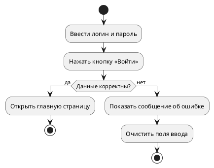
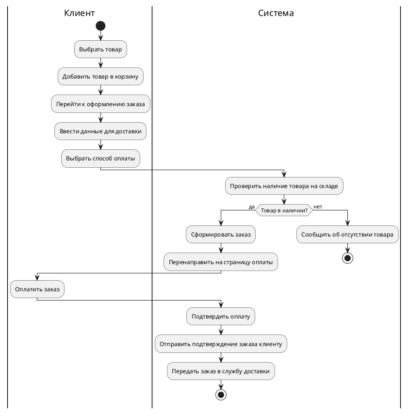
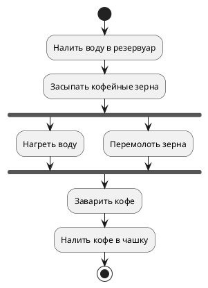

## Введение

Диаграмма деятельности (англ. Activity Diagram) — это один из видов диаграмм, используемых в языке моделирования UML (Unified Modeling Language). Она представляет собой блок-схему, которая наглядно демонстрирует последовательность действий и потоков управления в системе, бизнес-процессе или алгоритме. Основное предназначение диаграммы деятельности — визуализация динамических аспектов системы, то есть её поведения во времени.

Диаграммы деятельности помогают:

* **Моделировать бизнес-процессы:** наглядно представлять, как выполняются рабочие процессы в организации, кто за что отвечает и какие шаги необходимо предпринять для достижения цели.
* **Анализировать и проектировать программное обеспечение:** детализировать логику работы сложных методов, алгоритмов и вариантов использования (use cases).
* **Описывать технологические процессы:** визуализировать последовательность операций в производственных и других технологических цепочках.
* **Находить узкие места и возможности для оптимизации:** благодаря наглядности диаграмм, легко выявлять избыточные шаги, задержки и неэффективные участки процесса.

## Основные концепции и элементы

Диаграммы деятельности состоят из набора стандартных элементов, соединенных стрелками, которые показывают направление потока управления или данных.

| Элемент | Обозначение | Описание |
| --- | --- | --- |
| **Начальный узел** | ● | Закрашенный круг, обозначающий точку входа в процесс. У диаграммы может быть только один начальный узел. |
| **Конечный узел** | ◉ | Закрашенный круг в окружности, обозначающий точку завершения процесса. Диаграмма может иметь несколько конечных узлов. |
| **Действие** | Прямоугольник с закругленными углами | Представляет собой отдельный шаг или операцию в процессе. Внутри прямоугольника указывается название действия. |
| **Поток управления** | → | Сплошная линия со стрелкой, показывающая переход от одного действия к другому. |
| **Узел решения (ветвление)** | ◇ | Ромб, используемый для обозначения условия, в зависимости от которого процесс пойдет по одному из нескольких путей. Имеет один вход и несколько выходов, каждый из которых помечен условием. |
| **Узел слияния** | ◇ | Ромб, объединяющий несколько альтернативных потоков в один. Имеет несколько входов и один выход. |
| **Вилка (Fork)** | ▬ | Толстая горизонтальная или вертикальная черта, разделяющая один поток на несколько параллельных. |
| **Соединение (Join)** | ▬ | Толстая горизонтальная или вертикальная черта, объединяющая несколько параллельных потоков в один. Процесс продолжится только после завершения всех входящих потоков. |
| **Дорожки (Swimlanes)** | | Прямоугольные области, которые группируют действия по ответственным исполнителям (например, отделам, пользователям, системам). Позволяют наглядно показать, кто выполняет каждый шаг процесса. |

## Практические примеры

### Пример 1: Процесс аутентификации пользователя

Этот пример иллюстрирует простой процесс входа пользователя в систему.

### Пример 2: Процесс онлайн-покупки

Этот пример показывает более сложный процесс с использованием дорожек для разделения ответственности между клиентом и системой.

### Пример 3: Процесс приготовления кофе в кофемашине

Этот пример демонстрирует использование параллельных процессов.

## Типичные ошибки и как их избежать

1. **Избыточная детализация.** Не стоит пытаться отобразить на одной диаграмме абсолютно все мелкие шаги. Это делает ее перегруженной и сложной для восприятия. **Решение:** Используйте вложенные диаграммы деятельности для детализации сложных шагов.
2. **Неправильное использование узлов ветвления и слияния.** Часто путают узел решения с вилкой, а узел слияния — с соединением. **Решение:** Помните, что ромб (решение/слияние) используется для альтернативных потоков (выполняется только один), а черта (вилка/соединение) — для параллельных (выполняются все).
3. **Отсутствие конечного узла.** Любой процесс должен иметь логическое завершение. **Решение:** Убедитесь, что все ветви процесса в конечном итоге приводят к конечному узлу.
4. **Нелогичное расположение дорожек.** Неправильное распределение действий по дорожкам может запутать и исказить логику процесса. **Решение:** Тщательно анализируйте, какой актер или система отвечает за каждый конкретный шаг.

## Связь с другими темами UML

Диаграммы деятельности тесно связаны с другими диаграммами UML:

* **Диаграммы вариантов использования (Use Case Diagrams):** Диаграмма деятельности может детализировать один конкретный вариант использования, показывая по шагам, как он реализуется.
* **Диаграммы состояний (State Machine Diagrams):** Если диаграмма состояний фокусируется на жизненном цикле одного объекта и его переходах между состояниями, то диаграмма деятельности описывает поток работ, который может затрагивать множество объектов.

## Заключение

Диаграмма деятельности — это мощный и гибкий инструмент для моделирования и анализа бизнес-процессов и программных систем. Благодаря своей наглядности и простоте, она понятна как техническим специалистам, так и представителям бизнеса. Правильное использование диаграмм деятельности позволяет улучшить взаимопонимание в команде, выявить проблемы в процессах и спроектировать более эффективные и надежные системы.
