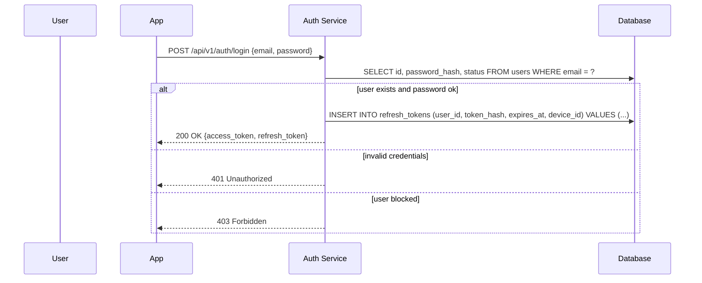

## Введение

Этот материал помогает описывать и проверять требования к доступу в системе: от входа пользователя до контроля прав.
> Если нужно быстро развести термины, см. [auth-vs-auth](auth-vs-auth).

Важно разделять два слоя:

- **Аутентификация (authentication)**: подтверждаем, кто пользователь (или сервис).
- **Авторизация (authorization)**: решаем, что ему разрешено делать.

## Базовый словарь

- **Идентификация**: пользователь заявляет, кто он (например, вводит email).
- **Аутентификация**: система проверяет это заявление (пароль, 2FA, сертификат, SSO).
- **Авторизация**: система проверяет права на конкретное действие/ресурс.
- **Сессия**: состояние входа пользователя (может быть серверным или «без состояния» через токены).
- **Токен**: строка, подтверждающая факт аутентификации и/или содержащая атрибуты доступа.
- **Role / Permission / Scope**:
  - **Role (роль)** — набор прав.
  - **Permission (право)** — конкретное действие (например, `users:read`).
  - **Scope** — ограничение/область доступа, часто в OAuth.

## Токены: Access и Refresh

Во многих API используется двухтокенная схема. После успешного входа система выдает временные ключи (токены), чтобы клиент мог обращаться к защищенным ресурсам без повторного ввода пароля.

| Тип токена | Назначение | Время жизни | Безопасность |
| :--- | :--- | :--- | :--- |
| **Access Token** | Доступ к ресурсам (API, данные профиля). | Короткое (например 5–30 минут) | Обычно передается в заголовке `Authorization: Bearer <token>` 
на клиенте предпочтительно хранить в памяти приложения, чтобы снизить риск XSS-кражи. |
| **Refresh Token** | Получение нового access token, когда старый истек. | Длинное (например 7–30 дней) | Типично хранится в защищенном контейнере (часто `HttpOnly` cookie) и используется только для обращения к эндпоинту обновления. |

Ключевой смысл: **access token живет мало**, поэтому его компрометация ограничена по времени. **refresh token живет долго**, поэтому к нему требования строже (ротация, отзыв, привязка к устройству/сессии).

## Пароли: хранение и проверка

⚠️ **Никогда не храните пароли в открытом виде!**

Пароли должны проходить через процесс хэширования – одностороннего криптографического преобразования. Популярные и надежные алгоритмы – **bcrypt** и **Argon2**.

- **Хэширование**: одностороннее преобразование (например, **bcrypt** или **Argon2**).
- **Соль (salt)**: уникальная случайная добавка к каждому паролю, хранится рядом с хешем.
- **Pepper**: дополнительный секрет (обычно на стороне сервера), усложняет оффлайн-подбор при утечке БД.

Что важно для аналитика в требованиях:

- Минимальная политика паролей (длина, сложность) и сценарии «забыли пароль».
- Ограничение попыток входа и реакция на подозрительную активность.
- Требования к журналированию (без записи пароля/OTP в логи).

## 2FA/MFA и OTP

Для повышения безопасности используется двухфакторная аутентификация (2FA). Это метод, требующий подтверждения личности двумя разными способами:

1. **Фактор знания:** то, что вы знаете (пароль).
2. **Фактор владения:** то, чем вы владеете (телефон для получения SMS).

**OTP (One-Time Password)** — одноразовый код, действующий короткое время (обычно 30–300 секунд). Практически встречаются:

- **TOTP** (приложения-аутентификаторы).
- **SMS OTP** (проще, но слабее из-за SIM-swap и перехватов).

Что стоит зафиксировать в требованиях:

- Для каких ролей 2FA обязательно (например, администраторы).
- Политика «доверенных устройств», резервные коды, восстановление доступа.

## Как описывать HTTP и SQL в sequence-диаграммах

Sequence-диаграмма удобна, чтобы согласовать поведение фронта/бэка/БД и проговорить ошибки.

### Участники

- `User`: Пользователь.
- `App`: Клиентское приложение (web/mobile).
- `Auth Service`: Сервис аутентификации.
- `Database`: База данных.

### Как подписывать сообщения

- **HTTP-запросы**: `POST /api/v1/auth/login {email, password}`
- **HTTP-ответы**: `200 OK {access_token, refresh_token}`
- **SQL-запросы**: `SELECT ... FROM users WHERE email = ?`

### Типовые фреймы

- `alt`: ветвления (успех/ошибка).
- `opt`: опциональные шаги.
- `loop`: повторения (например, несколько попыток).

### Пример: логин + выдача токенов (Mermaid)

## Таблица HTTP-статусов (аутентификация/авторизация)

| Код | Название | Когда использовать |
| :--- | :--- | :--- |
| **200 OK** | Успех | Успешный вход, обновление токена, получение профиля. |
| **201 Created** | Создано | Регистрация пользователя, создание сессии/устройства (если моделируется как ресурс). |
| **204 No Content** | Нет содержимого | Успешный logout (если тело ответа не требуется). |
| **400 Bad Request** | Неверный запрос | Не хватает обязательных полей, неверный формат payload. |
| **401 Unauthorized** | Не аутентифицирован | Неверный пароль, отсутствует/невалиден/истек access token. |
| **403 Forbidden** | Запрещено | Аутентификация есть, но прав на действие нет (RBAC/ABAC), или пользователь заблокирован. |
| **409 Conflict** | Конфликт | Попытка зарегистрировать email, который уже существует (если так принято в продукте). |
| **429 Too Many Requests** | Слишком много запросов | Rate limiting, защита от brute force/credential stuffing. |

## Основные SQL-операции, которые обычно встречаются

| Операция | Пример SQL | Зачем это нужно |
| :--- | :--- | :--- |
| **Создание пользователя** | `INSERT INTO users (...) VALUES (...)` | Регистрация. |
| **Поиск пользователя** | `SELECT id, password_hash, status FROM users WHERE email = ?` | Вход в систему. |
| **Фиксация неуспешной попытки** | `UPDATE users SET failed_attempts = failed_attempts + 1 WHERE id = ?` | Anti-bruteforce, блокировки. |
| **Сохранение refresh token** | `INSERT INTO refresh_tokens (...) VALUES (...)` | Создание «длинной» сессии/устройства. |
| **Ротация refresh token** | `UPDATE refresh_tokens SET token_hash = ?, rotated_at = ? WHERE id = ?` | Снижение риска при компрометации. |
| **Отзыв токенов** | `DELETE FROM refresh_tokens WHERE user_id = ?` | Logout «со всех устройств» или отзыв при инциденте. |

## Правила безопасности (и что важно не перепутать)

| Риск/угроза | Типовые меры защиты |
| :--- | :--- |
| **Brute force / credential stuffing** | Rate limiting, CAPTCHA по риск-сигналам, блокировки/заморозка, уведомления, мониторинг. |
| **CSRF** | Актуально, когда аутентификация опирается на cookies: `SameSite`, CSRF-токены, запрет кросс-сайтовых запросов где возможно. Если access token передается только в `Authorization` header, CSRF-риски обычно ниже, но XSS важнее. |
| **XSS** | Экранирование/санитизация, CSP, минимизация хранения токенов в доступных JS-хранилищах. `HttpOnly` cookie защищает от чтения токена JS-кодом, но не является «лекарством от XSS» в целом. |
| **SQL Injection** | Параметризованные запросы/ORM, валидация входных данных. |
| **Кража refresh token** | Хешировать refresh token в БД, привязка к устройству, ротация, обнаружение повторного использования (reuse detection). |

## Чек-лист для аналитика

- **Модель доступа**: роли/права/атрибуты, матрица доступа, что проверяется на каждом endpoint.
- **Сценарии**: login, refresh, logout, «logout со всех устройств», reset password, смена пароля, блокировка/разблокировка.
- **Политики**: сроки жизни токенов, ротация refresh, лимиты попыток, обязательность 2FA.
- **Ошибки**: единый формат ошибок, различение `401` и `403`, сообщения без утечек (не раскрывать «пользователь существует/не существует» без нужды).
- **Аудит**: какие события логируются (вход, выход, смена пароля, включение 2FA), где хранятся и кто имеет доступ.

## Связанные темы

- [auth-vs-auth](auth-vs-auth.md)
- [JWT](jwt.md)
- [OAuth 2.0 и OIDC](oauth.md)
