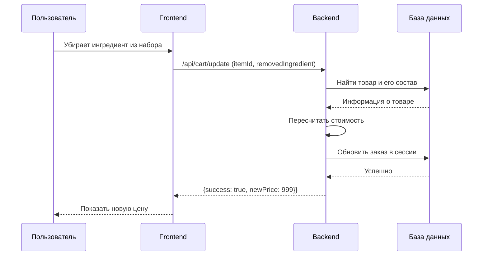

## Введение

В мире информационных технологий существует множество профессий, названия которых могут показаться похожими, но на деле они подразумевают совершенно разные роли и обязанности. Две такие профессии — бизнес-аналитик и системный аналитик. Обе они связаны с анализом, но фокус их работы кардинально отличается. Начинающие специалисты часто путают эти две роли, что может привести к неверному выбору карьерного пути. В этой статье мы подробно разберем, в чем заключаются ключевые различия между бизнес-аналитиком и системным аналитиком, какие задачи они решают, какими навыками должны обладать и как они взаимодействуют в рамках одного проекта. Понимание этих различий поможет не только выбрать правильное направление для развития, но и более эффективно выстраивать рабочие процессы в команде.

## Основные концепции

Чтобы понять разницу между бизнес-аналитиком и системным аналитиком, необходимо четко определить цели, задачи и зону ответственности каждого из них.

### Бизнес-аналитик: мост между бизнесом и IT

**Бизнес-аналитик (Business Analyst, BA)** — это специалист, который анализирует бизнес-процессы компании, выявляет проблемы и потребности бизнеса и предлагает решения для их улучшения. Главная задача бизнес-аналитика — помочь компании достичь своих стратегических целей за счет оптимизации процессов, внедрения новых технологий или изменения организационной структуры. Бизнес-аналитик работает на уровне "что" и "зачем": **что** нужно сделать и **зачем** это нужно бизнесу.

**Ключевые задачи бизнес-аналитика:**

* **Выявление и анализ требований:** Общение с заинтересованными сторонами (стейкхолдерами), такими как руководство компании, менеджеры отделов, конечные пользователи, для сбора и анализа их потребностей и ожиданий.
* **Моделирование бизнес-процессов:** Описание существующих бизнес-процессов (as-is) и проектирование улучшенных (to-be) с использованием различных нотаций, например, BPMN (Business Process Model and Notation).
* **Формулирование бизнес-требований:** Создание документации, в которой четко и однозначно описаны требования бизнеса к будущему продукту или изменению.
* **Оценка экономического эффекта:** Анализ потенциальной выгоды от внедрения предлагаемых решений, расчет возврата инвестиций (ROI).
* **Коммуникация:** Обеспечение эффективного взаимодействия между представителями бизнеса и технической командой.

### Системный аналитик: архитектор IT-решений

**Системный аналитик (Systems Analyst, SA)** — это специалист, который переводит бизнес-требования, сформулированные бизнес-аналитиком, на язык технических спецификаций, понятных для команды разработки. Системный аналитик работает на уровне "как": **как** именно будет реализовано то или иное требование с технической точки зрения. Он проектирует IT-систему, которая будет соответствовать бизнес-требованиям и эффективно решать поставленные задачи.

**Ключевые задачи системного аналитика:**

* **Декомпозиция бизнес-требований:** Разбиение высокоуровневых бизнес-требований на более мелкие и детализированные функциональные и нефункциональные требования к системе.
* **Проектирование IT-системы:** Разработка архитектуры системы, определение ее компонентов, интерфейсов и взаимодействия между ними. Для этого используются диаграммы, такие как UML (Unified Modeling Language).
* **Создание технических спецификаций:** Написание подробной технической документации для разработчиков, включая описание моделей данных, алгоритмов, интеграций с другими системами.
* **Контроль соответствия:** Участие в процессе разработки и тестирования для обеспечения того, чтобы конечный продукт соответствовал исходным требованиям.
* **Управление изменениями:** Анализ и обработка запросов на изменение требований в ходе проекта.

### Ключевые различия в фокусе

| Критерий | Бизнес-аналитик | Системный аналитик |
| --- | --- | --- |
| **Основной фокус** | Проблемы и цели бизнеса | Техническая реализация решения |
| **Ключевой вопрос** | Что? Зачем? | Как? |
| **С кем общается** | Бизнес-заказчики, пользователи | Команда разработки, тестировщики, архитекторы |
| **Результат работы** | Бизнес-требования, ТЭО | Техническое задание, спецификации, диаграммы |
| **Необходимые знания** | Экономика, менеджмент, маркетинг | IT-архитектура, базы данных, языки моделирования |

## Практические примеры

Рассмотрим на конкретных примерах, как распределяются роли бизнес-аналитика и системного аналитика в реальных проектах.

### Пример 1: Разработка новой функции для интернет-магазина

**Сценарий:** Владелец интернет-магазина по доставке здорового питания замечает снижение конверсии и среднего чека. Он обращается к команде с просьбой найти решение этой проблемы.

**Действия бизнес-аналитика:**

1.  **Анализ проблемы:** Бизнес-аналитик изучает данные аналитики, проводит опросы пользователей и анализирует конкурентов. Он выясняет, что многие пользователи уходят с сайта, потому что не могут изменить состав наборов питания.
2.  **Формулирование гипотезы:** BA предполагает, что если дать пользователям возможность настраивать состав наборов (например, убирать нежелательные ингредиенты), это повысит конверсию и лояльность.
3.  **Создание бизнес-требований:** Бизнес-аналитик описывает новую функцию — "Конструктор наборов". В документе он указывает, что пользователь должен иметь возможность убрать ингредиент из набора, после чего стоимость заказа должна автоматически пересчитываться. Он также создает диаграмму бизнес-процесса в нотации BPMN, чтобы наглядно показать, как изменится процесс заказа.

**Диаграмма бизнес-процесса (BPMN) от бизнес-аналитика:**

```mermaid
graph TD
    A[Пользователь заходит на сайт] --> B{Выбирает набор питания};
    B --> C{Хочет изменить состав?};
    C -- Да --> D[Использует "Конструктор наборов"];
    D --> E[Система пересчитывает стоимость];
    E --> F[Пользователь добавляет товар в корзину];
    C -- Нет --> F;
    F --> G[Оформление заказа];
```

**Действия системного аналитика:**

1.  **Анализ бизнес-требований:** Системный аналитик получает от бизнес-аналитика описание функции и диаграмму. Он задает уточняющие вопросы: как именно будет происходить удаление ингредиента, какие есть ограничения, как это повлияет на другие части системы (склад, логистика).
2.  **Проектирование решения:** SA продумывает техническую реализацию. Он решает, что для "Конструктора" потребуется доработка интерфейса карточки товара, изменение логики расчета стоимости в корзине и создание нового поля в базе данных для хранения информации о составе кастомизированного набора. Он создает wireframe (каркас) интерфейса, чтобы показать, как будет выглядеть новый элемент управления.
3.  **Создание технической спецификации:** Системный аналитик готовит подробное техническое задание для разработчиков. Он описывает, какие изменения нужно внести в код, какие API-методы добавить, как должна быть изменена структура базы данных. Для наглядности он использует UML-диаграммы, например, диаграмму последовательности, чтобы показать взаимодействие компонентов системы.

**Диаграмма последовательности (UML) от системного аналитика:**



### Пример 2: Внедрение оплаты по QR-коду в мобильном банке

**Сценарий:** Банк хочет добавить в свое мобильное приложение возможность оплаты по QR-коду, чтобы повысить удобство для клиентов и увеличить количество транзакций.

**Действия бизнес-аналитика:**

* **Исследование рынка:** BA анализирует, как подобная функция реализована у конкурентов, изучает ожидания пользователей и требования законодательства.
* **Определение бизнес-целей:** Формулирует цели: увеличить долю безналичных платежей, привлечь новых клиентов из числа молодежи, сократить расходы на эквайринг.
* **Описание пользовательского сценария:** Описывает, как пользователь будет инициировать платеж, сканировать QR-код и подтверждать операцию. Создает высокоуровневые требования к функции.

**Действия системного аналитика:**

* **Проектирование интеграции:** SA изучает документацию платежной системы (например, СБП), с которой предстоит интеграция. Он определяет, какие API-методы нужно будет вызывать, какой формат данных использовать и как обеспечить безопасность.
* **Разработка архитектуры:** Проектирует взаимодействие между мобильным приложением, бэкендом банка и внешней платежной системой. Определяет, какие компоненты нужно будет доработать, а какие создать с нуля.
* **Создание спецификаций:** Пишет подробные спецификации для разработчиков мобильного приложения и бэкенда, включая описание API, моделей данных, сценариев обработки ошибок и требований к безопасности.

## Типичные ошибки и как их избежать

Непонимание разницы между ролями бизнес-аналитика и системного аналитика часто приводит к ошибкам в проектах. Вот некоторые из них:

* **Смешение ролей:** Когда один человек пытается выполнять обе роли, не имея достаточной экспертизы в одной из областей. Это может привести к тому, что бизнес-цели будут поняты неверно, а техническое решение окажется неоптимальным.
* **Как избежать:** Четко разделять зоны ответственности. В небольших командах, где один специалист совмещает роли, важно, чтобы он осознавал, в какой "шляпе" он находится в данный момент, и уделял достаточное внимание как бизнес-, так и системному анализу.
* **Отсутствие бизнес-аналитика:** Когда команда разработки получает задачи напрямую от бизнеса без предварительной проработки. Это чревато тем, что будет реализовано не то, что действительно нужно, а то, как заказчик себе это представляет. Разработчики решают проблему "в лоб", не видя общей картины.
* **Как избежать:** Настаивать на необходимости этапа бизнес-анализа. Объяснять заказчику, что качественная проработка требований на начальном этапе экономит время и деньги в будущем.
* **"Испорченный телефон":** Когда бизнес-аналитик плохо передает требования системному аналитику, а тот, в свою очередь, неверно их интерпретирует. В результате разработчики делают совсем не то, что ожидал бизнес.
* **Как избежать:** Наладить тесную коммуникацию. Проводить совместные встречи, где бизнес-аналитик, системный аналитик и ключевые разработчики могут вместе обсудить требования и задать друг другу вопросы. Использовать общие инструменты и нотации.

## Связь с другими темами

Роли бизнес-аналитика и системного аналитика тесно переплетены с другими профессиями и концепциями в IT:

* **Product Manager (Менеджер по продукту):** Product Manager отвечает за стратегию развития продукта и его коммерческий успех. Он определяет, **что** делать с продуктом в долгосрочной перспективе. Бизнес-аналитик часто работает в тесной связке с Product Manager, помогая ему детализировать требования для конкретных фичей и релизов.
* **Project Manager (Менеджер проекта):** Project Manager отвечает за то, чтобы проект был выполнен в срок, в рамках бюджета и с заданным качеством. Он управляет ресурсами, рисками и коммуникациями. И бизнес-аналитик, и системный аналитик являются ключевыми участниками проектной команды и постоянно взаимодействуют с Project Manager.
* **Аналитик данных (Data Analyst):** Аналитик данных работает с большими объемами информации, ищет в них закономерности и инсайты. Бизнес-аналитик может обращаться к аналитику данных за статистикой для подтверждения своих гипотез (как в примере с интернет-магазином).
* **Архитектор ПО (Software Architect):** В сложных проектах системный аналитик тесно сотрудничает с архитектором ПО. Архитектор принимает высокоуровневые технические решения, а системный аналитик детализирует их до уровня конкретных компонентов и модулей.

## Заключение

Бизнес-аналитик и системный аналитик — это две разные, но одинаково важные роли в создании успешных IT-продуктов. **Бизнес-аналитик** фокусируется на **бизнес-потребностях**, отвечая на вопросы "что?" и "зачем?", в то время как **системный аналитик** концентрируется на **технической реализации**, отвечая на вопрос "как?".

Успех проекта во многом зависит от того, насколько эффективно эти два специалиста могут работать вместе, создавая синергию между бизнесом и разработкой. Четкое понимание их ролей, обязанностей и зон ответственности позволяет избежать многих проблем, сократить время на разработку и в итоге создать продукт, который будет не только технически совершенным, но и по-настоящему ценным для пользователей и прибыльным для бизнеса. Выбор между карьерой бизнес-аналитика и системного аналитика зависит от ваших личных склонностей: если вам интересно решать бизнес-задачи и много общаться с людьми — ваш путь в бизнес-анализ; если же вас больше привлекает проектирование сложных систем и работа с техническими деталями — добро пожаловать в системный анализ.