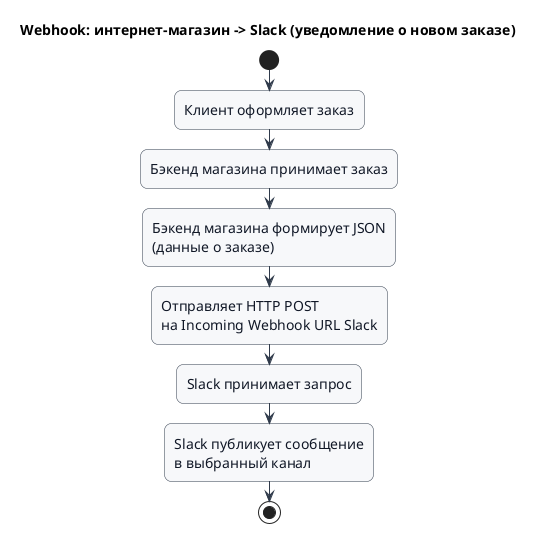

## Введение

В мире веб-разработки и API существует множество способов организации взаимодействия между различными компонентами системы. Два из наиболее распространенных, но часто путаемых, — это **коллбэки (callbacks)** и **вебхуки (webhooks)**. 

Оба механизма позволяют реализовать асинхронное взаимодействие и управлять потоком выполнения кода, но делают это по-разному и для разных целей. 

Мы разберем, что такое коллбэки и вебхуки, в чем их ключевые различия, и рассмотрим практические примеры их использования.

Если кратко, то:

* **Коллбэки** — это функции, которые передаются в другую функцию в качестве аргумента и выполняются после завершения основной операции
* **Вебхуки** — это механизм, позволяющий одному веб-приложению или сервису уведомлять другое о наступлении определенных событий в режиме реального времени

> Коллбэк это не вебхук! Вебхук это не коллбэк!

Коллбэк это механизм асинхронной обработки внутри приложения

Вебхух это механизм асинхронной обработки между приложениями / сервисами

## Основные концепции

### Что такое Callback?

**Callback** — это способ организовать выполнение логики внутри одного процесса/приложения: “после завершения операции вызови вот эту функцию/обработчик”.

**Callback (коллбэк, обратный вызов)** — это функция, которая передается в другую функцию в качестве аргумента и выполняется после завершения основной операции. Это фундаментальный паттерн в асинхронном программировании, особенно в языках вроде JavaScript. Коллбэки позволяют выполнять код не последовательно, а по мере готовности результата, не блокируя при этом основной поток выполнения.

Представьте, что вы запускаете долгую операцию. Вместо ожидания система “запоминает”, что делать дальше. Когда операция завершена, выполняется заранее определённая обработка результата: показать данные, обновить статус, отрисовать ошибку.

Как это выглядит глазами аналитика:

* Callback — деталь реализации (обычно в коде).
* На уровне требований вы **не пишете** “сделать callback”, вы пишете: “после события X выполнить действие Y”, а реализация может быть callback/Promise/async-await/observer и зависит от выбора разработчика.

### Что такое Webhook?

**Webhook** — это механизм уведомления между системами: поставщик событий отправляет HTTP-запрос (обычно POST) на заранее зарегистрированный URL потребителя, когда наступает событие.

**Webhook (вебхук, веб-перехватчик)** — это механизм, позволяющий одному веб-приложению или сервису уведомлять другое о наступлении определенных событий в режиме реального времени. По сути, это HTTP-коллбэк. Одно приложение (поставщик) отправляет HTTP-запрос (обычно POST) на заранее определенный URL другого приложения (потребителя) при возникновении события.

Допустим, вы оформили заявку в сервисе, а обработка идёт в другой системе. Вы заранее указываете адрес, куда присылать уведомления (endpoint). Дальше вам не нужно “опрашивать” систему — она сама отправляет HTTP-уведомления при каждом значимом событии:

* application.received — заявка принята,
* application.processing — в работе,
* application.approved / application.rejected — итог,
* application.documents_requested — запросили доп. документы.

Это и есть вебхук: поставщик событий сам “толкает” события на заранее зарегистрированный URL.

Webhook — это уже интеграция. Значит, в ТЗ должны быть:

* события, на которые подписываемся
* endpoint потребителя (куда прилетает)
* формат payload
* безопасность (подпись/секрет/mTLS)
* ретраи, дедупликация, идемпотентность
* наблюдаемость (корреляция, логи)

### Ключевые различия

| Характеристика | Callback | Webhook |
|---|---|---|
| **Среда выполнения** | В рамках одного приложения или процесса | Между разными веб-сервисами (межсетевое взаимодействие) |
| **Механизм** | Передача функции как аргумента | Отправка HTTP-запроса на URL |
| **Коммуникация** | Внутрипроцессная, синхронная или асинхронная | Межпроцессная, всегда асинхронная |
| **Зависимость от языка** | Языково-зависимый | Языково-независимый (основан на HTTP) |
| **Тип “ошибок”**              | ошибки выполнения в приложении         | сетевые ошибки, недоступность, таймауты, повторы    |
| **Что является “контрактом”** | сигнатура функции/обработчика (в коде) | HTTP endpoint + схема payload + правила доставки    |
| **Гарантии**                  | контролируются кодом в одном процессе  | нужны договорённости: retries, DLQ, идемпотентность |
| **Безопасность**              | внутренняя                             | обязательна: подписи, секреты, allowlist, mTLS      |

## Практические примеры

### Пример 1: Callback — где он всплывает в требованиях

> **Кейс**: пользователь нажал “Сохранить”, система отправила запрос, после ответа обновила UI.

Мы пишем в требованиях:
1. после успешного сохранения показать “Сохранено”
2. при ошибке показать текст ошибки и подсветить поля
3. пока запрос выполняется — лоадер/блокировка кнопки

Внутренне разработчик сделает это callback’ом или async/await — SA это не специфицирует.

### Пример 2: классический интеграционный сценарий

> **Кейс**: интернет-магазин хочет получать уведомления “создан заказ” в систему уведомлений/CRM.

Мы пишем в требованиях:

1. событие: order.created
2. когда возникает: после успешной фиксации заказа (после коммита)
3. endpoint потребителя: POST /webhooks/orders
4. payload: orderId, сумма, валюта, товары, createdAt
5. security: подпись HMAC + timestamp
6. retries: экспоненциальная задержка, лимит попыток
7. dedup: eventId, обработка идемпотентная
8. ответы: 2xx = принято, 4xx = невалидно (без ретраев), 5xx = ретраи

### Пример 3: Webhook для уведомлений в Slack

Предположим, у нас есть интернет-магазин, и мы хотим получать уведомления в Slack о каждом новом заказе. Для этого мы можем использовать вебхуки.

1. **Настройка в Slack:** В настройках Slack мы создаем "Incoming Webhook" для определенного канала. Slack генерирует для нас уникальный URL.
2. **Настройка в магазине:** В административной панели нашего магазина мы указываем этот URL в качестве эндпоинта для вебхуков о новых заказах.
3. **Процесс:**
    * Клиент оформляет заказ.
    * Бэкенд нашего магазина формирует JSON-объект с информацией о заказе.
    * Бэкенд отправляет `POST`-запрос с этим JSON на URL, предоставленный Slack.
    * Slack получает запрос и публикует отформатированное сообщение в указанном канале.

**Пример диаграммы взаимодействия:**

## Типичные ошибки и как их избежать

### Callback Hell (Ад коллбэков)

При большом количестве вложенных асинхронных операций код может превратиться в так называемый "ад коллбэков" — глубоко вложенную и трудночитаемую структуру.

**Как избежать:**

* **Именование функций:** Вместо анонимных функций используйте именованные.
* **Модульность:** Разбивайте код на небольшие, переиспользуемые функции.
* **Промисы (Promises) и Async/Await:** В современном JavaScript для работы с асинхронностью предпочтительнее использовать промисы и синтаксис `async/await`, которые делают код более плоским и читаемым.

## Что обязательно описывать в ТЗ, если выбран webhook

### Регистрация (setup)

1. кто хранит список подписчиков (provider или отдельный сервис)
2. как регистрируется URL (UI/конфиг/API)
3. как обновляется секрет/ключ
4. тестовая отправка (проверка доступности и подписи)

### Контракт webhook’а (endpoint)

1. HTTP метод и путь: POST /webhooks/topic
2. заголовки:
2.1 X-Event-Id (или аналог)
2.2 X-Signature (подпись)
2.3 X-Timestamp (защита от replay)
2.4 X-Correlation-Id (сквозная трассировка)
3. тело: JSON-schema (или OpenAPI фрагмент)

### Семантика доставки и повторы

1. delivery: почти всегда at-least-once
2. retries: политика (интервалы, лимит)
3. timeout: сколько ждём ответ от получателя
4. DLQ/лог “не доставлено”: где смотреть и кто разбирает

### Идемпотентность и дедупликация

1. уникальность: eventId
2. правило: повторная доставка одного eventId не должна приводить к повторным эффектам
3. хранение: TTL на ключи дедупликации (например, 7–30 дней)

### Ошибки и ответы получателя

1. 2xx: принято и обработано (или принято в очередь)
2. 4xx: ошибка данных/подписи → не ретраим
3. 5xx: временная ошибка → ретраи

### Проблемы с Webhook

* **Потеря событий:** Если ваш сервис-потребитель недоступен в момент отправки вебхука, уведомление может быть потеряно.
**Решение:** Поставщик вебхуков должен реализовывать механизм повторных отправок (retries) с экспоненциальной задержкой.
* **Безопасность:** Поскольку URL вебхука общедоступен, кто угодно может отправлять на него запросы.
**Решение:** Используйте подписи (signatures). Поставщик подписывает каждый запрос с помощью секретного ключа, а потребитель проверяет эту подпись, чтобы убедиться в подлинности запроса.
* **Дублирование событий:** Из-за повторных отправок ваш сервис может получить одно и то же уведомление несколько раз.
**Решение:** Делайте обработчики идемпотентными. Например, проверяйте уникальный ID события перед его обработкой.

## Как объяснить разницу на интервью

* Callback — “как внутри кода дождаться результата и продолжить”.
* Webhook — “как одна система уведомляет другую по HTTP о событии”.
* Для аналитика callback это “деталь реализации”, а webhook — “контракт интеграции и эксплуатации”.

## Шаблоны / примеры

> Webhook событие:

1. Событие: order.created
2. Поставщик: System A
3. Потребитель: System B
4. Когда отправляется: после успешного создания заказа (после коммита)
5. Endpoint: POST /webhooks/orders
6. Таймаут: 3 сек
7. Retries: 1m, 5m, 15m, 1h (макс 4 попытки)
8. Delivery: at-least-once
9. Dedup key: eventId (TTL 30 дней)
10. Security: HMAC подпись + timestamp
11. Ответы:

* 2xx — принято
* 4xx — ошибка данных/подписи (без ретраев)
* 5xx — временная ошибка (ретраи)

> Контракт тела запроса (payload)
1. Headers:

* X-Event-Id (uuid, required)
* X-Timestamp (ISO8601, required)
* X-Signature (string, required)
* X-Correlation-Id (string, optional/required — по договорённости)

2. Body (JSON):

* eventType (string)
* occurredAt (datetime)
* data (object)
* orderId (string, required)
* amount (number, required)
* currency (string, required)

## Связь с другими темами

* **API и REST:** Вебхуки являются частью архитектуры API и часто используются в связке с REST API для создания более реактивных и эффективных систем.
* **Событийно-ориентированная архитектура (EDA):** И коллбэки, и вебхуки являются ключевыми элементами событийно-ориентированной архитектуры, где компоненты системы реагируют на события, а не на прямые команды.
* **Микросервисы:** Вебхуки — популярный способ организации асинхронной коммуникации между микросервисами.

## Заключение

И коллбэки, и вебхуки являются мощными инструментами для управления асинхронными операциями. **Коллбэки** — это фундаментальный паттерн программирования, работающий внутри одного приложения, который позволяет выполнять код по завершении определенной задачи. **Вебхуки** же выводят эту концепцию на уровень межсетевого взаимодействия, позволяя разным веб-сервисам обмениваться информацией о событиях в реальном времени.

Понимание разницы между этими двумя механизмами и умение правильно их применять — ключ к созданию гибких, масштабируемых и эффективных приложений. В то время как современный JavaScript предлагает более элегантные решения для асинхронности, чем "чистые" коллбэки, понимание их работы остается важным для любого разработчика. Вебхуки же продолжают быть стандартом де-факто для интеграции множества SaaS-платформ и построения сложных распределенных систем.
