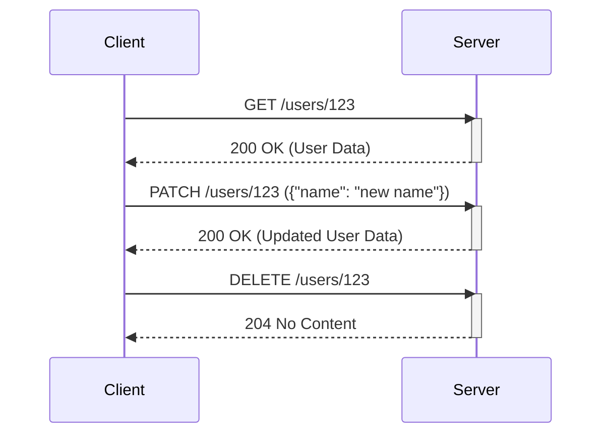

## Введение

HTTP (HyperText Transfer Protocol) — это протокол, лежащий в основе Всемирной паутины. Он определяет, как сообщения форматируются и передаются, и какие действия должны предпринимать веб-серверы и браузеры в ответ на различные команды. Ключевой частью этого протокола являются HTTP-методы, также известные как "глаголы". Они указывают на желаемое действие, которое должно быть выполнено для данного ресурса.

Понимание HTTP-методов необходимо для всех, кто работает с веб-технологиями, будь то фронтенд-разработчик, создающий пользовательские интерфейсы, бэкенд-разработчик, проектирующий API, или системный аналитик, описывающий взаимодействие между компонентами системы. Эти методы формируют основу RESTful API — архитектурного стиля, который стал стандартом для построения веб-сервисов.

В этой статье мы подробно рассмотрим пять основных HTTP-методов: **GET**, **POST**, **PUT**, **PATCH** и **DELETE**. Мы разберем их семантику, основные отличия, а также рассмотрим практические примеры их использования.


## Основные концепции

Каждый HTTP-метод имеет определенную семантику и свойства, которые определяют его поведение. Важно понимать два ключевых свойства: **идемпотентность** и **безопасность**.

* **Безопасный метод (Safe):** Метод считается безопасным, если он не изменяет состояние ресурса на сервере. Такие методы предназначены только для получения данных. К безопасным методам относится `GET`.
* **Идемпотентный метод (Idempotent):** Метод является идемпотентным, если многократное повторение одного и того же запроса приводит к тому же результату, что и одиночный запрос. Это не означает, что ресурс не изменится. Это означает, что повторные запросы не приведут к дополнительным изменениям. `GET`, `PUT`, и `DELETE` являются идемпотентными. `POST` и `PATCH` — нет.

### GET

Метод **GET** используется для запроса представления ресурса. Запросы с использованием GET должны только извлекать данные и не должны иметь другого эффекта. Это самый распространенный метод, используемый браузерами для получения веб-страниц и изображений.

* **Безопасность:** Да.
* **Идемпотентность:** Да.
* **Тело запроса:** Не должно быть.
* **Кеширование:** Результаты `GET`-запросов могут кешироваться.

### POST

Метод **POST** используется для отправки сущности на указанный ресурс, часто вызывая изменение состояния или побочные эффекты на сервере. Он используется для создания новых ресурсов, отправки форм и выполнения других операций, которые не являются ни безопасными, ни идемпотентными.

* **Безопасность:** Нет.
* **Идемпотентность:** Нет.
* **Тело запроса:** Есть.
* **Кеширование:** Результаты `POST`-запросов не кешируются, если это явно не указано в заголовках ответа.

### PUT

Метод **PUT** заменяет все текущее представление ресурса данными, содержащимися в теле запроса. Если ресурс не существует, он может быть создан. В отличие от POST, PUT является идемпотентным: многократная отправка одного и того же PUT-запроса будет иметь тот же эффект, что и один.

* **Безопасность:** Нет.
* **Идемпотентность:** Да.
* **Тело запроса:** Есть.
* **Кеширование:** Нет.

### PATCH

Метод **PATCH** используется для частичного обновления ресурса. В отличие от PUT, который полностью заменяет ресурс, PATCH применяет частичные изменения. Например, если нужно обновить только одно поле в профиле пользователя, используется PATCH.

*   **Безопасность**: Нет.
*   **Идемпотентность**: Нет.
*   **Тело запроса**: Есть.
*   **Кеширование**: Нет.

### DELETE

Метод **DELETE** удаляет указанный ресурс. Как и PUT, DELETE является идемпотентным: повторное выполнение запроса на удаление уже удаленного ресурса не приведет к ошибке (сервер вернет `404 Not Found`, но с точки зрения состояния системы ничего не изменится).

* **Безопасность:** Нет.
* **Идемпотентность:** Да.
* **Тело запроса:** Может быть, но обычно не используется.
* **Кеширование:** Нет.

| Метод  | Описание                                     | Идемпотентный | Безопасный | Тело запроса | Пример использования                               |
| :----- | :------------------------------------------- | :------------ | :--------- | :----------- | :------------------------------------------------- |
| GET    | Получение ресурса                           | Да            | Да         | Нет          | Получение списка пользователей: `GET /users`       |
| POST   | Создание нового ресурса                      | Нет           | Нет        | Да           | Создание нового пользователя: `POST /users`        |
| PUT    | Полное обновление/замена ресурса             | Да            | Нет        | Да           | Обновление данных пользователя: `PUT /users/123`   |
| PATCH  | Частичное обновление ресурса                 | Нет           | Нет        | Да           | Обновление имени пользователя: `PATCH /users/123`  |
| DELETE | Удаление ресурса                             | Да            | Нет        | Нет          | Удаление пользователя: `DELETE /users/123`         |
_## Практические примеры

Рассмотрим, как эти методы используются на практике при работе с RESTful API для управления коллекцией пользователей.

### Пример 1: Взаимодействие с API с помощью `curl`

`curl` — это популярная утилита командной строки для выполнения HTTP-запросов.

**1. Получение списка всех пользователей (GET)**

```bash
curl -X GET https://api.example.com/users
```

Сервер вернет JSON-массив с объектами пользователей.

**2. Создание нового пользователя (POST)**

```bash
curl -X POST https://api.example.com/users -H "Content-Type: application/json" -d '{
  "name": "John Doe",
  "email": "john.doe@example.com"
}'
```

Сервер создаст нового пользователя и, как правило, вернет в ответе его представление с присвоенным `id` и статусом `201 Created`.

**3. Полное обновление пользователя (PUT)**

Предположим, мы хотим обновить пользователя с `id=123`.

```bash
curl -X PUT https://api.example.com/users/123 -H "Content-Type: application/json" -d '{
  "name": "Johnathan Doe",
  "email": "johnathan.doe@example.com"
}'
```

Этот запрос полностью заменит данные пользователя с `id=123`.

**4. Частичное обновление пользователя (PATCH)**

Если нам нужно обновить только email пользователя с `id=123`.

```bash
curl -X PATCH https://api.example.com/users/123 -H "Content-Type: application/json" -d '{
  "email": "new.email@example.com"
}'
```

Имя пользователя (`name`) останется без изменений.

**5. Удаление пользователя (DELETE)**

```bash
curl -X DELETE https://api.example.com/users/123
```

Этот запрос удалит пользователя с `id=123`. Сервер вернет статус `204 No Content` в случае успеха.

### Пример 2: Диаграмма последовательности (Sequence Diagram)

Диаграммы последовательности помогают визуализировать взаимодействие между клиентом и сервером.



Эта диаграмма иллюстрирует три последовательных запроса: получение данных пользователя, их частичное обновление и последующее удаление.


## Типичные ошибки и как их избежать

Неправильное использование HTTP-методов может привести к проблемам в работе API, нарушению принципов REST и путанице у разработчиков.

**1. Использование GET для изменения состояния**

Одна из самых серьезных ошибок — использование GET-запросов для выполнения операций, изменяющих данные (например, удаление: `GET /users/123/delete`). Это нарушает семантику метода и может иметь катастрофические последствия, так как поисковые роботы и кеширующие прокси могут невольно вызывать такие URL, изменяя или удаляя данные.

* **Как избежать:** Всегда используйте `POST`, `PUT`, `PATCH` или `DELETE` для операций, изменяющих состояние. `GET` должен использоваться только для чтения.
**2. Неправильный выбор между PUT и POST**

Часто возникает путаница, когда использовать PUT, а когда POST. POST используется для создания *нового* ресурса в коллекции, при этом URL указывает на саму коллекцию (`POST /users`). Клиент не знает, какой URL будет у созданного ресурса. PUT используется для создания или *полной замены* ресурса по известному URL (`PUT /users/123`).

* **Как избежать:** Используйте `POST`, когда URL создаваемого ресурса определяет сервер. Используйте `PUT`, когда URL определяет клиент, или когда нужно полностью заменить существующий ресурс.

**3. Использование PUT для частичных обновлений**

Использование PUT, когда требуется обновить только часть ресурса, неэффективно и может привести к потере данных. Если клиент отправит PUT-запрос только с одним полем, все остальные поля ресурса будут удалены или сброшены в значения по умолчанию.

* **Как избежать:** Для частичных обновлений всегда используйте `PATCH`. Это явно указывает на намерение изменить только указанные поля.
**4. Отсутствие идемпотентности у PUT и DELETE**

Реализация PUT и DELETE на сервере должна быть идемпотентной. Если клиент отправит один и тот же DELETE-запрос дважды из-за проблем с сетью, второй запрос не должен приводить к ошибке `500 Internal Server Error`, потому что ресурс уже удален. Он должен вернуть `404 Not Found` или `204 No Content`.

* **Как избежать:** Проектируйте логику сервера так, чтобы повторные `PUT`- или `DELETE`-запросы не вызывали непредвиденных ошибок. Например, при удалении проверяйте, существует ли ресурс, прежде чем пытаться его удалить.

## Связь с другими темами

Понимание HTTP-методов неразрывно связано с другими ключевыми концепциями веб-разработки.

* **RESTful API:** Правильное использование HTTP-методов является одним из фундаментальных принципов REST (Representational State Transfer). RESTful-сервисы используют HTTP-методы для выполнения операций CRUD (Create, Read, Update, Delete) над ресурсами, которые идентифицируются с помощью URL.
* **HTTP Status Codes:** Каждый HTTP-ответ содержит код состояния, который информирует клиента о результате выполнения запроса. Например, успешный `GET`-запрос обычно возвращает `200 OK`, успешный `POST` — `201 Created`, а успешный `DELETE` — `204 No Content`. Ошибки клиента, такие как запрос к несуществующему ресурсу, возвращают `404 Not Found`.
* **Аутентификация и Авторизация:** Хотя HTTP-методы не определяют механизмы безопасности, они работают в связке с ними. Например, для выполнения "опасных" запросов (`POST`, `PUT`, `PATCH`, `DELETE`) сервер почти всегда требует, чтобы клиент был аутентифицирован (например, с помощью токена в заголовке `Authorization`) и имел необходимые права для выполнения операции.

## Заключение

HTTP-методы GET, POST, PUT, PATCH и DELETE составляют основу взаимодействия в вебе. Они предоставляют стандартизированный и предсказуемый способ управления ресурсами через сеть. Правильное и семантически верное использование этих методов — залог создания надежных, масштабируемых и удобных в сопровождении RESTful API.

Для разработчика важно не просто знать, что делает каждый метод, но и понимать их свойства, такие как безопасность и идемпотентность. Это позволяет проектировать системы, которые ведут себя предсказуемо даже в условиях сетевых сбоев и повторных запросов. В конечном счете, глубокое понимание HTTP-методов отличает профессионального веб-разработчика и является необходимым навыком для работы с современными веб-сервисами.
