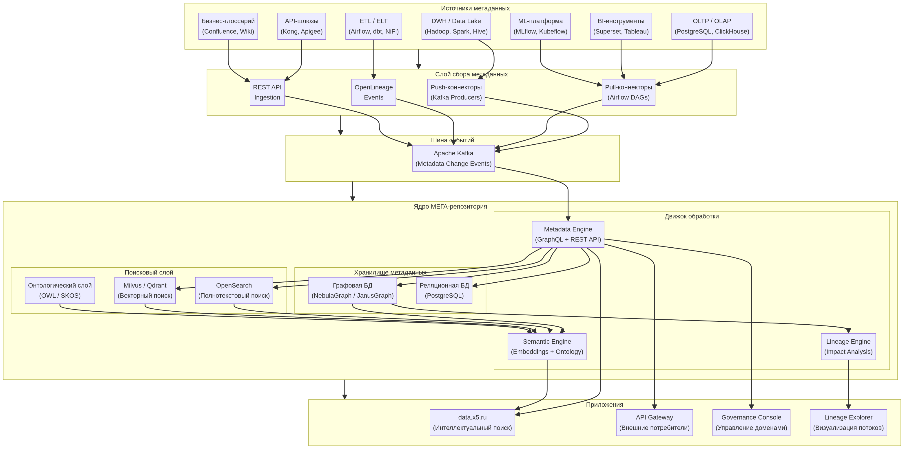
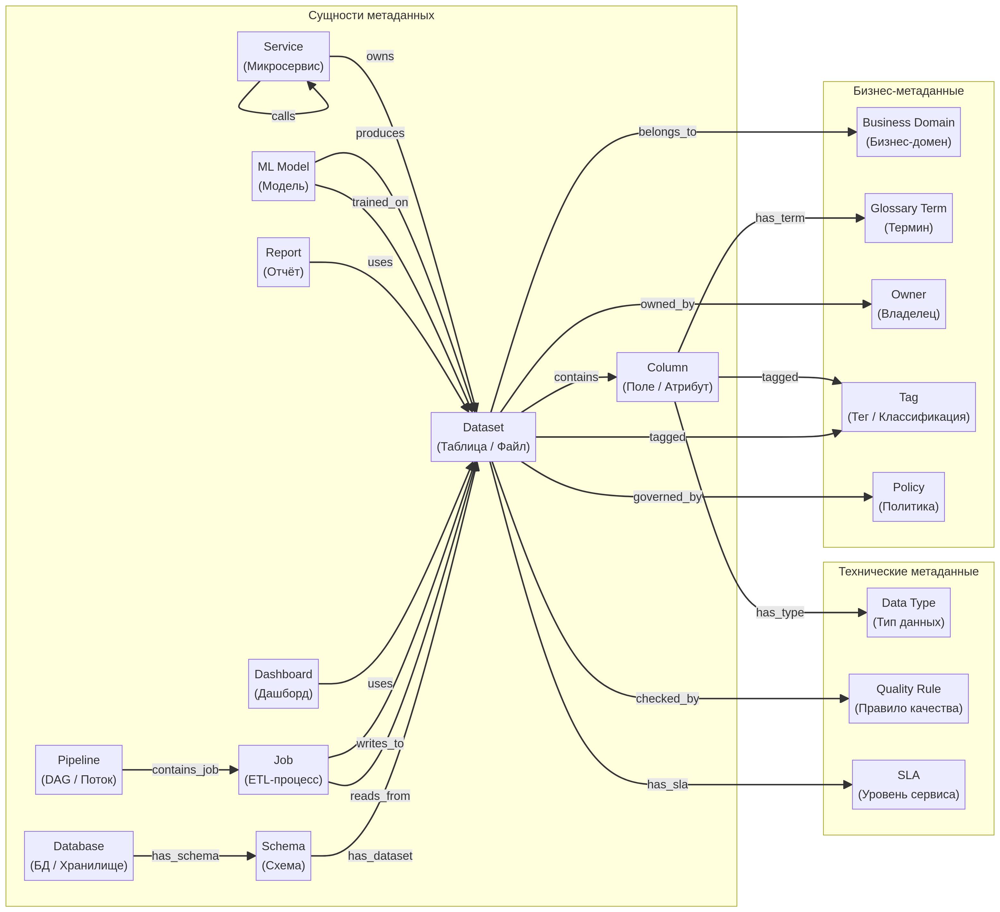
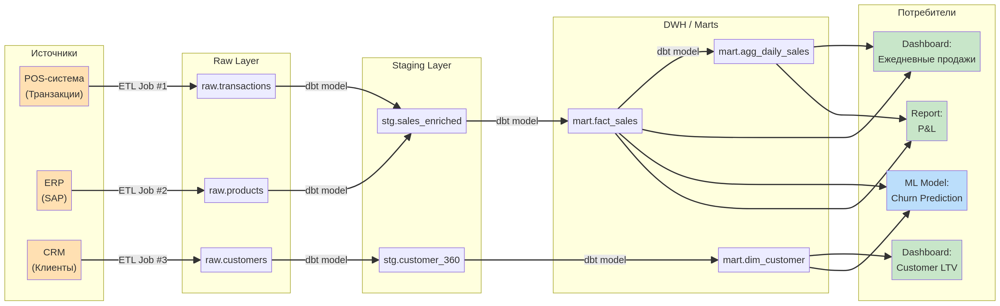
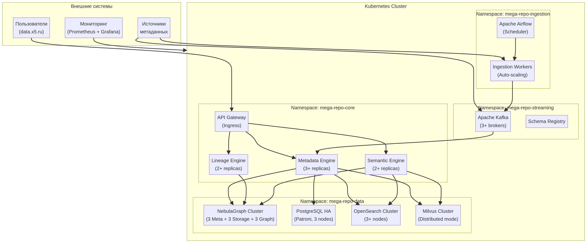

# Архитектура МЕГА-репозитория метаданных для X5 Group

**Автор:** Manus AI
**Дата:** 19 февраля 2026 г.

## 1. Введение и постановка задачи

Настоящий документ представляет собой архитектурное видение и техническое обоснование для создания **МЕГА-репозитория** — централизованной системы управления метаданными в X5 Group. Цель проекта — трансформировать текущий ландшафт данных, сделав его прозрачным, управляемым и доступным для интеллектуального поиска, что напрямую соответствует бизнес-задаче по развитию умного поиска на портале `data.x5.ru`.

### 1.1. Бизнес-контекст и цели

В условиях экспоненциального роста объемов данных и усложнения их потоков, X5 Group сталкивается с классическими вызовами: разрозненность метаданных, отсутствие единого источника правды, сложности в отслеживании происхождения данных (data lineage) и оценке влияния изменений (impact analysis). Это приводит к снижению доверия к данным, замедлению принятия решений и увеличению операционных рисков.

**Видение результата:** МЕГА-репозиторий должен стать единым, доверенным источником истины для метаданных всего ландшафта данных компании, обеспечивая основу для построения интеллектуальных сервисов, включая семантический поиск и автоматизированное управление данными.

### 1.2. Анализ требований

На основе предоставленных бизнес-требований, были сформулированы и проанализированы функциональные (FR) и нефункциональные (NFR) требования к системе.

#### 1.2.1. Функциональные требования (FR)

| ID | Требование | Интерпретация и ключевые архитектурные импликации |
|---|---|---|
| FR-1 | Хранение многомерных связей | Требуется модель данных, способная эффективно представлять сложные, неиерархические отношения между любыми сущностями. **Выбор:** Графовая модель данных является наиболее подходящей. |
| FR-2 | Data Lineage и Impact Analysis | Система должна автоматически отслеживать и визуализировать потоки данных от источника к потребителю. Это необходимо для анализа влияния изменений и поиска первопричин ошибок. **Выбор:** Графовая база данных с поддержкой алгоритмов обхода графа (pathfinding). |
| FR-3 | Принадлежность бизнес-доменам | Возможность классифицировать активы данных (таблицы, отчеты, модели) по бизнес-доменам, продуктам и командам. **Выбор:** Гибкая модель метаданных с поддержкой тегирования, глоссариев и управления таксономией. |
| FR-4 | Связывание любых данных | Система не должна быть ограничена предопределенными связями; пользователи должны иметь возможность создавать произвольные связи между любыми сущностями. **Выбор:** Графовая модель данных, где любая сущность может быть вершиной, а любая связь — ребром. |
| FR-5 | Семантический поиск | Поиск должен понимать смысл запроса, а не только ключевые слова. Это включает использование онтологий, векторов (embeddings) и полнотекстового поиска. **Выбор:** Гибридная архитектура поиска, сочетающая полнотекстовый движок, векторную базу данных и графовые запросы. |

#### 1.2.2. Нефункциональные требования (NFR)

| ID | Требование | Интерпретация и ключевые архитектурные импликации |
|---|---|---|
| NFR-1 | Горизонтальная масштабируемость | Система должна масштабироваться путем добавления новых узлов (серверов), а не только за счет увеличения мощности существующих. **Выбор:** Распределенные, cloud-native технологии (Kubernetes, распределенные БД). |
| NFR-2 | Линейный рост производительности | Производительность системы должна расти предсказуемо (линейно) при добавлении ресурсов. **Выбор:** Архитектура типа "shared-nothing" для ключевых компонентов, особенно для хранилища данных. |
| NFR-3 | Низкая задержка на запросы "impact analysis" | Запросы на анализ влияния (например, "что сломается, если я изменю это поле?") должны выполняться быстро, в идеале — в реальном времени. **Выбор:** Нативная графовая база данных, оптимизированная для таких запросов. |
| NFR-4 | Pathfinding по данным | Эффективный поиск путей и зависимостей в графе данных. **Выбор:** Графовая база данных с поддержкой соответствующих алгоритмов (например, Shortest Path, All Paths). |
| NFR-5 | OpenSource решения | Архитектура должна базироваться на решениях с открытым исходным кодом для избежания vendor lock-in и снижения TCO. **Выбор:** Тщательный отбор и сравнение зрелых OpenSource-проектов для каждого компонента стека. |

## 2. Высокоуровневая архитектура

Предлагаемая архитектура МЕГА-репозитория является модульной, масштабируемой и основана на событийно-ориентированном подходе. Она состоит из пяти логических слоев: источники, сбор, потоковая обработка, ядро и приложения.

*Рисунок 1. Высокоуровневая архитектура МЕГА-репозитория.*

### 2.1. Слой источников (Sources)

Этот слой представляет собой весь разнообразный ландшафт данных X5 Group. Сюда входят как традиционные источники (DWH, OLTP), так и современные (ML-платформы, BI-инструменты). Важно отметить, что МЕГА-репозиторий не хранит сами данные, а только метаданные о них.

### 2.2. Слой сбора (Ingestion)

Отвечает за сбор метаданных из источников. Используется гибридный подход:
- **Push-коннекторы:** Источники, поддерживающие real-time стриминг (например, через Kafka), могут напрямую отправлять события об изменении метаданных.
- **Pull-коннекторы:** Для систем, не способных отправлять события, используются периодические опросы (например, через Airflow DAGs), которые извлекают метаданные.
- **OpenLineage:** Для систем, поддерживающих стандарт OpenLineage (например, Spark, dbt, Airflow), события о запусках и потоках данных собираются в стандартизированном формате.
- **REST API:** Для ручного ввода или интеграции с системами, где другие способы не подходят.

### 2.3. Шина событий (Streaming)

Центральным элементом архитектуры является **Apache Kafka**. Все изменения метаданных, независимо от способа сбора, публикуются в виде событий в топики Kafka. Это создает единый, упорядоченный поток событий `Metadata Change Events`, который служит источником правды для всего репозитория и позволяет decoupled-взаимодействие между компонентами.

### 2.4. Ядро МЕГА-репозитория (Core)

Это сердце системы, где происходит хранение, индексация и обработка метаданных. Ядро состоит из трех ключевых частей:
1.  **Хранилище метаданных (Storage):** Гибридная модель, использующая сильные стороны разных типов БД для оптимального хранения.
2.  **Поисковый слой (Search):** Обеспечивает многогранный интеллектуальный поиск.
3.  **Движок обработки (Engine):** Набор сервисов, реализующих основную бизнес-логику.

### 2.5. Слой приложений (Applications)

Верхнеуровневый слой, с которым взаимодействуют конечные пользователи и системы:
- **data.x5.ru:** Основной пользовательский интерфейс, предоставляющий интеллектуальный поиск по данным.
- **API Gateway:** Точка входа для внешних систем, желающих интегрироваться с репозиторием.
- **Governance Console:** Интерфейс для дата-стюардов для управления доменами, глоссариями, политиками.
- **Lineage Explorer:** Интерактивный инструмент для визуализации и исследования потоков данных.

## 3. Детализация ядра архитектуры

Ядро системы спроектировано для максимальной производительности, масштабируемости и гибкости, разделяя задачи хранения, поиска и обработки на специализированные компоненты.

### 3.1. Хранилище метаданных (Storage Layer)

Для удовлетворения разнообразных требований к хранению и запросам метаданных предлагается гибридная модель хранения:

-   **Графовая БД (NebulaGraph / JanusGraph):** Является основным хранилищем для структуры и связей метаданных. Она идеально подходит для хранения многомерных связей (FR-1), отслеживания data lineage (FR-2) и выполнения быстрых запросов на анализ влияния (NFR-3, NFR-4). NebulaGraph рекомендуется как более современное, горизонтально масштабируемое решение с высокой производительностью [1, 2].
-   **Реляционная БД (PostgreSQL):** Используется для хранения "документной" части метаданных — больших текстовых описаний, JSON-атрибутов, профилей данных и другой структурированной информации, которая не требует графовых запросов. PostgreSQL обеспечивает транзакционность (ACID) и зрелость экосистемы.

Такое разделение позволяет использовать лучшее из двух миров: скорость и гибкость графовых запросов для связей и надежность и простоту реляционной модели для атрибутов.

### 3.2. Поисковый слой (Search Layer)

Для реализации интеллектуального поиска (FR-5) создается гибридный поисковый слой, объединяющий три парадигмы:

-   **Полнотекстовый поиск (OpenSearch):** Индексирует все текстовые метаданные (имена, описания, комментарии) и обеспечивает быстрый и релевантный поиск по ключевым словам с использованием алгоритмов, таких как BM25.
-   **Векторный поиск (Milvus / Qdrant):** Трансформирует текстовые метаданные в векторные представления (embeddings). Это позволяет находить семантически близкие, но лексически различные сущности. Например, запрос "выручка по клиентам" найдет дашборд с названием "Customer Revenue". Milvus является зрелым, масштабируемым решением для этой задачи [3].
-   **Онтологический слой (OWL / SKOS):** Формализует бизнес-знания в виде онтологии (например, "Продукт является частью Категории", "LTV является ключевой метрикой"). Это позволяет расширять запросы и делать логические выводы, которые недоступны другим видам поиска.

### 3.3. Движок обработки (Engine Layer)

Это набор микросервисов, которые реализуют основную логику работы с метаданными:

-   **Metadata Engine:** Предоставляет основной API (GraphQL и REST) для доступа к метаданным. Он оркестрирует запросы к хранилищу (графовому и реляционному) и поисковому слою, обеспечивая единую точку входа для всех приложений.
-   **Lineage Engine:** Специализированный сервис для обработки запросов к data lineage. Он выполняет сложные графовые обходы в NebulaGraph для построения сквозных потоков данных и анализа влияния.
-   **Semantic Engine:** Отвечает за создание и обновление векторных представлений (embeddings) и интеграцию с онтологическим слоем для обогащения поисковых запросов.

## 4. Модель данных: Граф метаданных

В основе МЕГА-репозитория лежит гибкая и расширяемая модель данных, реализованная в виде графа. Эта модель позволяет представить все активы данных и связи между ними как единую, связанную структуру, что является ключом к выполнению требований FR-1, FR-2 и FR-4.

*Рисунок 2. Концептуальная модель данных графа метаданных.*

### 4.1. Основные сущности (вершины графа)

Модель включает в себя три категории сущностей:

1.  **Физические активы данных:** Представляют собой реальные объекты в ландшафте данных.
    *   `Dataset`: Центральная сущность, представляющая таблицу, представление, топик Kafka, файл в Data Lake и т.д.
    *   `Column`: Атрибут или поле внутри `Dataset`.
    *   `Job`, `Pipeline`: Процессы ETL/ELT, которые преобразуют данные.
    *   `Dashboard`, `Report`: Объекты в BI-системах.
    *   `ML Model`: Модели машинного обучения.
    *   `Service`: Микросервисы, которые владеют или используют данные.

2.  **Бизнес-метаданные:** Обогащают физические активы бизнес-контекстом (FR-3).
    *   `Business Domain`: Принадлежность к бизнес-домену (Финансы, Логистика, Маркетинг).
    *   `Glossary Term`: Связь с бизнес-термином из глоссария.
    *   `Owner`: Владелец данных (команда или конкретный сотрудник).
    *   `Tag`: Произвольные теги для классификации (например, `PII`, `GDPR`, `critical`).

3.  **Технические метаданные:** Описывают технические атрибуты и правила.
    *   `Data Type`: Тип данных колонки.
    *   `Quality Rule`: Правила качества данных, применяемые к датасету.
    *   `SLA`: Соглашения об уровне сервиса.

### 4.2. Связи (ребра графа)

Связи определяют отношения между сущностями и являются основой для data lineage и impact analysis. Примеры связей:
- `contains`: `Dataset` содержит `Column`.
- `reads_from` / `writes_to`: `Job` читает из одного `Dataset` и пишет в другой.
- `uses`: `Dashboard` использует `Dataset`.
- `belongs_to`: `Dataset` принадлежит `Business Domain`.
- `owned_by`: `Dataset` владеет `Owner`.

Эта модель является расширяемой. Новые типы сущностей и связей могут быть добавлены в систему без изменения основной архитектуры, что обеспечивает гибкость на будущее.

## 5. Реализация Data Lineage и Impact Analysis

Способность отслеживать потоки данных (Data Lineage) и оценивать влияние изменений (Impact Analysis) является одной из ключевых функций МЕГА-репозитория (FR-2, NFR-3). Архитектура решает эту задачу за счет комбинации графовой модели данных и специализированного движка обработки.

*Рисунок 3. Пример визуализации Data Lineage от источника до потребителя.*

### 5.1. Сбор метаданных для Lineage

Качество lineage напрямую зависит от полноты собираемых метаданных. Архитектура предусматривает несколько каналов сбора:

-   **Автоматический парсинг SQL:** Коннекторы для DWH и ETL-инструментов (например, dbt) могут парсить SQL-запросы для автоматического определения связей "чтение/запись" между таблицами.
-   **Стандарт OpenLineage:** Интеграция с системами, поддерживающими OpenLineage (Spark, Airflow, Flink), позволяет получать детальную информацию о запусках (`runs`) и задействованных наборах данных (`datasets`) в стандартизированном формате.
-   **Декораторы и агенты:** Для кастомных приложений и микросервисов могут быть разработаны специальные агенты или декораторы, которые будут отправлять события о доступе к данным в Kafka.

### 5.2. Графовые запросы для анализа

Вся информация о lineage хранится в графовой БД (NebulaGraph) в виде вершин (датасеты, джобы) и ребер (`reads_from`, `writes_to`). Это позволяет выполнять сложные аналитические запросы с низкой задержкой:

-   **Downstream Impact Analysis:** ("Что сломается, если я изменю эту таблицу?"). Выполняется путем обхода графа "вперед" от измененной вершины по ребрам зависимостей. Запрос находит все дашборды, отчеты, ML-модели и другие датасеты, которые зависят от исходной таблицы.

-   **Upstream Data Lineage / Root Cause Analysis:** ("Откуда пришли данные в этот отчет?" или "Почему в этом дашборде неверные цифры?"). Выполняется путем обхода графа "назад" от интересующей вершины к ее источникам. Это позволяет проследить всю цепочку преобразований данных и быстро найти потенциальное место возникновения ошибки.

**Lineage Engine** инкапсулирует логику этих запросов, предоставляя простой API для приложений, таких как **Lineage Explorer**, который визуализирует результаты для пользователей.

## 6. Реализация семантического поиска

Функционал интеллектуального поиска (FR-5) является центральным для пользовательского приложения `data.x5.ru`. Предлагаемая архитектура реализует гибридный поиск, который объединяет сильные стороны нескольких подходов для достижения максимальной релевантности и "интеллектуальности".

*Рисунок 4. Архитектура гибридного семантического поиска.*

Процесс обработки поискового запроса выглядит следующим образом:

1.  **Обработка запроса:** Входящий запрос от пользователя проходит через NLP-пайплайн, где происходит его очистка, токенизация и извлечение именованных сущностей (Named Entity Recognition, NER). Параллельно, с помощью embedding-модели (например, из библиотеки `sentence-transformers`), запрос преобразуется в векторное представление (embedding).

2.  **Расширение запроса:** С помощью онтологического слоя запрос обогащается синонимами и связанными терминами. Например, если пользователь ищет "LTV", система может добавить в запрос "Lifetime Value" и связанные с ним метрики.

3.  **Параллельный поиск:** Обогащенный запрос одновременно отправляется в три поисковых движка:
    *   **OpenSearch (полнотекстовый поиск):** Ищет точные и частичные совпадения по ключевым словам в индексированных текстовых метаданных.
    *   **Milvus (векторный поиск):** Ищет семантически близкие сущности, сравнивая вектор запроса с векторами метаданных в базе.
    *   **NebulaGraph (графовый поиск):** Ищет сущности, связанные с ключевыми словами запроса через онтологию или другие связи в графе.

4.  **Ранжирование и объединение:** Результаты из трех движков объединяются с помощью алгоритма **Reciprocal Rank Fusion (RRF)**. Этот метод эффективно комбинирует ранжированные списки из разных источников, не требуя сложной настройки весов. Объединенный список затем может быть дополнительно пере-ранжирован с помощью более тяжелой модели (Cross-Encoder) для уточнения релевантности топ-N результатов.

5.  **Выдача результатов:** Конечному пользователю возвращается ранжированный список найденных активов данных. Важно, что вместе с каждым результатом возвращается и его **контекст**: ключевые связи из графа (владелец, домен, upstream/downstream зависимости), что позволяет пользователю сразу понять место сущности в общем ландшафте данных.

## 7. Архитектура развертывания и технологический стек

Для обеспечения горизонтальной масштабируемости (NFR-1), отказоустойчивости и управляемости, вся система развертывается в контейнерах под управлением **Kubernetes**. Логическая изоляция компонентов достигается за счет использования отдельных неймспейсов.

*Рисунок 5. Схема развертывания компонентов в Kubernetes-кластере.*

### 7.1. Технологический стек

Выбор технологического стека основан на требованиях к производительности, масштабируемости и приверженности OpenSource-решениям (NFR-5).

| Компонент | Технология | Обоснование выбора |
|---|---|---|
| **Контейнеризация** | Kubernetes, Docker | Стандарт де-факто для развертывания и оркестрации распределенных систем. Обеспечивает масштабируемость, отказоустойчивость и эффективное использование ресурсов. |
| **Шина событий** | Apache Kafka | Высокопроизводительная, масштабируемая платформа для потоковой передачи событий. Идеально подходит для создания decoupled-архитектуры. Используется вместе со Schema Registry для обеспечения консистентности контрактов. |
| **Графовая БД** | **NebulaGraph** | Распределенная графовая БД с архитектурой "shared-nothing", обеспечивающая горизонтальную масштабируемость и линейный рост производительности (NFR-1, NFR-2). Показывает отличные результаты в бенчмарках на запросах обхода графа в глубину, что критично для lineage и impact analysis (NFR-3) [1, 2]. |
| **Реляционная БД** | PostgreSQL | Надежная, зрелая и производительная СУБД. Используется для хранения структурированных метаданных. Развертывается в HA-конфигурации (например, с использованием Patroni) для отказоустойчивости. |
| **Полнотекстовый поиск** | OpenSearch | Форк Elasticsearch с лицензией Apache 2.0. Мощный и масштабируемый движок для полнотекстового поиска. |
| **Векторный поиск** | **Milvus** | Наиболее популярная и зрелая OpenSource векторная база данных. Поддерживает распределенное развертывание и различные типы индексов для эффективного поиска по миллиардам векторов [3]. |
| **Слой сбора** | Apache Airflow | Используется для pull-коннекторов. Гибкий и мощный инструмент для создания и управления ETL/ELT-пайплайнами. |
| **API Gateway** | GraphQL (Apollo) + REST | GraphQL предоставляет гибкий и эффективный способ запроса сложных структур метаданных, в то время как REST обеспечивает совместимость с традиционными клиентами. |

## 8. Дорожная карта реализации (Roadmap)

Внедрение МЕГА-репозитория предлагается проводить поэтапно, чтобы обеспечить быструю доставку ценности и снизить риски.

**Этап 1: MVP (3-4 месяца)**
- **Цель:** Создать ядро системы и подключить 1-2 ключевых источника (например, DWH и BI-систему).
- **Функционал:** Базовый сбор метаданных, хранение в графе, простой текстовый поиск, визуализация lineage для подключенных источников.
- **Технологии:** Kubernetes, Kafka, NebulaGraph, OpenSearch, базовый UI.

**Этап 2: Расширение и обогащение (4-6 месяцев)**
- **Цель:** Подключить большинство критичных источников данных, внедрить семантический поиск.
- **Функционал:** Разработка коннекторов для 5-7 новых источников, внедрение векторного поиска (Milvus), создание бизнес-глоссария, управление доменами.
- **Результат:** Пользователи могут находить данные по смыслу и видеть их бизнес-контекст.

**Этап 3: Governance и автоматизация (6+ месяцев)**
- **Цель:** Внедрить инструменты управления данными и автоматизировать процессы.
- **Функционал:** Управление политиками доступа, интеграция с системами Data Quality, автоматическое тегирование PII-данных, развитие API для внешних потребителей.
- **Результат:** МЕГА-репозиторий становится полноценной платформой для Data Governance.

## 9. Заключение

Предложенная архитектура МЕГА-репозитория представляет собой комплексное, но гибкое и масштабируемое решение, полностью отвечающее поставленным функциональным и нефункциональным требованиям. Она закладывает прочный фундамент для построения интеллектуального поиска и эффективного управления данными в X5 Group. Ключевыми преимуществами данного подхода являются:

- **Единый источник правды:** Централизация метаданных решает проблему их разрозненности.
- **Прозрачность данных:** Сквозной Data Lineage делает потоки данных понятными и отслеживаемыми.
- **Интеллектуальный поиск:** Гибридный подход к поиску позволяет пользователям находить данные по их смыслу.
- **Масштабируемость и надежность:** Cloud-native архитектура на базе Kubernetes обеспечивает рост системы вместе с ростом компании.
- **Открытый исходный код:** Отсутствие vendor lock-in и полный контроль над стеком технологий.

Успешная реализация данного проекта позволит X5 Group значительно повысить эффективность работы с данными, ускорить принятие решений и создать основу для будущих инноваций в области Data & AI.

## 10. Источники

[1] NebulaGraph Database v3.5.0 Benchmark Report. (2023, July 26). *NebulaGraph Blog*. Retrieved from https://www.nebula-graph.io/posts/nebulagraph-benchmark-3.5.0
[2] Benchmarking the Mainstream Open Source Distributed Graph Databases. (2020, October 20). *NebulaGraph Blog*. Retrieved from https://www.nebula-graph.io/posts/benchmarking-mainstraim-graph-databases-dgraph-nebula-graph-janusgraph
[3] Milvus: An Open-Source Vector Database. *Milvus.io*. Retrieved from https://milvus.io/
