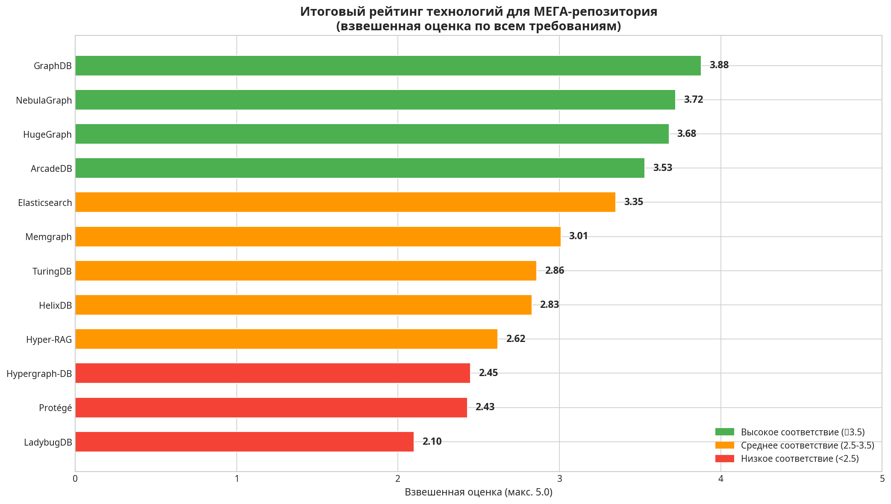
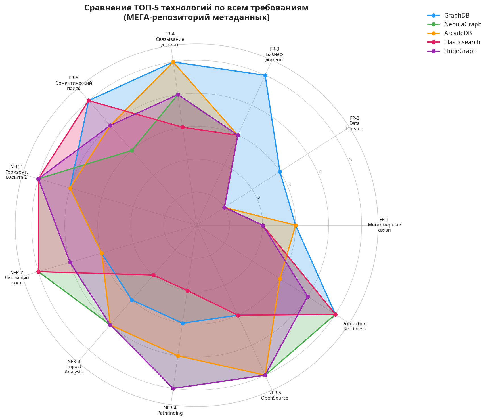
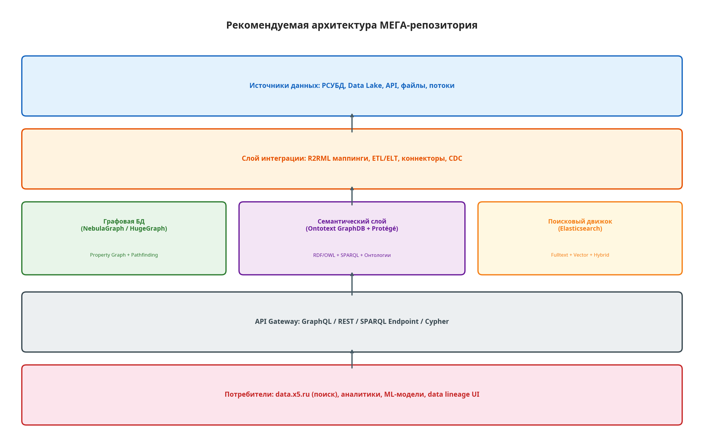

## Введение

МЕГА-репозиторий — это концепция единого источника истины для метаданных всего ландшафта данных крупной компании. Задача такого репозитория — объединить разрозненные описания таблиц, столбцов, дашбордов, ETL-потоков, бизнес-глоссариев и прочих артефактов данных в единую связную структуру, доступную через интеллектуальный поиск.

Данный материал представляет собой результат комплексного анализа 12 технологий и концепций, рассмотренных в контексте построения такого репозитория. Исследование опирается на книгу «Designing and Building Enterprise Knowledge Graphs» (Sequeda, Lassila, 2021), которая является практическим руководством по созданию корпоративных графов знаний.

## Бизнес-задача и видение

Основная бизнес-задача состоит в развитии интеллектуального поиска по данным компании. Пользователь должен иметь возможность задать вопрос на естественном языке или ввести ключевое слово и получить релевантные результаты, охватывающие таблицы, столбцы, отчёты, потоки данных и бизнес-термины. Видение результата заключается в том, что МЕГА-репозиторий становится единственным местом, где можно найти ответ на вопрос «что у нас есть по этой теме?».

## Функциональные требования

Функциональные требования к МЕГА-репозиторию определяют, какие возможности должна предоставлять система.

**FR-1. Хранение многомерных связей.** Метаданные по своей природе связаны множеством нетривиальных отношений. Одна таблица может быть связана с несколькими бизнес-доменами, использоваться в десятках отчётов и зависеть от нескольких ETL-процессов. Система должна поддерживать не только бинарные связи (A → B), но и N-арные отношения, где одна связь объединяет три и более сущности (например, «Процесс X загружает Таблицу Y из Источника Z по Расписанию W»). Такие отношения называются гиперрёбрами в теории гиперграфов.

**FR-2. Data Lineage.** Возможность отслеживать происхождение данных и полный поток их обработки — от источника до конечного отчёта. Это критически важно для анализа влияния (impact analysis): если изменится структура исходной таблицы, какие дашборды и отчёты будут затронуты?

**FR-3. Принадлежность бизнес-доменам.** Каждый элемент метаданных должен быть отнесён к одному или нескольким бизнес-доменам (например, «Логистика», «Маркетинг», «Финансы»). Это обеспечивает навигацию и фильтрацию по бизнес-контексту.

**FR-4. Связывание любых данных.** Система должна позволять создавать связи между любыми типами сущностей без ограничений жёсткой схемы. Это требование к гибкости модели данных.

**FR-5. Семантический поиск.** Поиск должен учитывать не только точное совпадение ключевых слов, но и семантическую близость. Для этого необходимы онтологии (формальные модели знаний), векторные представления (embeddings) и полнотекстовый поиск.

## Нефункциональные требования

Нефункциональные требования определяют качественные характеристики системы.

**NFR-1. Горизонтальная масштабируемость.** Система должна масштабироваться путём добавления новых узлов в кластер, а не за счёт наращивания мощности одного сервера.

**NFR-2. Линейный рост производительности.** При добавлении ресурсов производительность системы должна расти пропорционально (желательно линейно).

**NFR-3. Низкая задержка на Impact Analysis.** Запросы вида «покажи все зависимости этой таблицы» должны выполняться за миллисекунды, а не секунды.

**NFR-4. Pathfinding.** Возможность поиска путей между любыми двумя сущностями в графе метаданных (например, «как данные попадают из системы A в отчёт B?»).

**NFR-5. OpenSource.** Предпочтение отдаётся решениям с открытым исходным кодом для снижения зависимости от вендоров.

## Теоретическая основа: Knowledge Graphs

Книга Секеды и Лассилы определяет граф знаний как коллекцию реальных концепций (узлов) и связей (рёбер), используемую для интеграции данных из разнородных источников. Ключевая формула: **доступные данные = физические биты + семантика**. Без семантического слоя данные остаются «тёмными» — формально существуют, но не могут быть найдены и интерпретированы бизнес-пользователями.

Существуют два основных подхода к моделированию графов:

| Характеристика | Property Graph | RDF/OWL |
|---|---|---|
| Стандарт | Нет единого (Cypher, Gremlin, GQL) | W3C (RDF, SPARQL, OWL) |
| Модель | Узлы и рёбра с атрибутами | Тройки (субъект-предикат-объект) |
| Сильные стороны | Производительность, обход графа, pathfinding | Семантика, онтологии, логический вывод |
| Типичные задачи | Data lineage, impact analysis, fraud detection | Бизнес-глоссарии, таксономии, интеграция данных |
| Примеры БД | Neo4j, NebulaGraph, HugeGraph, Memgraph | GraphDB (Ontotext), Stardog, Virtuoso |

Для МЕГА-репозитория оптимальным является сочетание обоих подходов: Property Graph для хранения экземпляров метаданных и выполнения сложных обходов, а RDF/OWL — для формального описания онтологии и бизнес-глоссария.

## Сравнительный анализ технологий

В рамках исследования были проанализированы 12 технологий. Каждая из них оценивалась по 11 критериям, выведенным из функциональных и нефункциональных требований, по шкале от 0 до 5.

### Сводная таблица

| Технология | Категория | Лицензия | Масштаб. | Семантика | Lineage | Pathfinding | Зрелость | Итог |
|---|---|---|---|---|---|---|---|---|
| **Ontotext GraphDB** | RDF/SPARQL DB | Apache 2.0 / Comm. | 4 | 5 | 3 | 3 | 5 | **3.88** |
| **NebulaGraph** | Distributed Graph DB | Apache 2.0 | 5 | 3 | 1 | 5 | 5 | **3.72** |
| **Apache HugeGraph** | Graph DB (Apache) | Apache 2.0 | 5 | 4 | 1 | 5 | 4 | **3.68** |
| **ArcadeDB** | Multi-model DB | Apache 2.0 | 4 | 4 | 1 | 4 | 3 | **3.53** |
| **Elasticsearch** | Search Engine | EL 2.0 / AGPL | 5 | 5 | 1 | 2 | 5 | **3.35** |
| Memgraph | In-memory Graph DB | BSL / Comm. | 2 | 3 | 1 | 5 | 4 | 3.01 |
| TuringDB | In-memory Graph DB | BSL 1.1 | 1 | 3 | 4 | 4 | 3 | 2.86 |
| HelixDB | Graph-Vector DB | AGPL-3.0 | 3 | 4 | 1 | 4 | 2 | 2.83 |
| Hyper-RAG | RAG Framework | Apache 2.0 | 1 | 4 | 1 | 3 | 1 | 2.62 |
| Hypergraph-DB | Hypergraph DB | Apache 2.0 | 2 | 2 | 1 | 2 | 1 | 2.45 |
| Protégé | Ontology Editor | BSD 2-clause | 0 | 4 | 0 | 0 | 5 | 2.43 |
| LadybugDB | Embedded Graph DB | MIT | 1 | 3 | 1 | 3 | 1 | 2.10 |

### Матрица оценок

### Итоговый рейтинг

### Радарная диаграмма ТОП-5

## Анализ лидеров

**Ontotext GraphDB** (оценка 3.88) занял первое место благодаря уникальному сочетанию зрелости, полной поддержки стандартов W3C (RDF, OWL, SPARQL) и встроенных механизмов семантического вывода (reasoning). Это единственная из рассмотренных технологий, которая нативно поддерживает онтологии и бизнес-глоссарии, что делает её идеальным кандидатом для семантического слоя репозитория. Однако GraphDB уступает распределённым Property Graph базам в производительности на задачах обхода графа и не предоставляет нативного data lineage.

**NebulaGraph** (оценка 3.72) — это распределённая графовая база данных, разработанная для масштабируемости. Архитектура с разделением вычислений и хранения (compute-storage separation) обеспечивает линейный рост производительности при добавлении узлов. NebulaGraph используется в production крупными компаниями (Tencent, Meituan, JD Digits) и предоставляет мощный оператор FIND PATH для задач impact analysis. Основной недостаток — отсутствие нативной семантики и необходимость интеграции с Elasticsearch для полнотекстового поиска.

**Apache HugeGraph** (оценка 3.68) — проект верхнего уровня Apache Foundation, что свидетельствует о высокой зрелости. Поддерживает распределённый режим с объёмами до 1000 ТБ. Экосистема включает HugeGraph-AI для интеграции с LLM и векторным поиском. Преимущество перед NebulaGraph — более развитая экосистема AI-инструментов; недостаток — менее активное сообщество в последнее время.

**ArcadeDB** (оценка 3.53) — мультимодельная база данных, поддерживающая одновременно Property Graph, документы, ключ-значение и векторный поиск. Это наиболее гибкое решение из рассмотренных, позволяющее хранить разнородные данные в единой системе. Однако проект пока не имеет подтверждённых крупных production-внедрений.

**Elasticsearch** (оценка 3.35) — де-факто стандарт для полнотекстового и векторного поиска. Хотя Elasticsearch не является графовой базой данных, его возможности по поиску, агрегации и NLP незаменимы для пользовательского интерфейса интеллектуального поиска. В архитектуре МЕГА-репозитория Elasticsearch выступает как слой поиска, индексирующий данные из графовых баз.

## Роль вспомогательных инструментов

**Protégé** — это не база данных, а редактор онтологий, разработанный в Стэнфордском университете. В контексте МЕГА-репозитория Protégé используется для проектирования и поддержки корпоративной онтологии — формальной модели бизнес-сущностей и их связей. Онтология, созданная в Protégé, загружается в семантическую базу данных (например, GraphDB) и служит основой для семантического поиска.

**Hypergraph-DB** и **Hyper-RAG** — исследовательские проекты iMoonLab, предлагающие нативную поддержку гиперграфов. Гиперграф — это обобщение обычного графа, где одно ребро может соединять произвольное количество вершин. Эта модель идеально подходит для моделирования многомерных связей (FR-1), однако оба проекта находятся на ранней стадии развития и не готовы к промышленному использованию.

**TuringDB** и **Memgraph** — высокопроизводительные in-memory графовые базы данных. Они обеспечивают сверхнизкую задержку на запросах обхода графа, но ограничены в горизонтальной масштабируемости. Могут рассматриваться как кэширующий слой для наиболее частых запросов impact analysis.

## Рекомендуемая архитектура

Ни одна из рассмотренных технологий не закрывает все требования самостоятельно. Поэтому рекомендуется гибридная архитектура «best-of-breed», использующая сильные стороны лучших в своём классе инструментов.

### Компоненты архитектуры

| Слой | Компонент | Технология | Назначение |
|---|---|---|---|
| Хранение (Core) | Property Graph | NebulaGraph или HugeGraph | Граф экземпляров метаданных, data lineage, pathfinding |
| Хранение (Core) | Semantic Store | Ontotext GraphDB | Онтологии, бизнес-глоссарий, RDF/OWL, reasoning |
| Поиск | Search Engine | Elasticsearch | Полнотекстовый, векторный и гибридный поиск |
| Интеграция | ETL/Connectors | R2RML, CDC, API | Извлечение метаданных из источников |
| Доступ | API Gateway | GraphQL / REST | Унифицированный доступ для потребителей |
| Моделирование | Ontology Editor | Protégé | Проектирование корпоративной онтологии |

### Преимущества гибридного подхода

Сочетание Property Graph, RDF и поискового движка закрывает все функциональные требования. Распределённые системы (NebulaGraph/HugeGraph, Elasticsearch) обеспечивают горизонтальную масштабируемость. Компоненты слабо связаны и могут быть обновлены или заменены независимо. Архитектура опирается на открытые стандарты (RDF, OWL, SPARQL, openCypher), что снижает зависимость от вендоров.

## Следующие шаги

Для реализации МЕГА-репозитория рекомендуется следующий план действий. Первый шаг — провести Proof of Concept (PoC) на ограниченном наборе данных, чтобы проверить техническую связку компонентов и продемонстрировать сквозной бизнес-кейс. Второй шаг — сформировать выделенную команду (Data Product Team) с назначенным владельцем продукта. Третий шаг — начать разработку корпоративной онтологии с помощью Protégé и с привлечением бизнес-экспертов.

## Источники

1. Sequeda, J., & Lassila, O. (2021). *Designing and Building Enterprise Knowledge Graphs*. Morgan & Claypool Publishers.
2. [Ontotext GraphDB Documentation](https://graphdb.ontotext.com/)
3. [NebulaGraph Documentation](https://docs.nebula-graph.io/)
4. [Apache HugeGraph](https://hugegraph.apache.org/)
5. [ArcadeDB Documentation](https://docs.arcadedb.com/)
6. [Elasticsearch Documentation](https://www.elastic.co/guide/en/elasticsearch/reference/current/index.html)
7. [Protégé Ontology Editor](https://protege.stanford.edu/)
8. [Memgraph Documentation](https://memgraph.com/docs)
9. [HelixDB](https://www.helix-db.com/)
10. [Hypergraph-DB (iMoonLab)](https://github.com/iMoonLab/Hypergraph-DB)
11. [Hyper-RAG (iMoonLab)](https://github.com/iMoonLab/Hyper-RAG)
12. [LadybugDB](https://github.com/LadybugDB/ladybug)
