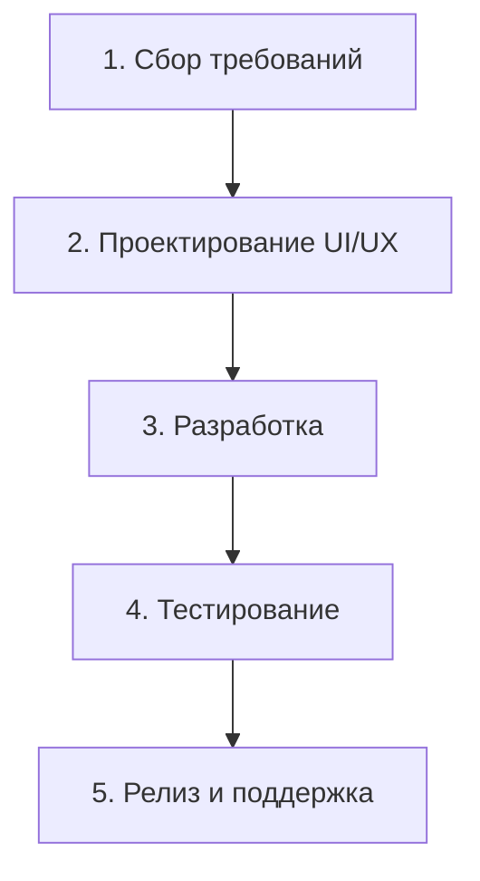

## Введение

В мире разработки программного обеспечения и управления проектами существует множество подходов, которые помогают командам организовывать свою работу и достигать поставленных целей. Выбор правильной методологии является ключевым фактором успеха любого проекта. В этой статье мы подробно рассмотрим три популярные методологии: классическую каскадную модель (Waterfall), гибкий подход (Agile) и один из его самых известных фреймворков — Scrum. Мы разберем их основные концепции, приведем практические примеры, обсудим типичные ошибки и определим, как эти подходы связаны с другими аспектами разработки.

## Основные концепции

### Waterfall (Каскадная модель)

**Waterfall** — это традиционная, последовательная методология разработки, где каждый этап проекта строго следует за предыдущим, подобно потоку воды в водопаде. Переход к следующему этапу возможен только после полного завершения предыдущего.

**Основные этапы:**

1. **Сбор и анализ требований:** На этом этапе происходит детальное обсуждение и документирование всех требований к будущему продукту.
2. **Проектирование:** Разрабатывается архитектура системы, логика работы и дизайн.
3. **Разработка:** Написание кода в соответствии с утвержденным проектом.
4. **Тестирование:** Проверка готового продукта на наличие ошибок и соответствие требованиям.
5. **Внедрение и поддержка:** Выпуск продукта и его последующая поддержка.

**Преимущества:**

* **Четкая структура и план:** Все этапы и сроки заранее определены.
* **Простота в управлении:** Легко отслеживать прогресс и контролировать бюджет.
* **Подробная документация:** Каждый этап подробно документируется.

**Недостатки:**

* **Низкая гибкость:** Внесение изменений на поздних этапах является сложным и дорогостоящим процессом.
* **Поздняя обратная связь:** Заказчик видит готовый продукт только в конце разработки.
* **Высокие риски:** Ошибки, допущенные на ранних этапах, могут быть обнаружены слишком поздно.

### Agile (Гибкая методология)

**Agile** — это итеративный и инкрементальный подход к разработке, который фокусируется на гибкости, сотрудничестве и быстрой реакции на изменения. В отличие от Waterfall, Agile предполагает разделение проекта на короткие циклы (итерации или спринты), в конце каждого из которых команда представляет работающую часть продукта.

**Основные принципы Agile (согласно Agile Manifesto):**

* **Люди и взаимодействие** важнее процессов и инструментов.
* **Работающий продукт** важнее исчерпывающей документации.
* **Сотрудничество с заказчиком** важнее согласования условий контракта.
* **Готовность к изменениям** важнее следования первоначальному плану.
**Преимущества:**

* **Гибкость и адаптивность:** Легко вносить изменения на любом этапе.
* **Быстрая обратная связь:** Заказчик регулярно видит результаты и может вносить коррективы.
* **Высокая вовлеченность команды:** Постоянное взаимодействие и самоорганизация.

**Недостатки:**

* **Сложность в планировании:** Трудно предсказать точные сроки и бюджет всего проекта.
* **Требует высокой квалификации и дисциплины** от всех членов команды.
* **Риск "размывания" первоначальной цели** из-за постоянных изменений.

### Scrum

**Scrum** — это один из самых популярных фреймворков для реализации Agile-подхода. Он предоставляет четкую структуру для организации работы команды в рамках коротких итераций, называемых **спринтами**.

**Ключевые элементы Scrum:**

1. **Роли:**

* **Владелец продукта (Product Owner):** Отвечает за формирование и приоритизацию бэклога продукта (списка задач).
* **Скрам-мастер (Scrum Master):** Помогает команде следовать принципам Scrum и устраняет препятствия.  
* **Команда разработки (Development Team):** Кросс-функциональная группа специалистов, которая реализует задачи.

2. **Артефакты:**

* **Бэклог продукта (Product Backlog):** Приоритезированный список всех требований к продукту.
* **Бэклог спринта (Sprint Backlog):** Список задач, выбранных для реализации в текущем спринте.
* **Инкремент продукта (Product Increment):** Работающая часть продукта, созданная за спринт.

3. **События:**

* **Спринт (Sprint):** Итерация длиной от 1 до 4 недель.
* **Планирование спринта (Sprint Planning):** Команда выбирает задачи на следующий спринт.
* **Ежедневный скрам (Daily Scrum):** Короткая (15 минут) ежедневная встреча для синхронизации.  
* **Обзор спринта (Sprint Review):** Демонстрация результатов спринта заказчику.  
* **Ретроспектива спринта (Sprint Retrospective):** Обсуждение прошедшего спринта и выявление возможностей для улучшения.

## Практические примеры

### Пример 1: Диаграмма для Waterfall

Представим разработку простого мобильного приложения для заказа еды по методологии Waterfall. Процесс можно визуализировать с помощью диаграммы Mermaid:

На этапе **сбора требований** составляется подробное ТЗ: функции личного кабинета, каталог блюд, корзина, система оплаты. На этапе **проектирования** дизайнеры создают макеты всех экранов. Затем **разработчики** пишут код. После этого **тестировщики** проверяют все функции. И только после успешного тестирования приложение публикуется в App Store и Google Play.

### Пример 2: Сценарий Scrum-спринта

Команда разрабатывает новый функционал для интернет-магазина — "Список желаний".

* **Product Owner** добавляет в **Product Backlog** пользовательскую историю: "Как покупатель, я хочу добавлять товары в список желаний, чтобы купить их позже".
* На **Sprint Planning** команда решает взять эту задачу в двухнедельный спринт. Они декомпозируют ее на более мелкие задачи: создать кнопку "Добавить в желаемое", разработать страницу списка желаний, реализовать логику добавления и удаления товаров.
* Каждый день на **Daily Scrum** команда обсуждает прогресс. Разработчик сообщает, что закончил верстку кнопки, а бэкенд-разработчик работает над API.
* В конце спринта на **Sprint Review** команда демонстрирует работающий функционал "Списка желаний" Product Owner'у и другим заинтересованным сторонам.
* На **Sprint Retrospective** команда обсуждает, что прошло хорошо, а что можно улучшить. Они решают, что в следующем спринте нужно уделить больше внимания автоматическому тестированию.

## Типичные ошибки и как их избежать

| Методология | Типичная ошибка | Как избежать |
| :--- | :--- | :--- |
| **Waterfall** | **"Паралич анализа"** - слишком долгое и детальное планирование на начальных этапах. | Устанавливайте четкие временные рамки для этапа сбора требований и проектирования. |
| | **Недостаточное тестирование** из-за сжатых сроков в конце проекта. | Интегрируйте тестирование на более ранних этапах, где это возможно (например, модульное тестирование). |
| **Agile** | **Отсутствие четкого видения продукта** и постоянное изменение приоритетов без цели. | Product Owner должен поддерживать и доносить до команды долгосрочное видение продукта. |
| | **Пренебрежение техническим долгом** в погоне за скоростью. | Выделяйте время в каждом спринте на рефакторинг и улучшение качества кода. |
| **Scrum** | **Scrum Master как менеджер проекта**, который раздает задачи и контролирует команду. | Scrum Master должен быть фасилитатором и коучем, а не начальником. Команда должна быть самоорганизующейся. |
| | **Пропуск или формальное проведение ретроспектив.** | Создайте атмосферу доверия, где команда не боится обсуждать проблемы. Фокусируйтесь на поиске решений, а не виновных. |

## Связь с другими темами

Выбор методологии тесно связан с такими понятиями, как **DevOps** и **CI/CD (Continuous Integration/Continuous Delivery)**. Agile и Scrum создают идеальные условия для внедрения этих практик, так как они нацелены на быструю и частую поставку работающего ПО. Автоматизация сборки, тестирования и развертывания (CI/CD) позволяет командам, работающим по Agile, быстрее получать обратную связь и повышать качество продукта.

В свою очередь, Waterfall-подход меньше сочетается с DevOps, так как его длительные циклы разработки и редкие релизы не позволяют в полной мере реализовать преимущества непрерывной интеграции и поставки.

## Заключение

Не существует "серебряной пули" или единственно верной методологии разработки. Выбор между Waterfall, Agile и Scrum зависит от множества факторов: размера и сложности проекта, стабильности требований, корпоративной культуры и опыта команды.

**Waterfall** может быть эффективен для небольших, предсказуемых проектов с четко определенными требованиями. **Agile** и **Scrum** лучше подходят для сложных, инновационных продуктов, где требования могут меняться, а быстрая реакция на изменения и тесное взаимодействие с заказчиком являются ключом к успеху. Понимание сильных и слабых сторон каждой методологии поможет вам сделать правильный выбор и привести ваш проект к успешному завершению.
