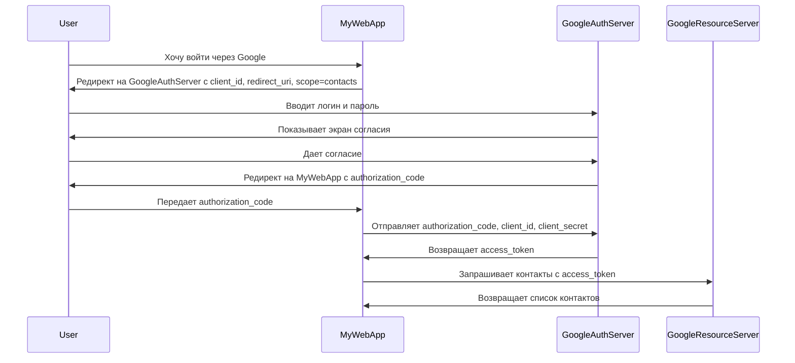
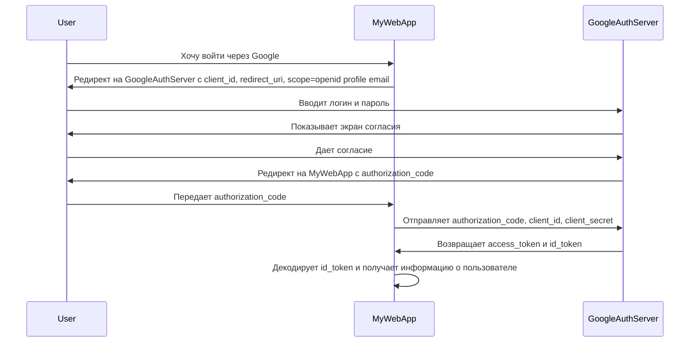

## Введение

OAuth 2.0 и OpenID Connect (OIDC) являются фундаментальными протоколами в современной веб-разработке, обеспечивающими безопасную авторизацию и аутентификацию пользователей. OAuth 2.0 предоставляет приложениям делегированный доступ к ресурсам пользователя без необходимости передавать логин и пароль, в то время как OpenID Connect, надстройка над OAuth 2.0, добавляет уровень аутентификации, позволяя приложениям получать информацию о пользователе.

В этой статье мы подробно разберем оба протокола, их основные концепции, практические примеры использования, а также рассмотрим типичные ошибки и способы их избежать.

## Основные концепции

### OAuth 2.0

OAuth 2.0 — это протокол авторизации, который позволяет приложениям получать ограниченный доступ к учетным записям пользователей на HTTP-сервисах, таких как Facebook, GitHub и Google. Протокол делегирует аутентификацию сервису, который владеет учетной записью пользователя, и предоставляет авторизацию сторонним приложениям.

**Ключевые участники (Roles):**

* **Resource Owner (Владелец ресурса):** Пользователь, который предоставляет доступ к своим данным.
* **Client (Клиент):** Приложение, которое хочет получить доступ к данным пользователя.
* **Authorization Server (Сервер авторизации):** Сервер, который аутентифицирует владельца ресурса и выдает токен доступа.
* **Resource Server (Сервер ресурсов):** Сервер, на котором хранятся защищенные данные пользователя.

**Типы грантов (Grant Types):**

OAuth 2.0 определяет несколько способов получения токена доступа, называемых "грантами". Наиболее распространенные из них:

* **Authorization Code:** Наиболее безопасный и распространенный способ, используемый для веб-приложений, работающих на стороне сервера.
* **Implicit:** Упрощенный способ, предназначенный для одностраничных приложений (SPA), работающих в браузере.
* **Resource Owner Password Credentials:** Используется, когда клиент является доверенным (например, официальное мобильное приложение сервиса).
* **Client Credentials:** Используется для межсервисного взаимодействия, когда нет прямого участия пользователя.

### OpenID Connect

OpenID Connect — это простой уровень идентификации поверх протокола OAuth 2.0. Он позволяет клиентам проверять личность конечного пользователя на основе аутентификации, выполненной сервером авторизации, а также получать базовую информацию профиля о конечном пользователе в совместимом и REST-подобном виде.

**Ключевые дополнения к OAuth 2.0:**

* **ID Token:** JSON Web Token (JWT), который содержит информацию о пользователе (claims), такую как его идентификатор, имя, email и т.д.
* **UserInfo Endpoint:** Дополнительная точка доступа, с которой клиент может запросить больше информации о пользователе.
* **Стандартизированные области (Scopes):** OIDC определяет стандартные области, такие как `openid`, `profile`, `email`, `address` и `phone`.

## Практические примеры

### Пример 1: Authorization Code Flow в OAuth 2.0

Рассмотрим сценарий, в котором веб-приложение "MyWebApp" хочет получить доступ к списку контактов пользователя из его учетной записи Google.

**Диаграмма последовательности:**



**Пример кода (Node.js с использованием `passport-google-oauth20`):**

```javascript
const passport = require('passport');
const GoogleStrategy = require('passport-google-oauth20').Strategy;

passport.use(new GoogleStrategy({
    clientID: GOOGLE_CLIENT_ID,
    clientSecret: GOOGLE_CLIENT_SECRET,
    callbackURL: "http://www.example.com/auth/google/callback"
  },
  function(accessToken, refreshToken, profile, cb) {
    // Здесь можно сохранить информацию о пользователе в базу данных
    return cb(null, profile);
  }
));

// Редирект на Google для аутентификации
app.get('/auth/google', passport.authenticate('google', { scope: ['profile', 'email'] }));

// Callback URL после аутентификации
app.get('/auth/google/callback', 
  passport.authenticate('google', { failureRedirect: '/login' }),
  function(req, res) {
    // Успешная аутентификация, редирект на главную страницу.
    res.redirect('/');
  });
```

### Пример 2: OpenID Connect для аутентификации

Теперь рассмотрим, как "MyWebApp" может использовать OpenID Connect для аутентификации пользователя и получения информации о нем.

**Диаграмма последовательности:**



**Пример кода (Node.js с использованием `openid-client`):**

```javascript
const { Issuer } = require('openid-client');

Issuer.discover('https://accounts.google.com')
  .then(function (googleIssuer) {
    const client = new googleIssuer.Client({
      client_id: 'YOUR_CLIENT_ID',
      client_secret: 'YOUR_CLIENT_SECRET',
      redirect_uris: ['http://localhost:3000/cb'],
      response_types: ['code'],
    });

    // Редирект на Google для аутентификации
    const authorizationUrl = client.authorizationUrl({
      scope: 'openid profile email',
    });
    res.redirect(authorizationUrl);

    // Callback URL после аутентификации
    app.get('/cb', async (req, res) => {
      const params = client.callbackParams(req);
      const tokenSet = await client.callback('http://localhost:3000/cb', params);
      console.log('received and validated tokens %j', tokenSet);
      console.log('validated ID Token claims %j', tokenSet.claims());
      res.send('Success!');
    });
  });
```

## Типичные ошибки и как их избежать

1. **Хранение `client_secret` в публично доступном месте:** `client_secret` должен храниться на сервере и никогда не должен быть доступен в клиентском коде (например, в JavaScript в браузере).
2. **Неправильная реализация `redirect_uri`:** `redirect_uri` должен быть строго задан и проверяться на сервере авторизации, чтобы предотвратить атаки с перенаправлением.
3. **Использование Implicit Flow для получения `access_token` в новых приложениях:** Этот поток считается менее безопасным, и рекомендуется использовать Authorization Code Flow с PKCE (Proof Key for Code Exchange) для SPA и мобильных приложений.
4. **Отсутствие проверки состояния (state):** Параметр `state` должен использоваться для предотвращения CSRF-атак. Клиент должен генерировать случайное значение, отправлять его на сервер авторизации и проверять его при получении ответа.

## Связь с другими темами

* **JWT (JSON Web Tokens):** ID Token в OpenID Connect является JWT. Понимание структуры и принципов работы JWT необходимо для работы с OIDC.
* **RESTful APIs:** OAuth 2.0 часто используется для защиты RESTful API. Токен доступа передается в заголовке `Authorization` каждого запроса к API.
* **Single Sign-On (SSO):** OpenID Connect является основой для многих SSO-решений, позволяя пользователям входить в несколько приложений, используя одну учетную запись.

## Заключение

OAuth 2.0 и OpenID Connect являются мощными инструментами для создания безопасных и удобных систем авторизации и аутентификации. Понимание их принципов работы, различий и правильных сценариев использования является ключевым навыком для любого современного веб-разработчика. Надеемся, что эта статья помогла вам разобраться в этих важных протоколах и вы сможете успешно применять их в своих проектах.
