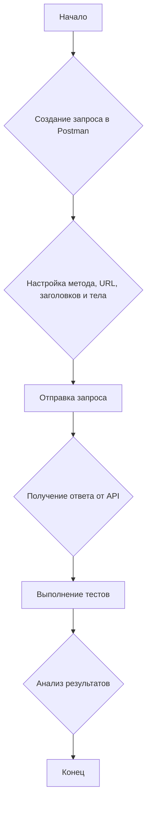

## Введение

Postman — это мощная и удобная платформа для разработки и тестирования API (Application Programming Interface). Изначально созданный как простой REST-клиент, Postman превратился в полноценную среду для совместной работы над API, которая позволяет разработчикам, тестировщикам и системным аналитикам проектировать, создавать, тестировать и документировать API.

Для системного аналитика Postman является незаменимым инструментом. Он позволяет:

* **Исследовать существующие API:** Быстро отправлять запросы к различным эндпоинтам, чтобы понять, как они работают, какие данные возвращают и какие параметры принимают.
* **Тестировать API на ранних этапах:** Проверять работоспособность API еще до того, как будет готов пользовательский интерфейс.
* **Создавать моки (mock servers):** Эмулировать работу API, что позволяет фронтенд-разработчикам работать независимо от бэкенда.
* **Документировать API:** Создавать и публиковать интерактивную документацию, которая всегда будет актуальной.

В этой статье мы подробно разберем, что такое Postman, каковы его основные концепции, и как использовать его для эффективного тестирования API.

## Основные концепции

Для эффективной работы с Postman необходимо понимать его ключевые концепции:

* **Запрос (Request):** Основа всего. Запрос — это обращение к API для получения или отправки данных. В Postman можно настроить метод запроса (`GET`, `POST`, `PUT`, `DELETE` и т.д.), URL-адрес, заголовки (`Headers`), тело запроса (`Body`) и параметры.
* **Коллекция (Collection):** Коллекции — это способ организации запросов. Вы можете группировать связанные запросы в папки, что упрощает их менеджмент и повторное использование. Коллекциями можно делиться с командой, что способствует совместной работе.
* **Окружение (Environment):** Окружения позволяют управлять переменными. Например, у вас может быть одно окружение для разработки (с URL-адресом `http://localhost:3000`) и другое для тестирования (с URL-адресом `https://test.api.com`). Это избавляет от необходимости вручную менять URL и другие параметры в каждом запросе.
* **Переменные (Variables):** Postman поддерживает несколько типов переменных: глобальные, коллекционные, окружения и локальные. Они позволяют хранить и переиспользовать значения, такие как токены аутентификации, ID пользователей и другие данные.
* **Тесты (Tests):** Postman позволяет писать тесты на JavaScript для проверки ответов от API. Вы можете проверять статус-коды, наличие определенных полей в ответе, их типы и значения. Это автоматизирует процесс тестирования и гарантирует качество API.
* **Pre-request Scripts:** Это скрипты на JavaScript, которые выполняются перед отправкой запроса. Их можно использовать для генерации динамических данных, например, для установки текущей даты или случайного значения в параметрах запроса.

## Практические примеры

Рассмотрим несколько практических примеров использования Postman для тестирования API.

### Пример 1: Тестирование GET-запроса

Предположим, у нас есть API для управления пользователями. Мы хотим получить список всех пользователей, отправив GET-запрос на эндпоинт `/users`.

1. **Создаем новый запрос в Postman:**
    * Выбираем метод `GET`.
    * Вводим URL: `https://api.example.com/users`.

2. **Отправляем запрос:** Нажимаем кнопку "Send".

3. **Анализируем ответ:** В ответ мы должны получить JSON-массив с пользователями. Мы можем написать тест, чтобы убедиться, что запрос прошел успешно и вернул правильные данные.

```json
[
    {
        "id": 1,
        "name": "Иван Иванов",
        "email": "ivan@example.com"
    },
    {
        "id": 2,
        "name": "Петр Петров",
        "email": "petr@example.com"
    }
]
```

**Тест для проверки ответа:**

```javascript
pm.test("Status code is 200", function () {
    pm.response.to.have.status(200);
});

pm.test("Response is an array", function () {
    pm.expect(pm.response.json()).to.be.an('array');
});
```

### Пример 2: Тестирование POST-запроса

Теперь создадим нового пользователя, отправив POST-запрос на тот же эндпоинт `/users`.

1. **Создаем новый запрос:**
    * Выбираем метод `POST`.
    * Вводим URL: `https://api.example.com/users`.
    * Переходим во вкладку "Body", выбираем `raw` и `JSON`.

2. **Заполняем тело запроса:**

```json
{
    "name": "Анна Сидорова",
    "email": "anna@example.com"
}
```

3. **Отправляем запрос и пишем тесты:**

```javascript
pm.test("Status code is 201", function () {
    pm.response.to.have.status(201);
});

pm.test("User was created", function () {
    var jsonData = pm.response.json();
    pm.expect(jsonData.name).to.eql("Анна Сидорова");
});
```

### Диаграмма процесса тестирования



## Типичные ошибки и как их избежать

При работе с Postman начинающие пользователи часто допускают одни и те же ошибки. Рассмотрим наиболее распространенные из них и способы их решения.

* **Хардкодинг значений:** Вместо того чтобы использовать переменные окружения, пользователи жестко прописывают URL, токены и другие данные прямо в запросах. Это делает их неудобными для повторного использования и переключения между средами.
**Решение:** всегда используйте переменные для данных, которые могут меняться.
* **Отсутствие тестов:** Многие используют Postman только для отправки запросов, забывая о его мощных возможностях для тестирования.
**Решение:** Пишите тесты для каждого запроса, чтобы автоматизировать проверку ответов и гарантировать качество API.
* **Большие и неструктурированные коллекции:** Со временем коллекции могут разрастаться и становиться неуправляемыми.
**Решение:** Группируйте запросы в папки по функциональности, используйте понятные имена и добавляйте описания.
* **Игнорирование Pre-request Scripts:** Эти скрипты могут значительно упростить работу, но их часто упускают из виду.
**Решение:** Используйте Pre-request Scripts для генерации динамических данных, например, для получения актуального токена аутентификации перед запросом.

## Связь с другими темами

Postman тесно связан с другими инструментами и концепциями в разработке программного обеспечения:

* **CI/CD (Continuous Integration/Continuous Delivery):** Postman можно интегрировать в конвейеры CI/CD с помощью инструмента командной строки.
* **Newman**. Это позволяет автоматически запускать тесты API при каждом изменении кода.
* **Swagger/OpenAPI:** Postman позволяет импортировать спецификации Swagger/OpenAPI для автоматического создания коллекций запросов. Это экономит время и обеспечивает соответствие тестов документации.
* **Git:** Коллекции Postman можно хранить в системе контроля версий Git, что позволяет отслеживать изменения, совместно работать над ними и восстанавливать предыдущие версии.
* **Мок-серверы:** Postman позволяет создавать мок-серверы, которые имитируют поведение реального API. Это полезно для разработки и тестирования фронтенда, когда бэкенд еще не готов.

## Заключение

Postman — это не просто REST-клиент, а комплексная платформа для работы с API. Для системного аналитика это незаменимый инструмент, который позволяет исследовать, тестировать и документировать API, а также эффективно взаимодействовать с командой разработки. Понимание основных концепций Postman и умение применять его на практике значительно повышает эффективность работы и качество конечного продукта. Начните использовать Postman уже сегодня, и вы увидите, насколько проще и удобнее станет ваша работа с API.