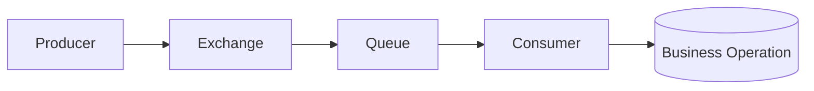
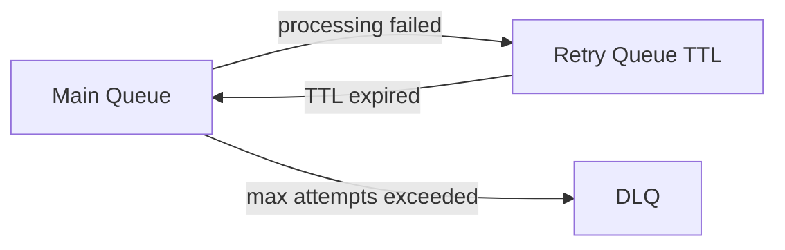

# RabbitMQ для системного аналитика: от базового понимания до технического уровня и собеседований

## Зачем системному аналитику RabbitMQ

RabbitMQ нужен системному аналитику не для «настройки кластера руками», а для правильного проектирования интеграций:

- как сервисы обмениваются событиями без жесткой связности;
- какие есть гарантии доставки и где возможны дубликаты;
- как формализовать контракт сообщения, чтобы изменения не ломали потребителей;
- как описывать нефункциональные требования: надежность, задержки, обработка сбоев;
- как объяснить архитектурные решения команде, архитектору и бизнесу.

Если говорить просто: RabbitMQ помогает строить предсказуемую и отказоустойчивую асинхронную интеграцию.

---

## Часть 1. Обзорный уровень

## Что такое RabbitMQ

**RabbitMQ** - это брокер сообщений. Продюсер отправляет сообщение в брокер, брокер маршрутизирует его в очередь, консьюмер забирает сообщение и обрабатывает.

Ключевая идея: отправитель и получатель не должны быть «онлайн» одновременно и не обязаны знать друг о друге напрямую.

## Базовые сущности

- **Producer** - сервис, который публикует сообщение.
- **Exchange** - точка приема сообщений в RabbitMQ и маршрутизатор.
- **Queue** - очередь хранения сообщений для дальнейшей обработки.
- **Consumer** - сервис, который читает сообщения из очереди.
- **Binding** - правило связи между `exchange` и `queue`.
- **Routing key** - строка маршрутизации, по которой exchange выбирает очередь.

## Базовая схема взаимодействия



## Когда RabbitMQ уместен

- Асинхронные бизнес-процессы: регистрация, уведомления, начисления, интеграции с внешними системами.
- Разгрузка пиков: входящий трафик высокий, обработка тяжелая.
- Оркестрация фоновых задач.
- Event-driven сценарии в микросервисах.

## Когда RabbitMQ не лучший выбор

- Нужен большой событийный журнал с долгим хранением и replay в стиле log-based streaming (часто выбирают Kafka).
- Нужна аналитика по историческим событиям «из коробки» в течение длительного периода.

## Что системный аналитик должен уточнить на старте

- Что является событием и кто его владелец.
- Допустима ли eventual consistency.
- Какая максимальная задержка обработки допустима.
- Что делать при сбоях консьюмера/внешних систем.
- Нужна ли строгая очередность обработки.
- Как будет устроена повторная обработка и дедупликация.

---

## Часть 2. Детальный уровень

## Типы exchange и как объяснять выбор

### 1) Direct exchange

Маршрутизация по точному совпадению `routing_key`.

Применение:

- простые сценарии point-to-point;
- маршрутизация по фиксированному списку ключей.

### 2) Topic exchange

Маршрутизация по шаблону (`*`, `#`) для составных ключей, например `order.created.eu`.

Применение:

- событийная модель с доменами;
- гибкая подписка нескольких потребителей на разные паттерны.

### 3) Fanout exchange

Сообщение отправляется во все привязанные очереди без учета ключа.

Применение:

- широковещательные события;
- уведомления нескольким независимым системам.

### 4) Headers exchange

Маршрутизация по заголовкам сообщения.

Применение:

- редко; когда логика маршрутизации завязана на метаданные, а не на routing key.

## Рекомендуемый способ именования routing key

Используйте доменную нотацию:

`<bounded-context>.<entity>.<event>.<version>`

Пример:

`billing.invoice.created.v1`

Плюсы:

- читаемость;
- простая фильтрация в topic exchange;
- контролируемая эволюция контрактов.

## Гарантии доставки: что важно проговаривать

RabbitMQ в реальных системах чаще работает в модели **at-least-once**:

- сообщение будет доставлено минимум один раз;
- возможны дубликаты;
- потребитель обязан быть идемпотентным.

Модель **exactly-once** на уровне распределенной системы крайне дорогая и обычно реализуется прикладными паттернами, а не «магической галочкой» RabbitMQ.

## Ack/Nack/Requeue

- `ack` - сообщение обработано успешно, можно удалить из очереди.
- `nack`/`reject` + `requeue=true` - вернуть в очередь (риск бесконечного цикла).
- `nack`/`reject` + `requeue=false` - отправить в DLQ (если настроен dead-letter).

Для SA это означает: в требованиях к обработке ошибок нужно явно описывать политику повторов и условия финального отказа.

## Retry и DLQ как обязательная часть дизайна

Рабочая схема:

1. Основная очередь `q.orders.processing`.
2. Retry-очередь `q.orders.retry.10s` (или несколько: 10s, 1m, 5m).
3. Dead-letter queue `q.orders.dlq` для «ядовитых» сообщений.



Что фиксировать в спецификации:

- максимальное число попыток;
- интервалы повторов;
- критерии «невосстановимой ошибки»;
- процесс разбора DLQ (кто и как реагирует).

## Контракты сообщений

Для SA критично:

- зафиксировать структуру payload;
- определить обязательные и опциональные поля;
- задать правила версионирования;
- добавить корреляционные поля для трассировки.

Минимальный набор полей в сообщении:

- `event_id` - уникальный идентификатор;
- `event_type` - тип события;
- `event_version` - версия контракта;
- `occurred_at` - когда событие произошло;
- `source` - источник события;
- `correlation_id` - сквозная корреляция запроса;
- `payload` - бизнес-данные.

Пример JSON-контракта:

```json
{
  "event_id": "5d8b9098-5afe-4f43-bd31-17e6f2a6d51f",
  "event_type": "order.created",
  "event_version": "v1",
  "occurred_at": "2026-02-07T10:15:30Z",
  "source": "order-service",
  "correlation_id": "req-45f5-9b2e-33",
  "payload": {
    "order_id": "ORD-100045",
    "customer_id": "C-7788",
    "amount": 1599.90,
    "currency": "RUB"
  }
}
```

## Версионирование событий

Практичный подход:

- не ломать старую версию сразу;
- поддерживать минимум 2 версии на переходный период;
- совместимые изменения (добавление необязательных полей) делать без смены major;
- несовместимые изменения - новая версия события (`v2`).

## Идемпотентность: что писать в требованиях

Принцип: повторная обработка того же события не должна менять результат.

Реализация:

- таблица обработанных `event_id`;
- уникальные бизнес-ключи;
- upsert-подход;
- проверка состояния перед выполнением операции.

## Очередность и параллелизм

Что часто путают на проектах:

- FIFO в очереди не гарантирует «глобальную» строгую последовательность при множестве консьюмеров.
- Если нужен строгий порядок по сущности (например, по `order_id`), это надо проектировать отдельно:
- шардинг по ключу;
- ограничение конкурентности;
- сериализация обработки в консьюмере.

## Производительность: базовые рычаги

- `prefetch` - сколько необработанных сообщений выдать консьюмеру.
- Количество инстансов консьюмера.
- Размер сообщения (избегать «тяжелых» payload, хранить ссылки на blob).
- Длительность обработки и внешние зависимости.
- Политики персистентности.

## Безопасность и доступ

Минимальные требования:

- TLS между клиентами и RabbitMQ;
- отдельные users/vhosts по контурам;
- принцип least privilege (только нужные права на exchange/queue);
- аудит и ротация credentials.

---

## Часть 3. Технический уровень

## Декларация инфраструктуры RabbitMQ

Обычно приложения при старте объявляют:

- exchange;
- queue;
- binding;
- аргументы очереди (TTL, DLX и пр.).

Важно согласовать ownership:

- кто владеет именами и параметрами очередей;
- можно ли менять параметры без релиза клиентов;
- какая команда управляет политиками брокера.

## Пример технической конфигурации (концепт)

```yaml
exchange:
  name: ex.order.events
  type: topic
  durable: true

queue:
  name: q.order.created.billing
  durable: true
  arguments:
    x-dead-letter-exchange: ex.order.events.dlx
    x-dead-letter-routing-key: order.created.billing.dlq
    x-message-ttl: 60000

binding:
  exchange: ex.order.events
  queue: q.order.created.billing
  routing_key: order.created.v1
```

## Durable, Persistent, Auto-delete

- **durable queue/exchange** - переживают рестарт брокера (метаданные).
- **persistent message** - сообщение сохраняется на диск (при корректной настройке).
- **auto-delete/exclusive** - обычно для временных/служебных очередей, не для критичных бизнес-событий.

На собеседовании полезно говорить так: «Для прод-сценариев очереди и обменники делаем durable, сообщения - persistent, а volatile-настройки применяем только осознанно».

## Quorum Queue vs Classic Queue

### Classic queue

- исторически стандартный тип;
- может быть быстрее в отдельных сценариях;
- меньше гарантий устойчивости к некоторым видам отказов.

### Quorum queue

- основана на Raft-репликации;
- лучше для надежных сценариев и предсказуемого восстановления;
- выше накладные расходы.

Практический совет для SA:

- если критична надежность и согласованность после сбоев, чаще выбирают quorum;
- если сценарий не критичен и важна минимальная латентность, обсуждают classic.

## Publisher Confirms

`Publisher confirms` - механизм подтверждения от брокера, что сообщение принято.

Без confirms продюсер может считать, что отправил сообщение, хотя оно потерялось на сетевом/брокерном уровне.

В требованиях: для критичных бизнес-событий предусмотреть подтверждения публикации и стратегию retry на стороне продюсера.

## Consumer Prefetch и backpressure

`prefetch` ограничивает количество сообщений «в полете» у консьюмера.

- Слишком высокий `prefetch` - перегрузка консьюмера, рост времени ответа, риск таймаутов.
- Слишком низкий - недоиспользование ресурсов.

Баланс подбирается нагрузочным тестом.

## Poison message handling

Poison message - сообщение, которое стабильно падает на обработке.

Нужно определить:

- лимит попыток;
- критерии направления в DLQ;
- алертинг на рост DLQ;
- процедуру ручного/автоматического reprocess.

## RPC поверх RabbitMQ (когда надо и когда нет)

RabbitMQ поддерживает RPC-паттерн (request/reply через очереди), но:

- это часто усложняет систему;
- может скрыть синхронность под видом асинхронности.

Лучше использовать RPC в RabbitMQ только когда есть четкое техническое обоснование. Иначе для request/response обычно проще HTTP/gRPC.

## Observability: что мониторить

Ключевые метрики:

- `queue depth` (длина очереди);
- `ready` vs `unacked` сообщений;
- rate publish/consume/ack;
- consumer lag по бизнес-SLA (время от `occurred_at` до обработки);
- количество сообщений в DLQ;
- ошибки консьюмера по типам.

Операционные алерты:

- резкий рост очереди;
- отсутствие активных консьюмеров;
- рост DLQ выше порога;
- длительное время обработки > SLA.

## Типовой production-чеклист

- durable exchange/queue;
- persistent messages;
- DLQ + retry policy;
- publisher confirms;
- idempotent consumers;
- correlation id и трассировка;
- мониторинг и алерты;
- регулярный disaster recovery drill.

---

## Что говорить на собеседовании про RabbitMQ

## Краткий уверенный pitch (30-40 секунд)

«RabbitMQ - это брокер сообщений для асинхронной интеграции. Я использую его, когда нужно развязать сервисы, сгладить нагрузку и повысить отказоустойчивость. В проектировании я фокусируюсь на контрактах событий, at-least-once доставке, идемпотентности, retry/DLQ, наблюдаемости и четких SLA по обработке».

## Частые вопросы и сильные ответы

### 1) Чем RabbitMQ отличается от Kafka?

Коротко:

- RabbitMQ - очереди и маршрутизация, хорошо для task/event интеграций.
- Kafka - распределенный commit log и стриминг больших объемов.

Если нужна гибкая маршрутизация, быстрый старт и классический message broker - часто RabbitMQ.

### 2) Какие гарантии доставки в RabbitMQ?

Типично at-least-once при корректной конфигурации (ack + retry + durable/persistent + confirms). Значит, дубликаты возможны, и потребитель обязан быть идемпотентным.

### 3) Зачем нужен DLQ?

Для изоляции сообщений, которые не удалось обработать после лимита попыток. Иначе можно получить бесконечный цикл переобработки и блокировку полезного потока.

### 4) Что такое routing key и exchange type?

`routing_key` - ключ маршрутизации, `exchange type` - правило маршрутизации (direct/topic/fanout/headers). Вместе определяют, в какую очередь попадет сообщение.

### 5) Как обеспечиваете надежность?

- durable сущности;
- persistent messages;
- publisher confirms;
- quorum queue для критичных потоков;
- retries + DLQ;
- мониторинг + алерты + runbook.

### 6) Какие ошибки встречали чаще всего?

- отсутствие идемпотентности;
- бесконечный requeue;
- «тяжелые» payload;
- отсутствие versioning контрактов;
- нет алертов на рост очередей и DLQ.

## Что особенно ценят у системного аналитика

- умение формализовать асинхронный сценарий end-to-end;
- понятные контракты событий и стратегия их эволюции;
- явные NFR: SLA, RPO/RTO, допустимые потери/дубликаты;
- совместная работа с архитектором/разработкой по отказоустойчивости.

---

## Антипаттерны и как их предотвращать

## Антипаттерн 1: «Сделаем async, а там разберемся»

Результат: нет SLA, нет retry-политик, хаос при сбоях.

Решение: сразу описывать delivery semantics, тайминги, ownership очередей и DLQ-процедуры.

## Антипаттерн 2: «Событие как копия таблицы БД»

Результат: чрезмерная связанность, ломкие интеграции.

Решение: публиковать бизнес-события, а не внутреннюю структуру хранения.

## Антипаттерн 3: «Один общий exchange и сотни несогласованных ключей»

Результат: сложно поддерживать, сложно отлаживать.

Решение: доменная стратегия именования + стандарты routing key + архитектурный governance.

## Антипаттерн 4: «Успех интеграции измеряем только фактом публикации»

Результат: событие отправлено, но бизнес-эффект не достигнут.

Решение: метрики до конечного бизнес-результата и мониторинг lag по SLA.

---

## Мини-шаблон требований SA для RabbitMQ-интеграции

1. **Бизнес-событие**: что случилось и зачем публикуется.
2. **Источник**: какой сервис владелец события.
3. **Контракт**: схема payload + метаданные + версия.
4. **Маршрутизация**: exchange, routing key, целевые очереди.
5. **SLA**: максимальная задержка доставки/обработки.
6. **Delivery semantics**: at-least-once, дубликаты допустимы/нет.
7. **Обработка ошибок**: retry-политика, DLQ, ответственность.
8. **Идемпотентность**: как реализована.
9. **Наблюдаемость**: метрики, алерты, correlation id.
10. **Безопасность**: доступ, шифрование, аудит.

---

## Итог

Для системного аналитика RabbitMQ - это не «просто очередь», а инструмент управления асинхронной целевой архитектурой. Сильный уровень на собеседовании показывает не знание терминов, а способность:

- связать бизнес-требования с техническими механизмами RabbitMQ;
- заранее заложить обработку сбоев, дубликатов и задержек;
- обеспечить управляемую эволюцию событийных контрактов;
- мыслить интеграцию как продукт: с метриками, SLA и ответственностью.

Если вы уверенно покрываете эти пункты, вы уже говорите про RabbitMQ на уровне сильного системного аналитика.
