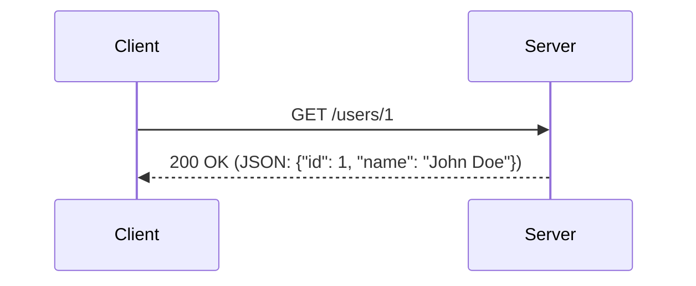

## Введение

REST (Representational State Transfer) — это архитектурный стиль, который определяет набор ограничений для создания веб-сервисов. Веб-сервисы, соответствующие стилю REST, называемые RESTful веб-сервисами, обеспечивают взаимодействие между компьютерными системами в интернете. RESTful-системы, как правило, взаимодействуют через протокол HTTP, используя те же HTTP-методы (GET, POST, PUT, DELETE и т.д.), которые веб-браузеры используют для получения веб-страниц и отправки данных на удаленные серверы.

Основная идея REST заключается в том, чтобы рассматривать все данные как ресурсы, к которым можно получить доступ по уникальному идентификатору (URI). Клиенты и серверы обмениваются представлениями ресурсов, используя стандартизированный интерфейс и протокол. Эти представления могут быть в различных форматах, таких как JSON, XML или HTML. JSON (JavaScript Object Notation) является наиболее популярным форматом благодаря своей легкости и простоте парсинга.

## Основные концепции

Архитектура REST основана на шести ключевых принципах:

1. **Клиент-серверная архитектура:** Клиент и сервер разделены. Клиент отвечает за пользовательский интерфейс, а сервер — за хранение и обработку данных. Это разделение позволяет им развиваться независимо друг от друга. Например, команда фронтенда может работать над веб-интерфейсом, в то время как команда бэкенда разрабатывает API, и им нужно только договориться о контракте API.
2. **Отсутствие состояния (Stateless):** Каждый запрос от клиента к серверу должен содержать всю информацию, необходимую для его выполнения. Сервер не хранит никакого контекста о клиенте между запросами. Это упрощает масштабирование и повышает надежность. Если один сервер выходит из строя, запрос может быть перенаправлен на другой сервер без потери информации. Вся информация о сессии хранится на стороне клиента (например, в виде токена аутентификации).
3. **Кэширование (Cacheable):** Ответы от сервера должны быть явно или неявно помечены как кэшируемые или некэшируемые. Это позволяет клиентам и промежуточным узлам кэшировать ответы для повышения производительности. Заголовки HTTP, такие как `Cache-Control` и `Expires`, используются для управления кэшированием.
4. **Единообразный интерфейс (Uniform Interface):** Это фундаментальное требование REST, которое упрощает и разделяет архитектуру. Оно состоит из четырех ограничений:
    * **Идентификация ресурсов:** Ресурсы идентифицируются по URI. Например, `/users/123` однозначно идентифицирует пользователя с ID 123.
    * **Манипулирование ресурсами через представления:** Клиент работает с представлением ресурса, а не с самим ресурсом. Например, при запросе `GET /users/123` сервер возвращает JSON-представление пользователя.
    * **Самодостаточные сообщения:** Каждое сообщение содержит достаточно информации для его обработки. Например, запрос `POST /users` с JSON в теле содержит все данные, необходимые для создания нового пользователя.
    * **Гипермедиа как двигатель состояния приложения (HATEOAS):** Клиент взаимодействует с приложением исключительно через гипермедиа, динамически предоставляемые сервером. Ответы API содержат ссылки на возможные следующие действия. Например, ответ на `GET /users/123` может содержать ссылки для обновления или удаления этого пользователя.
5. **Многоуровневая система (Layered System):** Клиент не может сказать, подключен ли он напрямую к конечному серверу или к промежуточному. Промежуточные серверы могут повысить масштабируемость системы за счет балансировки нагрузки и предоставления общих кэшей. Это также повышает безопасность, так как компоненты в каждом слое не могут видеть за пределы слоя, с которым они взаимодействуют.
6. **Код по требованию (Code-On-Demand, необязательный):** Серверы могут временно расширять или настраивать функциональность клиента, передавая ему исполняемый код, например, в виде скриптов JavaScript. Этот принцип используется реже всего.

## Практические примеры

### Пример 1: Простое API для блога

Предположим, у нас есть API для управления постами в блоге. Вот как могут выглядеть эндпоинты:

* `GET /posts` — получить список всех постов.
* `GET /posts/123` — получить пост с ID 123.
* `POST /posts` — создать новый пост. Данные поста передаются в теле запроса.
* `PUT /posts/123` — обновить пост с ID 123. Новые данные передаются в теле запроса.
* `DELETE /posts/123` — удалить пост с ID 123.

**Пример запроса на создание поста с использованием `curl`:**

```bash
curl -X POST -H "Content-Type: application/json" -d '{
  "title": "Мой первый пост",
  "content": "Это содержимое моего первого поста."
}' http://api.example.com/posts
```

### Пример 2: Диаграмма последовательности для получения данных



Эта диаграмма показывает, как клиент запрашивает информацию о пользователе с ID 1, и сервер отвечает данными в формате JSON.

### Пример 3: API для интернет-магазина

Рассмотрим более сложный пример API для интернет-магазина:

* `GET /products` — получить список товаров с возможностью фильтрации и пагинации (например, `GET /products?category=electronics&page=2`).
* `POST /orders` — создать новый заказ. В теле запроса передается список товаров и информация о доставке.
* `GET /orders/{orderId}` — получить информацию о конкретном заказе.
* `PUT /orders/{orderId}/status` — обновить статус заказа (например, на `shipped`).

**Пример ответа с использованием HATEOAS:**

```json
{
  "orderId": 456,
  "status": "processing",
  "total": 99.99,
  "_links": {
    "self": { "href": "/orders/456" },
    "customer": { "href": "/customers/123" },
    "cancel": { "href": "/orders/456/cancel", "method": "POST" },
    "update_status": { "href": "/orders/456/status", "method": "PUT" }
  }
}
```

## Типичные ошибки и как их избежать

* **Использование глаголов в URI:** URI должны идентифицировать ресурсы, а не действия. Вместо `/getUser` используйте `GET /users/{id}`.`.
* **Неправильное использование HTTP-методов:** Используйте `GET` для получения данных, `POST` для создания, `PUT` для обновления и `DELETE` для удаления. Не используйте `GET` для изменения состояния на сервере.сервере.
* **Игнорирование кодов состояния HTTP:** Всегда возвращайте осмысленные коды состояния (например, `200 OK`, `201 Created`, `400 Bad Request`, `404 Not Found`, `500 Internal Server Error`). Это помогает клиентам правильно обрабатывать ответы.
* **Отсутствие версионирования API:** По мере развития вашего API вам, вероятно, придется вносить изменения, которые нарушают обратную совместимость. Версионирование (например, `/api/v1/posts`) позволяет плавно переходить на новые версии..
* **"Болтливый" API:** Проектируйте API так, чтобы клиенты могли получать всю необходимую информацию за минимальное количество запросов. Используйте вложенные ресурсы или параметры для включения связанных данных.
* **Небезопасные API:** Всегда используйте HTTPS. Для аутентификации и авторизации применяйте стандартные подходы, такие как OAuth 2.0 или JWT (JSON Web Tokens).

## Связь с другими темами

REST тесно связан с **HTTP**, так как он использует его методы и коды состояния. Он также является альтернативой другим архитектурным стилям, таким как **SOAP** и **GraphQL**.

* **SOAP (Simple Object Access Protocol):** Это протокол, который имеет строгий стандарт. Сообщения SOAP обычно передаются в формате XML. SOAP более сложен в использовании, но предоставляет встроенные средства для обеспечения безопасности и надежности (WS-Security).
* **GraphQL:** Это язык запросов для API, разработанный Facebook. В отличие от REST, где для каждого ресурса есть свой эндпоинт, GraphQL использует один эндпоинт, на который отправляются запросы. Клиент может точно указать, какие данные ему нужны, что решает проблему избыточной или недостаточной выборки данных, характерную для REST.

## Заключение

REST — это мощный и гибкий архитектурный стиль для создания веб-сервисов. Его простота, масштабируемость и независимость от платформы сделали его стандартом де-факто для создания API в вебе. Понимание его основных принципов и лучших практик необходимо для любого современного разработчика. Правильно спроектированный RESTful API обеспечивает надежное и эффективное взаимодействие между различными системами, что является ключом к успеху многих современных приложений.
