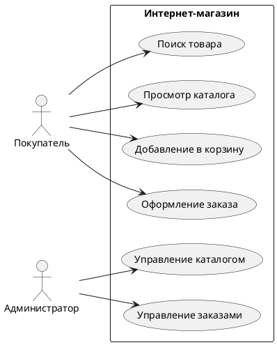
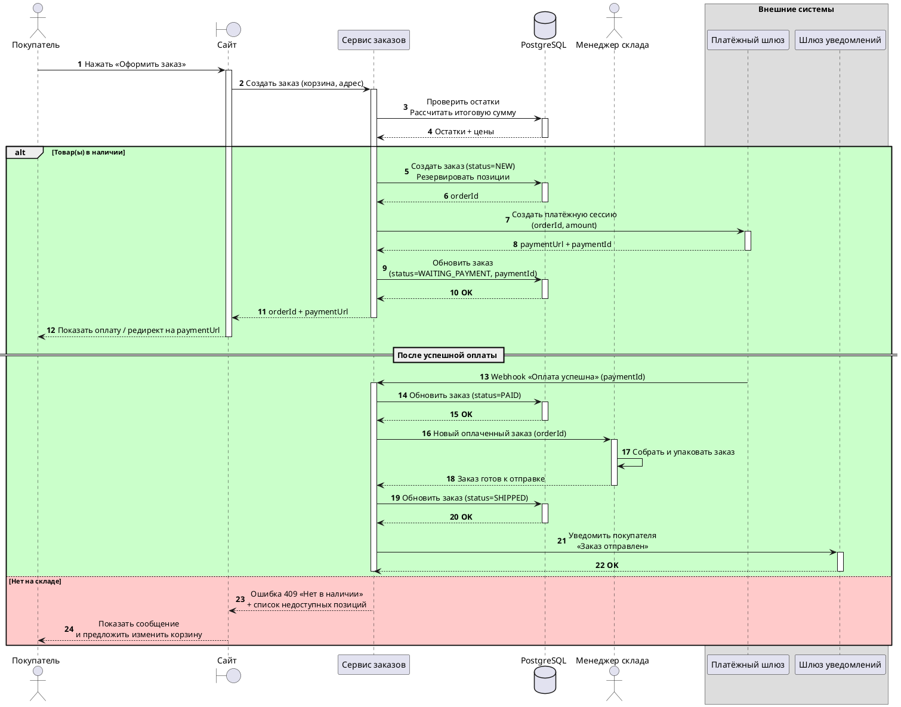

## Введение

Системный аналитик — это IT-специалист, который выступает связующим звеном между бизнесом и командой разработки. Его основная задача — перевести потребности и цели бизнеса на язык, понятный программистам, и убедиться, что итоговый продукт будет решать поставленные задачи. В мире, где цифровизация проникает во все сферы жизни, роль системного аналитика становится все более важной, ведь именно от его работы зависит, насколько полезным будет создаваемый программный продукт (именно продукт! так как системный аналитики в 99% случаев работают в командах по созданию / развитию продуктов).

Если попроще, то системный аналитик — это "переводчик" и "мини-архитектор" в мире IT. Аналитик помогает заказчику сформулировать, что именно он хочет получить, описывает требования заказчика техническим языком, проектирует "как будет выглядеть будущее решение (проблемы заказчика)", помогает разработчикам понять решаемую проблему и как реализовать решение проблемы. Без системного аналитика проекты рискуют затянуться, выйти за рамки бюджета или, в худшем случае, оказаться совершенно бесполезными для конечного пользователя.

## Основные концепции

Работа системного аналитика строится на нескольких ключевых концепциях и процессах, которые помогают ему эффективно выполнять свои задачи. Понимание этих концепций — первый шаг к освоению профессии.

### Сбор и анализ требований

Аналитик выясняет, что именно нужно сделать. Для этого он:

* Проводит интервью с заказчиками и пользователями
* Изучает существующие процессы и документацию
* Успокаивает истеричных заказчиков
* Анализирует конкурентов и знаком с принятыми в отрасли практиками
* Составляет вопросы, чтобы выявить неочевидные требования
* Задаёт вопросы, чтобы уточнить **очевидные** вещи
* Объясняет заказчику, что уважаемый заказчик хочет космолёт по цене шавермы
* Объясняет техническую сложность предлагаемого решения и что оно (решение) не решит проблему заказчика ("вам не нужен ИИ для поиска по сайту - для начала хорошо бы структурировать разделы сайта и обновить дизайн")
* Фиксирует требования, чтобы уважаемый заказчик не говорил, что он такого не говорил

> Заказчики (стейкхолдеры) редко знают, что им нужно. Они говорят о решениях ("сделайте кнопку"), а не о проблемах ("мне нужно быстрее оформлять заказы"). Наша аналитическая задача это докопаться до сути

Сбор и анализ требований это, пожалуй, самая важная часть работы системного аналитика. Требования — это спецификация того, что должно быть реализовано. Требования бывают нескольких видов:

*   **Бизнес-требования:** высокоуровневые цели, которые бизнес хочет достичь с помощью системы (например, "увеличить продажи на 20%" или "сократить время обработки заявок вдвое").
*   **Пользовательские требования:** задачи, которые пользователи должны иметь возможность выполнять в системе (например, "пользователь должен иметь возможность зарегистрироваться на сайте с помощью email и пароля").
*   **Функциональные требования:** как именно система должна выполнять пользовательские задачи (например, "при регистрации система должна проверять корректность введенного email и требовать пароль длиной не менее 8 символов").
*   **Нефункциональные требования:** определяют качественные характеристики системы, такие как производительность, безопасность, надежность, удобство использования (например, "сайт должен загружаться не дольше 2 секунд в 95% случаев", "данные пользователей должны быть зашифрованы при помощи AES-256").

Для сбора требований аналитик использует различные методы: интервью с заказчиками и пользователями, анкетирование, анализ документов, наблюдение за работой пользователей.

### Моделирование и проектирование

Собранные требования необходимо структурировать и представить в виде, понятном команде разработки. Для этого используются различные нотации и диаграммы:

*   **UML (Unified Modeling Language):** стандартный язык для визуального моделирования программных систем. С его помощью можно создавать диаграммы различных типов:
    *   **Use Case Diagram (Диаграмма вариантов использования):** показывает, какие действия (варианты использования) могут выполнять пользователи (акторы) в системе.
    *   **Activity Diagram (Диаграмма деятельности):** пошаговый рабочий процесс или алгоритм.
    *   **Sequence Diagram (Диаграмма последовательности):** взаимодействия объектов во времени.
*   **BPMN (Business Process Model and Notation):** нотация для моделирования бизнес-процессов. Помогает визуализировать, как устроены процессы в компании, и найти пути их оптимизации.
*   **ERD (Entity-Relationship Diagram):** диаграмма схемы БД. Обычно используется при проектировании БД с нуля или при значительных изменениях существующей схемы БД.

### Жизненный цикл разработки ПО

Системный аналитик участвует во всех этапах жизненного цикла разработки программного обеспечения (Software Development Lifecycle, SDLC), от планирования до внедрения и поддержки. Существуют различные методологии разработки, и роль аналитика в них может немного отличаться:

*   **Waterfall (Водопадная модель):** классическая модель, где каждый этап (анализ, проектирование, разработка, тестирование) выполняется строго последовательно. Аналитик в этой модели отвечает за создание полного и исчерпывающего технического задания (ТЗ) на начальном этапе.
*   **Agile (Гибкие методологии, например, Scrum, Kanban):** итеративный подход, где разработка ведется короткими циклами (в SCRUM они называются спринтами). Аналитик в Agile-команде работает в тесном контакте с разработчиками, тестировщиками, дизайнерами и заказчиком, уточняя и детализируя требования, чтобы составить такую постановку задачи, которая удовлетворяла бы требованиям заказчика.

## Практические примеры

Теория становится понятнее, когда подкреплена практикой. Рассмотрим несколько примеров.

> Рассмотренные ниже ситуации исключительно синтетические и с подобными задачами к нам в корпорации никогда не придут

### Пример 1: Проектирование системы онлайн-магазина (Use Case Diagram)

Представим, что к нам пришел заказчик, который хочет создать небольшой интернет-магазин по продаже книг. Наша задача как аналитиков — описать, как пользователи будут взаимодействовать с системой. Мы хоть и системные аналитики, но бизнес-анализ никто не отменял.

**Акторы (Actors):**

*   **Покупатель:** незарегистрированный или зарегистрированный пользователь, который хочет купить книгу.
*   **Администратор:** сотрудник магазина, управляющий каталогом товаров и заказами.

**Варианты использования (Use Cases):**

*   **Поиск товара:** Покупатель может искать книги по названию, автору или жанру.
*   **Просмотр каталога:** Покупатель может просматривать список книг, отсортированный по разным параметрам.
*   **Добавление в корзину:** Покупатель может добавить выбранную книгу в корзину.
*   **Оформление заказа:** Покупатель может оформить заказ, указав свои контактные данные и адрес доставки.
*   **Управление каталогом:** Администратор может добавлять, редактировать и удалять книги.
*   **Управление заказами:** Администратор может просматривать и изменять статусы заказов.

На основе этого мы можем построить простую Use Case диаграмму:

Эта диаграмма наглядно показывает основные функции системы и роли пользователей, что помогает всей команде иметь единое видение продукта.

Какие требования ещё нужно учесть в этом кейсе:

1. есть работа с ПДн (персональными данными). Необходимо добавить согласие на обработку ПДн и политику конфиденциальности.
2. работа с поставщиком платёжного решения (мы же не будем с нуля разрабатывать собственный процессинг операций, да?). Нужно настроить интеграцию с поставщиком платёжного шлюза (формочки оплаты)

### Пример 2: Моделирование процесса обработки заказа (UML)

Теперь давайте детализируем процесс оформления и обработки заказа с помощью нотации UML. Это поможет нам понять, какие шаги включает в себя процесс и где его можно улучшить.

> Если схема не грузится, попробуйте обновить страницу

Описана последовательность действий от момента оформления заказа покупателем до его отправки. По схеме понятны узкие места (шаг 17 - ручная сборка заказа), схема даёт нам возможность подумать автоматизацией узких мест.

### Пример 3: Фрагмент технического задания

Предположим, нам нужно описать требование к функции регистрации. Фрагмент ТЗ может выглядеть так:

**Функциональное требование FR-01: Регистрация пользователя**

* **Описание:** Система должна предоставлять пользователю возможность зарегистрироваться с использованием email и пароля.

* **Поля:**
    * Email (обязательное, валидация на корректность формата. Формат - email по определению из RFC 3696)
    * Пароль (обязательное, не менее 8 символов, должен содержать как минимум одну заглавную букву и одну цифру)
    * Подтверждение пароля (обязательное, должно совпадать с полем "Пароль")

* **Логика:**
    1. При отправке формы система проверяет, что все обязательные поля заполнены.
    2. Система проверяет, что email еще не зарегистрирован в системе.
    3. Система проверяет пароль на соответствие требованиям безопасности.
    4. Система проверяет, что пароль и его подтверждение совпадают.
    5. В случае успеха, система создает новую учетную запись пользователя и отправляет на указанный email письмо для подтверждения регистрации.

## Типичные ошибки и как их избежать

На пути системного аналитика, особенно начинающего, встречается немало подводных камней. Знание типичных ошибок помогает избежать их и повысить качество своей работы.

### Ошибка 1: Недостаточное погружение в предметную область

Аналитики, особенно с техническим бэкграундом, концентрируются на технологиях, упуская из виду специфику бизнеса, для которого создается система. Это приводит к тому, что продукт формально работает, но не решает реальные проблемы пользователей.

* **Как избежать:** Потратьте время на изучение предметной области. Общайтесь с экспертами со стороны заказчика, используйте LLM, читайте отраслевую литературу, анализируйте конкурентов. Ваша цель — говорить с бизнесом на одном языке.

### Ошибка 2: Поверхностный сбор требований

Принять на веру первые же слова заказчика — большая ошибка. Часто люди не могут четко сформулировать, что им нужно, или упускают важные детали. Если аналитик не задает уточняющих вопросов, требования получаются неполными и противоречивыми.

* **Как избежать:** Используйте технику "5 почему". Задавайте открытые вопросы. Не бойтесь задавать вопросы - это ваша работа. Проводите повторные интервью. Прототипируйте — увидев макет будущего интерфейса, заказчик лучше понимает, чего он на самом деле хочет.

### Ошибка 3: Игнорирование нефункциональных требований

Все силы брошены на реализацию функций, но никто не подумал о том, что система должна выдерживать нагрузку в 1000 одновременных пользователей или быть доступной 99.9% времени. В итоге, на этапе эксплуатации возникают серьезные проблемы.

* **Как избежать:** С самого начала обсуждайте с заказчиком нефункциональные требования (НФТ). Определите **ожидания** по производительности, надежности, безопасности, масштабируемости. Фиксируйте их в документации так же, как и функциональные. НФТ не являются истиной на 100%, часто требования нереализуемы и это нужно объяснить заказчику. В случае НФТ к производительности это чаще ориентир, чем жёсткое требование

### Ошибка 4: Слабая коммуникация с командой

Написать ТЗ и "бросить его через стену" разработчикам — порочная практика. Без постоянного взаимодействия команда может неверно интерпретировать требования, что приведет к необходимости дорогостоящих переделок.

* **Как избежать:** Будьте частью команды. Участвуйте в ежедневных встречах, отвечайте на вопросы разработчиков и тестировщиков, демонстрируйте готовый функционал заказчику. Помните, что вы — мост между бизнесом и разработкой.

Аналитик находится в центре коммуникаций между разными ролями:

* Бизнес-аналитик — передает стратегические цели, получает детализированные требования
* Менеджер проекта — получает требования для планирования сроков и ресурсов
* Разработчики — получают спецификации для реализации
* Тестировщики — получают критерии приемки для проверки
* UX/UI дизайнер — совместно проектирует интерфейсы и сценарии
* Архитектор — обсуждает технические ограничения и решения

## Связь с другими темами

Профессия системного аналитика тесно переплетена с множеством других областей в IT и бизнесе. 

* **Бизнес-анализ:** границы между системным и бизнес-анализом часто размыты. В идеале, бизнес-аналитик фокусируется на стратегии и потребностях бизнеса (ЧТО нужно сделать), а системный аналитик — на том, как это реализовать в IT-системе (КАК это сделать). Однако, во многих компаниях один специалист выполняет обе роли.

* **Управление проектами (Project Management):** аналитик тесно сотрудничает с менеджером проекта. Аналитик поставляет требования, на основе которых менеджер строит план работ, оценивает сроки и ресурсы. От качества работы аналитика напрямую зависит, насколько предсказуемым и управляемым будет проект.

* **Разработка и тестирование:** Для разработчиков аналитик — основной источник информации о том, что и как нужно реализовать. Для тестировщиков — создатель "эталона", с которым они сверяют работу программы. Четкие и непротиворечивые требования от аналитика — залог быстрой разработки и эффективного тестирования.

* **UX/UI дизайн:** Аналитик и дизайнер работают в паре над созданием удобного и понятного пользовательского интерфейса. Аналитик определяет, КАКИЕ задачи должен решать пользователь в системе, а дизайнер — КАК сделать этот процесс максимально простым и приятным. Они вместе проектируют пользовательские сценарии (user flows) и создают прототипы.

* **Архитектура ПО:** В сложных проектах системный аналитик работает вместе с архитектором ПО. Аналитик отвечает за функциональные требования, а архитектор, на их основе, принимает глобальные технические решения о структуре приложения, используемых технологиях и способах взаимодействия компонентов.

## Заключение

Системный аналитик — это многогранная и ответственная профессия на стыке бизнеса, технологий и коммуникаций. Это не "писатель ТЗ", а участник команды, который обеспечивает создание продуктов, действительно приносящих пользу бизнесу. Аналитик обеспечивает понимание между бизнесом и разработкой, предотвращает дорогостоящие ошибки и помогает создавать продукты, которые решают реальные задачи.
Успешный системный аналитик сочетает в себе техническую грамотность, аналитический склад ума, умение находить общий язык с самыми разными людьми и глубокое понимание предметной области.

Путь в эту профессию требует постоянного обучения и развития, но он открывает широкие возможности для карьерного роста и участия в создании сложных и интересных IT-решений. Если вам нравится докапываться до сути вещей, структурировать информацию и видеть, как ваши идеи воплощаются в реальных продуктах, то профессия системного аналитика может стать для вас настоящим призванием.
