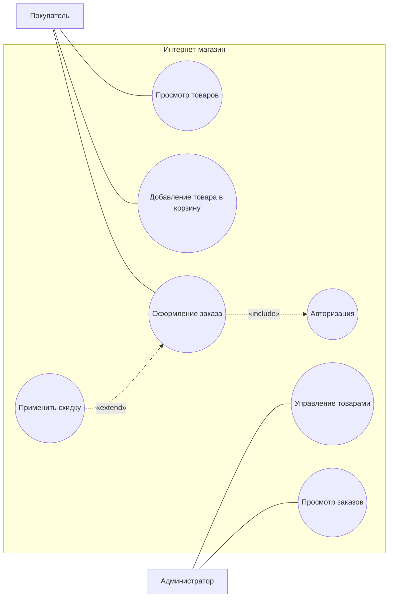
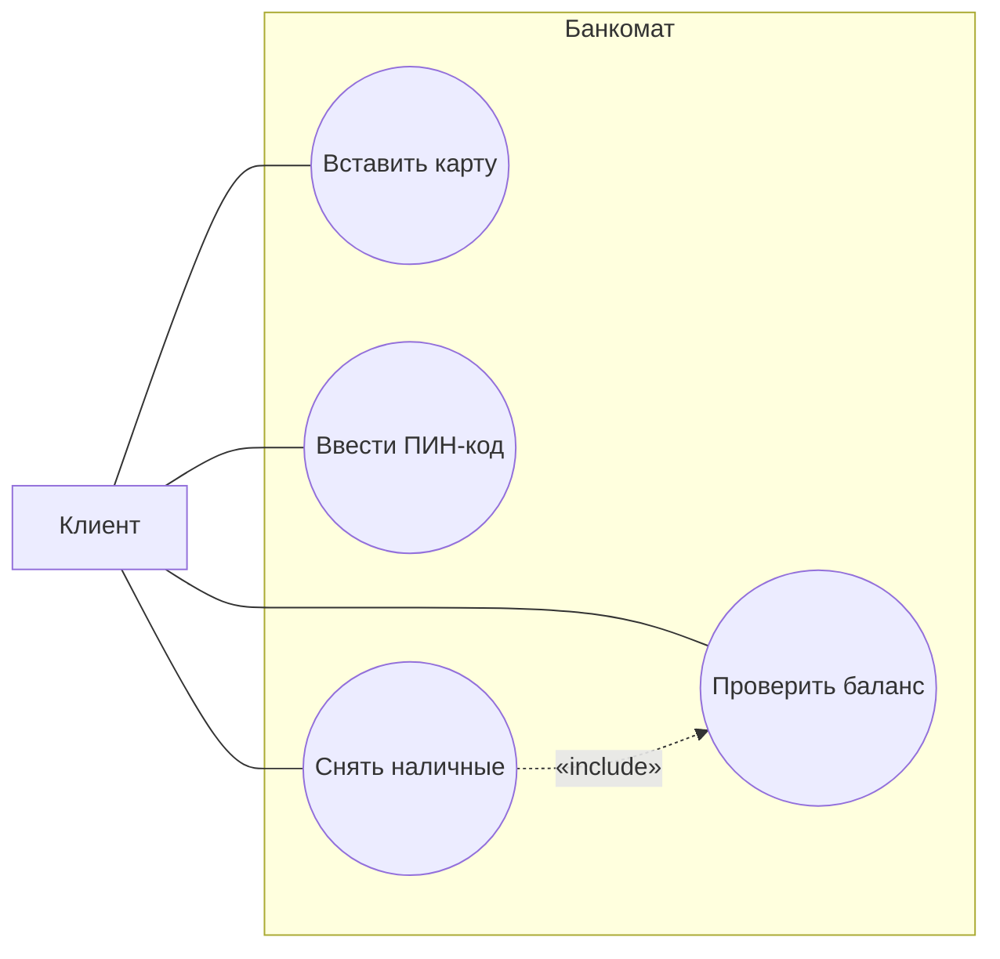

## Введение

В мире разработки программного обеспечения, где требования постоянно меняются, а команды стремятся к максимальной эффективности, ключевым фактором успеха становится четкое и однозначное понимание того, что именно должна делать система. Одним из наиболее мощных инструментов для достижения этой ясности являются **Use Case диаграммы и сценарии**. Они позволяют описать взаимодействие пользователей с системой на простом и понятном языке, формируя мост между бизнес-требованиями и технической реализацией.

Use Case, или вариант использования, — это не просто техническая диаграмма, а полноценный метод описания функциональности системы с точки зрения конечного пользователя. Этот подход помогает не только зафиксировать требования, но и глубже понять потребности тех, для кого создается продукт. В этой статье мы подробно разберем, что такое Use Case, из каких элементов они состоят, как их правильно создавать и использовать в работе, а также рассмотрим практические примеры и типичные ошибки.

## Основные концепции

Для того чтобы эффективно использовать Use Case, необходимо понимать его ключевые концепции и элементы. Основными составляющими являются диаграмма вариантов использования и текстовые сценарии, которые ее дополняют.

### Диаграмма Use Case

Диаграмма Use Case — это визуальное представление функциональности системы, которое показывает, какие действия могут выполнять пользователи и как система на них реагирует. Она относится к языку моделирования UML (Unified Modeling Language) и включает в себя следующие основные элементы:

1. **Актор (Actor):** Это роль, которую выполняет пользователь или другая система при взаимодействии с нашей системой. Актор — это не конкретный человек, а именно роль. Например, в системе интернет-магазина акторами могут быть «Покупатель», «Администратор» и «Платежная система». Акторы изображаются в виде человечков.
2. **Вариант использования (Use Case):** Это конкретное действие или последовательность действий, которые система выполняет для достижения цели актора. Варианты использования изображаются в виде овалов и обычно именуются глаголом с существительным, например, «Оформить заказ» или «Проверить статус заказа».
3. **Система (System):** Границы системы, которые показывают, что входит в ее функциональность, а что является внешним окружением. Обычно изображается в виде прямоугольника, внутри которого находятся варианты использования.
4. **Отношения (Relationships):** Связи между акторами и вариантами использования, а также между самими вариантами использования. Основные типы отношений:
    * **Ассоциация (Association):** Показывает, что актор взаимодействует с вариантом использования. Изображается сплошной линией.
    * **Включение (Include):** Указывает, что один вариант использования всегда включает в себя функциональность другого. Например, «Оформление заказа» всегда включает «Авторизацию пользователя». Изображается пунктирной стрелкой с надписью `<<include>>`.
    * **Расширение (Extend):** Показывает, что один вариант использования может быть расширен функциональностью другого при определенных условиях. Например, «Оформление заказа» может быть расширено вариантом «Применить скидочный купон». Изображается пунктирной стрелкой с надписью `<<extend>>`.

### Сценарии использования

Диаграмма дает общее представление о функциональности, но для детального описания каждого варианта использования применяются текстовые сценарии. Сценарий — это пошаговое описание взаимодействия актора с системой. Как правило, он включает в себя:

* **Название Use Case:** Соответствует названию на диаграмме.
* **Актор(ы):** Кто выполняет данный сценарий.
* **Предусловия (Preconditions):** Условия, которые должны быть выполнены до начала сценария.
* **Постусловия (Postconditions):** Состояние системы после успешного завершения сценария.
* **Основной поток событий (Main Flow):** Пошаговое описание успешного выполнения сценария.
* **Альтернативные потоки (Alternative Flows):** Описание других, менее типичных, но также успешных путей выполнения сценария.
* **Потоки исключений (Exception Flows):** Описание ситуаций, когда сценарий не может быть успешно завершен (ошибки, сбои).

## Практические примеры

Рассмотрим несколько практических примеров, чтобы лучше понять, как создавать и использовать Use Case диаграммы и сценарии.

### Пример 1: Интернет-магазин

Представим, что мы проектируем простой интернет-магазин. Основные акторы: «Покупатель» и «Администратор».

**Диаграмма Use Case:**

**Сценарий для Use Case «Оформление заказа»:**

* **Название:** Оформление заказа
* **Актор:** Покупатель
* **Предусловия:** Покупатель добавил хотя бы один товар в корзину.
* **Постусловия:** Заказ успешно создан и сохранен в системе.
* **Основной поток:**
    1. Покупатель переходит в корзину.
    2. Система отображает список добавленных товаров и итоговую сумму.
    3. Покупатель нажимает кнопку «Оформить заказ».
    4. Система запрашивает авторизацию (выполняется Use Case «Авторизация»).
    5. Система предлагает ввести адрес доставки и выбрать способ оплаты.
    6. Покупатель вводит данные и нажимает «Подтвердить заказ».
    7. Система сохраняет заказ и отображает сообщение об успешном оформлении.
* **Альтернативный поток (Применение скидки):**
    1. На шаге 5 основного потока Покупатель вводит промокод в специальное поле.
    2. Система проверяет промокод и, если он действителен, пересчитывает итоговую сумму.
* **Поток исключений (Неудачная оплата):**
    1. На шаге 6 система не может обработать платеж.
    2. Система отображает сообщение об ошибке и предлагает выбрать другой способ оплаты.

### Пример 2: Банкомат

**Диаграмма Use Case:**

## Типичные ошибки и как их избежать

При создании Use Case диаграмм и сценариев легко допустить ошибки, которые могут привести к недопониманию и проблемам в разработке. Вот некоторые из них:

1. **Слишком много деталей на диаграмме.** Диаграмма должна давать общее представление, а не описывать каждый клик. Детали должны быть в текстовых сценариях.
    * **Как избежать:** Фокусируйтесь на целях акторов, а не на конкретных действиях в интерфейсе.

2. **Неправильное использование `<<include>>` и `<<extend>>`.** Часто путают эти два отношения. `<<include>>` — это обязательная часть, `<<extend>>` — опциональная.
    * **Как избежать:** Задайте себе вопрос: «Может ли основной Use Case выполниться без этого шага?». Если нет — это `<<include>>`, если да — `<<extend>>`.

3. **Забывают про альтернативные потоки и исключения.** Описывают только «счастливый путь», что делает требования неполными.
    * **Как избежать:** Всегда думайте о том, что может пойти не так, и описывайте реакцию системы на эти ситуации.

4. **Акторы — это конкретные люди.** Актор — это роль. Один человек может выступать в разных ролях.
    * **Как избежать:** Называйте акторов по их роли в системе (например, «Клиент», «Менеджер»), а не по должности или имени.

## Связь с другими темами

Use Case диаграммы тесно связаны с другими артефактами системного анализа и UML. Они служат отправной точкой для создания более детальных диаграмм:

* **Диаграммы активности (Activity Diagram):** Могут использоваться для визуализации логики основного и альтернативных потоков внутри одного Use Case.
* **Диаграммы последовательности (Sequence Diagram):** Помогают спроектировать взаимодействие между объектами системы при выполнении конкретного сценария.
* **Диаграммы состояний (State Machine Diagram):** Описывают, как меняется состояние объекта в процессе выполнения различных Use Case.

Таким образом, Use Case является центральным элементом, который связывает требования пользователей с архитектурой и поведением системы.

## Заключение

Use Case диаграммы и сценарии — это незаменимый инструмент в арсенале системного аналитика и разработчика. Они помогают структурировать требования, обеспечить общее понимание функциональности в команде и снизить риски, связанные с неправильной интерпретацией задач. Несмотря на кажущуюся простоту, создание качественных Use Case требует практики и внимания к деталям. Однако вложения в этот процесс многократно окупаются на последующих этапах разработки, тестирования и поддержки продукта, делая его по-настоящему ориентированным на пользователя.
