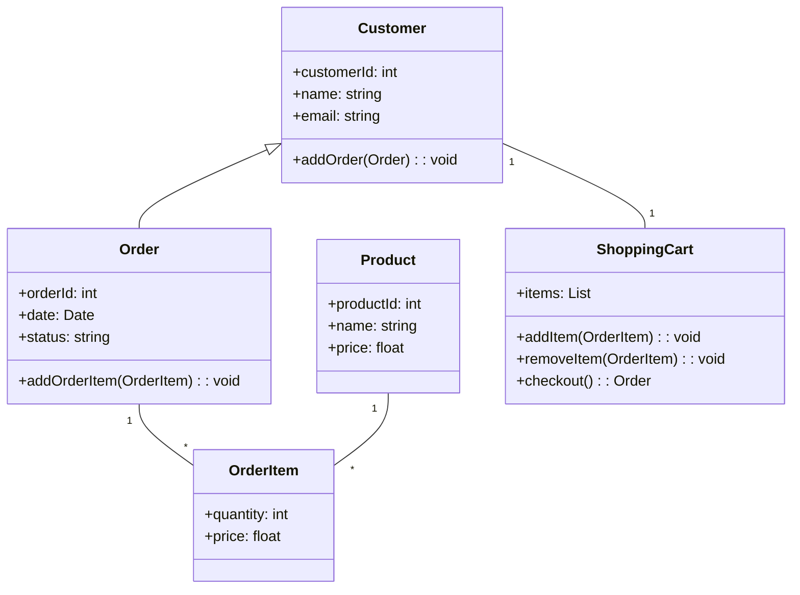
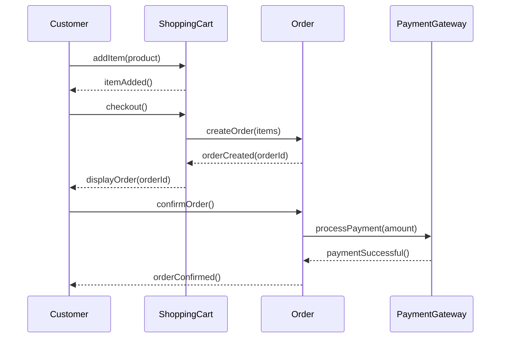
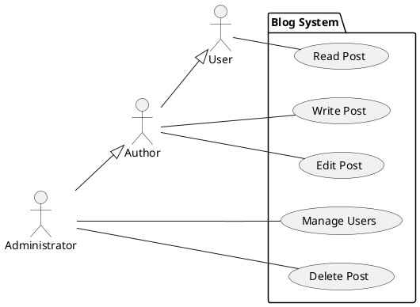

## Введение

UML (Unified Modeling Language) — это унифицированный язык моделирования, который используется в разработке программного обеспечения для визуализации, спецификации, конструирования и документирования артефактов программных систем. Проще говоря, UML — это набор графических нотаций, который помогает разработчикам, аналитикам и другим заинтересованным сторонам лучше понимать и проектировать сложные системы.

### Зачем нужен UML?

Представьте, что вы строите дом. Прежде чем начать строительство, вы создаете чертежи, которые описывают структуру дома, его коммуникации и внешний вид. UML выполняет аналогичную функцию в мире программного обеспечения. Он позволяет:

*   **Визуализировать систему:** Диаграммы UML помогают представить структуру и поведение системы в наглядной форме.
*   **Специфицировать требования:** UML позволяет точно описать требования к системе, что снижает риск недопонимания между заказчиком и разработчиками.
*   **Конструировать систему:** Диаграммы UML могут служить основой для написания кода, а некоторые инструменты даже позволяют генерировать код из диаграмм.
*   **Документировать систему:** UML-диаграммы являются важной частью технической документации, которая помогает в поддержке и развитии системы.

### Преимущества использования UML

*   **Стандартизация:** UML является общепринятым стандартом, что обеспечивает взаимопонимание между специалистами из разных компаний и стран.
*   **Полнота:** UML предоставляет широкий набор диаграмм для моделирования различных аспектов системы.
*   **Распространенность:** UML поддерживается большинством инструментов для моделирования и разработки ПО.
*   **Автоматизация:** Существуют инструменты, которые позволяют автоматизировать рутинные задачи, такие как генерация кода из диаграмм или создание диаграмм из существующего кода.

## Основные концепции с объяснениями

Диаграммы UML делятся на две большие категории: **структурные** и **поведенческие**.

### Структурные диаграммы

Структурные диаграммы показывают статическую структуру системы и ее частей. К ним относятся:

*   **Диаграмма классов (Class Diagram):** Самая распространенная диаграмма в UML. Она описывает классы, их атрибуты, методы и отношения между ними (ассоциация, агрегация, композиция, наследование).
*   **Диаграмма компонентов (Component Diagram):** Показывает, как система разделена на компоненты (например, библиотеки, файлы, исполняемые файлы) и какие зависимости существуют между ними. Это помогает понять архитектуру системы.
*   **Диаграмма объектов (Object Diagram):** Показывает экземпляры классов (объекты) и их отношения в определенный момент времени. Это как «снимок» системы в определенный момент.
*   **Диаграмма развертывания (Deployment Diagram):** Описывает физическое развертывание артефактов на узлах. Показывает, на каком оборудовании будет работать программное обеспечение.
*   **Диаграмма пакетов (Package Diagram):** Используется для организации элементов модели в группы (пакеты). Помогает управлять сложностью больших моделей.

### Поведенческие диаграммы

Поведенческие диаграммы показывают динамическое поведение системы. К ним относятся:

*   **Диаграмма вариантов использования (Use Case Diagram):** Описывает взаимодействие пользователей (акторов) с системой. Помогает определить функциональные требования к системе.
*   **Диаграмма последовательности (Sequence Diagram):** Показывает последовательность сообщений, которыми обмениваются объекты во времени. Отлично подходит для визуализации сценариев взаимодействия.
*   **Диаграмма деятельности (Activity Diagram):** Моделирует бизнес-процессы и потоки работ. Похожа на блок-схему, но с более строгими правилами.
*   **Диаграмма состояний (State Machine Diagram):** Описывает состояния, в которых может находиться объект, и переходы между этими состояниями. Полезна для моделирования жизненного цикла объектов.
*   **Диаграмма коммуникации (Communication Diagram):** Похожа на диаграмму последовательности, но акцентирует внимание на отношениях между объектами, а не на времени.

## Практические примеры

### Пример 1: Диаграмма классов для интернет-магазина

Представим, что мы проектируем простой интернет-магазин. Диаграмма классов для него может выглядеть следующим образом:



**Код на Python, соответствующий диаграмме:**

```python
class Customer:
    def __init__(self, customer_id, name, email):
        self.customer_id = customer_id
        self.name = name
        self.email = email
        self.orders = []

    def add_order(self, order):
        self.orders.append(order)

class Order:
    def __init__(self, order_id, date, status):
        self.order_id = order_id
        self.date = date
        self.status = status
        self.order_items = []

    def add_order_item(self, order_item):
        self.order_items.append(order_item)

# и так далее для остальных классов...
```

### Пример 2: Диаграмма последовательности для процесса заказа

Эта диаграмма показывает, как происходит процесс оформления заказа:



### Пример 3: Диаграмма вариантов использования для системы блога

Эта диаграмма описывает, что могут делать разные пользователи в системе блога:



## Типичные ошибки и как их избежать

*   **Слишком много деталей:** Не пытайтесь уместить всю информацию о системе на одной диаграмме. Лучше создать несколько диаграмм, каждая из которых фокусируется на определенном аспекте. Помните, что диаграмма должна упрощать понимание, а не усложнять его.
*   **Неправильное использование нотаций:** Убедитесь, что вы правильно используете символы и отношения, определенные в стандарте UML. Неправильно использованная стрелка может полностью изменить смысл диаграммы.
*   **Несоответствие диаграмм коду:** Диаграммы должны отражать реальное состояние кода. Регулярно обновляйте их при внесении изменений в код. Существуют инструменты, которые помогают синхронизировать код и диаграммы.
*   **Отсутствие цели:** Прежде чем создавать диаграмму, определите, какую проблему вы хотите решить с ее помощью. Это поможет вам выбрать правильный тип диаграммы и не увязнуть в ненужных деталях.

## Связь с другими темами

UML тесно связан с другими областями разработки программного обеспечения:

*   **Объектно-ориентированное программирование (ООП):** UML является языком моделирования для ООП. Диаграммы классов напрямую отображают концепции ООП, такие как классы, объекты, наследование и полиморфизм.
*   **Проектирование баз данных:** Диаграммы классов UML могут использоваться для проектирования схем баз данных. Существуют инструменты, которые могут генерировать SQL-код из диаграмм классов.
*   **Бизнес-анализ:** Диаграммы деятельности и вариантов использования помогают аналитикам понять и описать бизнес-процессы. Это способствует лучшему взаимопониманию между бизнесом и разработчиками.
*   **Архитектура программного обеспечения:** Диаграммы компонентов и развертывания используются для проектирования архитектуры системы. Они помогают принимать решения о том, как система будет структурирована и развернута.

## Инструменты для создания UML-диаграмм

Существует множество инструментов для создания UML-диаграмм, как платных, так и бесплатных. Вот некоторые из них:

*   **Lucidchart:** Онлайн-инструмент с интуитивно понятным интерфейсом и большим набором шаблонов.
*   **Creately:** Еще один популярный онлайн-инструмент для совместной работы над диаграммами.
*   **draw.io (diagrams.net):** Бесплатный онлайн-редактор диаграмм с поддержкой UML.
*   **StarUML:** Мощный настольный инструмент для моделирования с поддержкой UML 2.
*   **Visual Paradigm:** Комплексный инструмент для моделирования, который поддерживает не только UML, но и другие нотации.

## Заключение

UML является мощным инструментом для моделирования программных систем. Он помогает улучшить коммуникацию в команде, снизить риски и повысить качество конечного продукта. Несмотря на то, что UML может показаться сложным на первый взгляд, его изучение и применение окупается сторицей в долгосрочной перспективе. Начните с основных диаграмм, и вы увидите, как ваши проекты станут более структурированными и понятными. Главное — помнить, что UML — это инструмент, а не самоцель. Используйте его разумно, и он принесет вам большую пользу.
